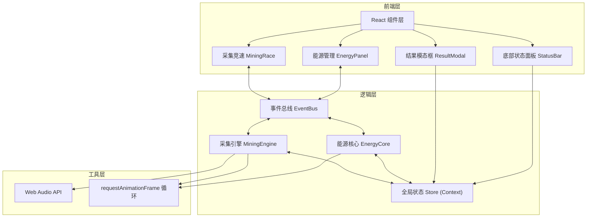

## 1. 架构设计



## 2. 技术说明
- **前端框架**: React 18 + TypeScript 5
- **构建工具**: Vite 5 + @vitejs/plugin-react
- **状态管理**: React Context + useReducer
- **事件系统**: 自定义 EventBus（发布/订阅模式）
- **样式方案**: 原生 CSS + CSS Modules（或内联styled-jsx样式）
- **动画方案**: CSS transition/animation + requestAnimationFrame
- **音频方案**: Web Audio API 原生合成

## 3. 项目目录结构

```
src/
├── eventBus.ts          # 自定义事件总线
├── store.ts             # 全局状态(Context + Reducer)
├── main.tsx             # 应用入口
├── App.tsx              # 根组件
├── index.css            # 全局样式
├── energy/
│   ├── EnergyPanel.tsx  # 能源管理面板组件
│   └── EnergyCore.ts    # 能源核心逻辑
└── mining/
    ├── MiningRace.tsx   # 采集竞速组件
    └── MiningEngine.ts  # 采集引擎逻辑
```

## 4. 核心模块定义

### 4.1 EventBus 事件类型
| 事件名 | 触发方 | 接收方 | 数据 |
|--------|--------|--------|------|
| ENERGY_ALLOCATED | EnergyPanel | EnergyCore | { engineRatio: number, shieldRatio: number } |
| ENERGY_UPDATED | EnergyCore | Store, MiningEngine | { engine: number, shield: number } |
| MINING_TRIGGERED | MiningRace | MiningEngine | { playerX: number } |
| MINING_SUCCESS | MiningEngine | Store, EnergyCore | { score: number, energyCost: number, x: number, who: 'player' \| 'npc' } |
| NPC_MINING | MiningEngine | Store | { score: number, x: number } |
| GAME_TICK | requestAnimationFrame | EnergyCore, MiningEngine | { deltaTime: number } |
| GAME_START | App | All | void |
| GAME_OVER | App/Store | All | void |

### 4.2 Store 状态类型

```typescript
interface GameState {
  energy: {
    engine: number;       // 0-100
    shield: number;       // 0-100
    engineRatio: number;  // 0-100 分配比例
    shieldRatio: number;  // 0-100 分配比例
    totalConsumed: number;
  };
  mining: {
    playerScore: number;
    npcScore: number;
    playerX: number;      // 0-100 百分比位置
    npcX: number;
    npcSpeedFactor: number; // 0.8-1.2
    crystals: Crystal[];
  };
  game: {
    status: 'idle' | 'playing' | 'finished';
    timeLeft: number;     // 秒
  };
  ship: {
    speedMultiplier: number; // 受护盾影响
  };
  effects: VisualEffect[];
}

interface Crystal {
  id: string;
  x: number;   // 0-100%
  y: number;   // 像素
  size: number; // 12-18px
  color: string;
}

interface VisualEffect {
  id: string;
  type: 'ring' | 'particles';
  x: number;
  y: number;
  createdAt: number;
  color?: string;
}
```

### 4.3 核心算法

**能量消耗算法 (每帧)**:
```
baseConsumption = 1 * deltaTime  // 每秒1点基础消耗
miningConsumption = isMining ? 2 * deltaTime : 0
total = baseConsumption + miningConsumption
engine -= total * (engineRatio / 100)
shield -= total * (shieldRatio / 100)
```

**护盾减速判定**:
```
if shield < 20: speedMultiplier = 0.7
else: speedMultiplier = 1.0
```

**NPC 速度波动**:
```
每1-2秒随机更新: npcSpeedFactor = 0.8 + Math.random() * 0.4
```

**采集成功判定**:
```
distance = |shipX - crystalX| < 20px  && keyPressed(SPACE)
```

**晶石重生**:
```
采集后 1-2秒 在随机位置生成新晶石
```

## 5. 性能约束
- 帧率目标: ≥ 30 FPS
- 晶石生成计算: ≤ 5ms/帧
- NPC AI决策: ≤ 2ms/帧
- 能量更新: 每帧1次
- 使用 requestAnimationFrame 统一调度
