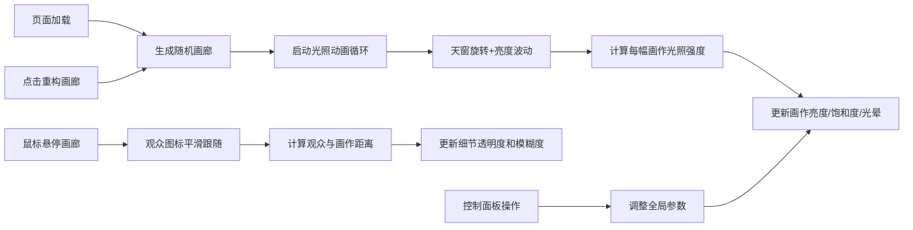

## 1. 产品概述

微型艺术画廊模拟器是一个 2D 俯视视角的交互式艺术展示验证工具。主要解决在缺少完整物理引擎时，验证动态艺术展示逻辑与实时视觉反馈如何有效协同工作的问题。目标用户为交互设计师、前端开发者和艺术展示技术研究者。

产品价值在于提供一个轻量级的可交互测试平台，用于验证光照系统、观众距离感应和艺术作品动态呈现之间的视觉协同效果。

## 2. 核心功能

### 2.1 用户角色
| 角色 | 注册方式 | 核心权限 |
|------|----------|----------|
| 访客用户 | 无需注册 | 浏览画廊、交互操作、调整参数 |

### 2.2 功能模块
1. **画廊画布**：800x600 2D俯视空间，展示画作、天窗光照、观众图标
2. **控制面板**：环境亮度调节、色温调节、风格筛选、重置按钮
3. **状态面板**：实时显示每幅画作的亮度、距离、透明度数据
4. **重构画廊**：随机生成新的画廊布局和画作

### 2.3 页面详情
| 页面名称 | 模块名称 | 功能描述 |
|---------|----------|----------|
| 主页面 | 画廊画布 | 渲染画作、天窗、观众，支持鼠标交互 |
| 主页面 | 控制面板 | 滑动条调节环境亮度和色温，下拉筛选艺术风格，按钮重置状态 |
| 主页面 | 状态面板 | 右上角实时显示所有画作的状态数据 |
| 主页面 | 重构按钮 | 重新生成随机画作布局 |

## 3. 核心流程

用户进入页面 → 自动生成初始画廊 → 天窗自动旋转和亮度波动 → 画作根据光照实时更新视觉效果 → 鼠标悬停时观众图标跟随移动 → 画作根据观众距离调整模糊度 → 用户通过控制面板调整参数 → 所有效果即时响应

## 4. 用户界面设计

### 4.1 设计风格
- **主色调**：暖灰色墙面 #D2C6B0、浅棕色地板 #C8A882、棕色边框 #8B7355
- **点缀色**：米白色天花板 #F5E6D3、金色天窗 #FFD700、金色观众 #FFD700
- **控件样式**：深色半透明背景 #1A1A2E，圆角 12px，毛玻璃效果
- **字体**：优雅的无衬线字体，清晰易读
- **布局风格**：画布居中，控制面板左上角，状态面板右上角
- **动画**：0.4秒缓出过渡，悬停发光描边

### 4.2 页面设计概述
| 页面名称 | 模块名称 | UI 元素 |
|---------|----------|---------|
| 主页面 | 画廊画布 | 暖色调背景、带边框画作矩形、菱形天窗、圆形观众图标、光晕效果、模糊遮罩 |
| 主页面 | 控制面板 | 深色半透明卡片、滑动条、下拉选择器、按钮、悬停发光描边 |
| 主页面 | 状态面板 | 深色半透明卡片、白色文字、数据列表、每秒刷新 |

### 4.3 响应式
- 桌面端优先设计，画布固定 800x600 像素
- 控制面板和状态面板使用绝对定位叠加在画布上
- 不考虑移动端适配

## 5. 性能要求
- 20 幅画作同时渲染时帧率不低于 45FPS
- 使用 requestAnimationFrame 驱动 60fps 更新循环
- 使用 React.memo 和 useMemo 优化渲染性能
