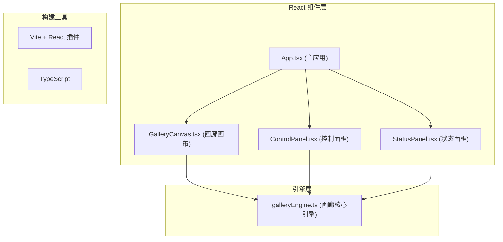

## 1. 架构设计



## 2. 技术描述
- **前端**：React 18 + TypeScript + Vite
- **构建工具**：Vite 5.x，配置 React 插件和路径别名
- **语言**：TypeScript 严格模式，target ES2020，moduleResolution bundler
- **样式**：内联样式 + CSS 变量，不使用 CSS 框架
- **状态管理**：galleryEngine 类管理核心状态，React 组件订阅状态更新
- **动画驱动**：requestAnimationFrame 60fps 循环

## 3. 项目结构
```
src/
├── main.tsx          # 应用入口
├── App.tsx           # 主应用组件
├── galleryEngine.ts  # 画廊核心引擎
└── components/
    ├── GalleryCanvas.tsx   # 画廊画布组件
    ├── ControlPanel.tsx    # 控制面板组件
    └── StatusPanel.tsx     # 状态面板组件
```

## 4. 核心数据模型

### 4.1 画作数据结构
```typescript
interface Painting {
  id: string;
  x: number;          // 左上角X坐标
  y: number;          // 左上角Y坐标
  width: number;      // 宽度 100-150px
  height: number;     // 高度 80-120px
  initialBrightness: number;    // 初始亮度 0.8
  initialSaturation: number;    // 初始饱和度 0.7
  initialDetailOpacity: number; // 初始细节透明度 0.6
  style: '印象派' | '抽象派' | '现实主义';
  artPattern: ArtPattern;  // 艺术色块图案
}
```

### 4.2 天窗数据结构
```typescript
interface Skylight {
  x: number;           // 中心X坐标
  y: number;           // 中心Y坐标
  size: number;        // 边长 60px
  rotation: number;    // 旋转角度
  brightness: number;  // 当前亮度 0.7-1.0
}
```

### 4.3 观众数据结构
```typescript
interface Viewer {
  x: number;           // 当前X坐标
  y: number;           // 当前Y坐标
  targetX: number;     // 目标X坐标
  targetY: number;     // 目标Y坐标
  visible: boolean;    // 是否可见
}
```

### 4.4 全局参数
```typescript
interface GlobalParams {
  ambientBrightness: number;    // 环境亮度 0.1-1.5，覆盖光照系统
  colorTemperature: number;     // 色温 2000K-8000K
  styleFilter: '全部' | '印象派' | '抽象派' | '现实主义';
}
```

## 5. 核心算法

### 5.1 画作生成算法
- 随机生成 6-10 幅画作
- 位置不重叠检测（矩形碰撞检测）
- 离边界至少 50px
- 画作之间保留 40px 间距
- 每幅画作生成 3-5 个随机颜色的圆点或条纹图案

### 5.2 光照强度计算
- 天窗中心到画作中心的距离
- 距离每增加 100px 光照衰减 0.15
- 最低光照不低于 0.2
- 乘以天窗当前亮度
- 环境亮度可覆盖计算结果

### 5.3 观众距离与透明度映射
- 距离 < 100px：透明度 0.2，模糊半径 15px
- 100-200px：透明度 0.5，模糊半径 10px
- 200-300px：透明度 0.7，模糊半径 5px
- > 300px：透明度 1.0，模糊半径 3px

### 5.4 平滑跟随算法
- 观众图标使用线性插值平滑移动
- 延迟 0.2 秒的跟随效果
- 每帧更新位置：current += (target - current) * smoothingFactor

## 6. 性能优化策略
- React.memo 包裹画布组件，避免不必要重渲染
- useMemo 缓存画作样式计算结果
- requestAnimationFrame 统一驱动动画循环
- 状态变更使用节流或批量更新
- 减少 DOM 操作，使用 CSS transform 和 opacity 动画
