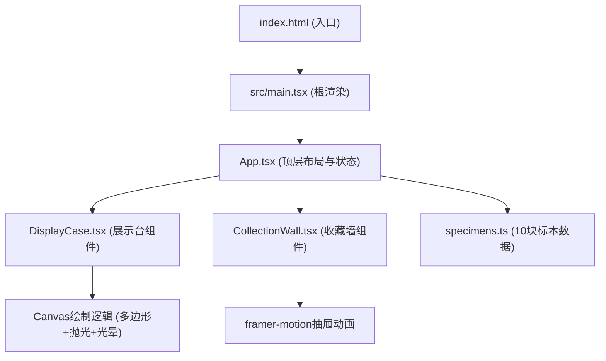

## 1. 架构设计



## 2. 技术描述

- 前端框架：React@18 + TypeScript
- 构建工具：Vite + @vitejs/plugin-react
- 动画库：framer-motion（抽屉/卡片过渡）
- Canvas API：岩石标本渲染与抛光动画
- 状态管理：React useState/useReducer 管理抛光状态与当前选中标本
- 样式方案：原生CSS（styled-components不使用，保持轻量）

## 3. 目录结构

```
auto154/
├── index.html
├── package.json
├── vite.config.js
├── tsconfig.json
└── src/
    ├── main.tsx
    ├── App.tsx
    ├── data/
    │   └── specimens.ts
    ├── components/
    │   ├── DisplayCase.tsx
    │   └── CollectionWall.tsx
    └── styles/
        └── index.css
```

## 4. 类型定义

```typescript
// 标本数据结构
interface Specimen {
  id: number;
  name: string;
  mineralColor: string;       // 最终矿物本色 (HEX)
  rarity: 1 | 2 | 3 | 4 | 5; // 稀有度 1-5星
  latitude: number;          // 采集纬度
  longitude: number;         // 采集经度
  description: string;       // 趣味描述
  polishCount: number;       // 当前抛光次数 0-5
  isCollected: boolean;      // 是否已收藏
}

// 杂质斑点结构
interface Impurity {
  x: number;
  y: number;
  r: number;
  color: string;
  visibleAt: number; // 在此抛光次数及以下可见
}

// 多边形顶点结构
interface PolygonPoint {
  x: number;
  y: number;
  noise: number; // 顶点噪声量，抛光时减少
}
```

## 5. 数据模型 (specimens.ts 初始数据)

预置10块岩矿标本：
| ID | 名称 | 矿物颜色 | 稀有度 | 采集地示例 |
|----|------|----------|--------|------------|
| 1 | 紫水晶 | #9966CC | 3 | 巴西-米纳斯吉拉斯 |
| 2 | 蓝铜矿 | #4B9CD3 | 4 | 美国-亚利桑那州 |
| 3 | 黄铁矿 | #D4A017 | 2 | 秘鲁-利马 |
| 4 | 孔雀石 | #1B7A3E | 3 | 刚果-卢本巴希 |
| 5 | 石榴石 | #7A1F1F | 3 | 印度-斋浦尔 |
| 6 | 海蓝宝 | #6BB8D9 | 4 | 巴基斯坦-吉尔吉特 |
| 7 | 碧玺 | #2D5A27 | 5 | 阿富汗-努里斯坦 |
| 8 | 蔷薇石英 | #E8B4B8 | 1 | 马达加斯加-图利亚拉 |
| 9 | 黑曜石 | #2C2C2C | 2 | 冰岛-雷克雅未克 |
| 10 | 青金石 | #1A3A8C | 4 | 阿富汗-巴达赫尚 |

## 6. Canvas 抛光算法设计

1. **初始形态生成**：以展示台中心为基准，生成8-12个等角度分布的初始顶点，每个顶点加入 ±15-25px 随机噪声形成凹凸不平的多边形
2. **杂质斑点**：在多边形内部随机生成 4-6 个白色 (#F5F5F5) 或浅黄色 (#FFF3B0) 小圆点，记录 visibleAt 属性
3. **颜色插值函数**：实现 hexToRgb → linearInterpolation → rgbToHex 的颜色过渡工具，polishCount=0 时为 #6D6D6D，=5 时为 mineralColor
4. **逐次抛光变化**：
   - 第n次点击：顶点噪声量 × (5-n)/5 衰减
   - 杂质斑点 visibleAt < n 的从渲染列表过滤
   - 颜色按 n/5 比例在灰色与矿物本色之间插值
5. **光晕动画**：第5次完成时，requestAnimationFrame 绘制600ms的径向渐变圆，半径从 50px 扩展到 350px，alpha从 0.8 衰减到 0

## 7. 响应式断点

- CSS 媒体查询: `@media (max-width: 1100px)`
- 桌面端：`.container` width: 1000px, display: flex, gap: 24px
- 小屏端：`.collection-wall` display: none, 汉堡菜单按钮 display: block, 抽屉 position: fixed; top: 0; left: 0; right: 0; z-index: 50
