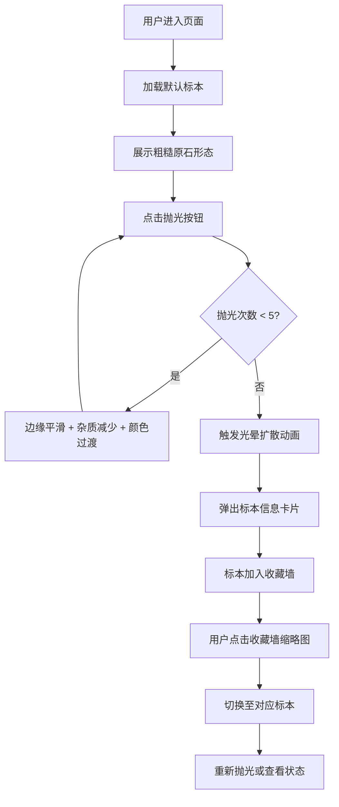

## 1. 产品概述

岩矿标本收藏与抛光成果展示柜是一款地质爱好者的互动式Web应用，用户可以通过逐步抛光岩石标本的过程，观察矿物从粗糙原石到宝石光泽的蜕变，并将收集到的精美标本展示在个人收藏墙上。

- 核心价值：提供沉浸式的岩石抛光体验，传播地质科普知识
- 目标用户：地质爱好者、矿物收藏家、教育领域用户

## 2. 核心功能

### 2.1 用户角色

| 角色 | 注册方式 | 核心权限 |
|------|----------|----------|
| 普通用户 | 无需注册，直接访问 | 体验抛光、浏览收藏、切换标本 |

### 2.2 功能模块

1. **中央展示台模块**：Canvas绘制多边形岩石标本、5阶抛光渐变动画、光晕完成效果、信息卡片弹出
2. **抛光交互模块**：圆形抛光按钮、悬停反馈、点击缩放回弹动画
3. **收藏墙模块**：3列缩略图网格、悬停高亮放大、金色收藏标记、点击切换标本
4. **响应式模块**：1100px断点、收藏墙抽屉式折叠菜单

### 2.3 页面详情

| 页面名称 | 模块名称 | 功能描述 |
|----------|----------|----------|
| 主页 | 背景纹理层 | 粗颗粒岩石质感背景，主色调岩灰+墨绿 |
| 主页 | 中央展示台 | 400×460px深棕色展台，金色装饰线，Canvas标本渲染 |
| 主页 | 抛光按钮 | 50px圆形渐变按钮，悬停/点击动画，触发抛光进度 |
| 主页 | 信息卡片 | 300×100px半透明白色卡片，显示标本名称/稀有度/经纬度/描述 |
| 主页 | 收藏墙 | 240px右侧区域，3列网格缩略图，垂直滚动 |
| 主页 | 顶部折叠菜单 | <1100px时显示汉堡图标，抽屉式收藏墙 |

## 3. 核心流程

用户进入页面 → 默认展示第一块未抛光标本 → 点击抛光按钮（共5次）→ 每次点击岩石边缘更平滑、杂质减少、颜色向目标矿物过渡 → 第5次完成时触发光晕动画 + 弹出信息卡片 + 加入收藏墙 → 用户点击收藏墙缩略图切换其他标本 → 重新抛光或查看已抛光标本

## 4. 用户界面设计

### 4.1 设计风格

- 主色调：岩灰色 #4A4A4A、墨绿色 #2E4A2A
- 装饰色：金色 #D4AF37、深棕色 #3E2723
- 背景：粗颗粒噪点纹理模拟岩石质感
- 按钮风格：圆形50px直径，深灰→亮银垂直渐变，悬停内阴影加深+1px外扩，点击0.15s缩放回弹
- 字体：标题使用具有复古地质感的衬线字体，正文使用清晰的无衬线字体
- 布局：单屏居中设计，总宽度1000px，中央展示台+右侧收藏墙并排

### 4.2 页面设计概览

| 页面名称 | 模块名称 | UI元素 |
|----------|----------|--------|
| 主页 | 背景层 | #4A4A4A + #2E4A2A 渐变叠加 + SVG噪点纹理 |
| 主页 | 展示台 | 400×460px #3E2723背景，16px圆角，上下各1px #D4AF37装饰线 |
| 主页 | 岩石标本 | Canvas绘制多边形，初始#6D6D6D带白色/浅黄色杂质斑点，5阶平滑过渡到矿物本色 |
| 主页 | 抛光按钮 | 50px圆形，#5D5D5D→#B0B0B0渐变，悬停/点击交互动效 |
| 主页 | 信息卡片 | 300×100px半透明白色，8px圆角，0.4s淡入动画，金星级稀有度 |
| 主页 | 收藏墙 | 240px宽 #3A3A3A背景，3列网格，70×70px缩略图 |
| 主页 | 缩略图 | 6px圆角，1px #5C5C5C边框，悬停→金色边框+1.05倍放大0.3s过渡，金色小圆点收藏标记 |
| 主页 | 折叠抽屉 | <1100px时汉堡图标触发，顶部滑出0.3s过渡 |

### 4.3 响应式设计

- **桌面端 (≥1100px)**：1000px居中容器，中央展示台+右侧收藏墙并排
- **小屏幕 (<1100px)**：收藏墙隐藏，顶部汉堡菜单图标，点击从顶部滑出抽屉式收藏墙，0.3s动画过渡

### 4.4 动画与交互细节

1. 岩石抛光：每次点击多边形顶点噪声减少，边缘更圆润，杂质斑点逐步消失，颜色通过颜色插值算法向目标色平滑过渡
2. 完成光晕：第5次抛光后，以标本为中心绘制0.6秒径向渐变扩散，从矿物本色渐变到白色
3. 信息卡片弹出：0.4秒 opacity 0→1 + translateY 10px→0 淡入
4. 收藏墙缩略图：hover时 0.3s transition border-color + transform: scale(1.05)
5. 抽屉动画：framer-motion animate={{ y: isOpen ? 0 : '-100%' }} transition={{ duration: 0.3 }}
