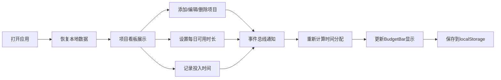

## 1. 产品概述

本产品是面向自由职业者的项目看板与智能时间预算分配应用，帮助用户同时管理多个项目，基于项目截止日期、剩余任务量和优先级自动推荐每日工作时长，并实时跟踪实际投入与计划的偏差。

- 核心价值：解决自由职业者多项目时间管理痛点，通过智能算法优化工作分配，提升工作效率
- 目标用户：自由职业者、独立开发者、远程工作者等需要同时管理多个项目的人群

## 2. 核心功能

### 2.1 用户角色
| 角色 | 注册方式 | 核心权限 |
|------|----------|----------|
| 普通用户 | 无需注册，本地存储 | 项目增删改查、时间预算分配、投入时间记录、数据持久化 |

### 2.2 功能模块
1. **项目看板页面**：项目卡片列表、添加/编辑/删除项目、筛选排序功能
2. **时间预算面板**：智能时间分配算法、预算可视化条形图、偏差颜色提示
3. **投入时间记录**：手动输入已投入时长、偏差百分比计算、实时状态更新

### 2.3 页面详情
| 页面名称 | 模块名称 | 功能描述 |
|----------|----------|----------|
| 项目看板 | 项目列表 | 展示所有项目卡片，支持悬停动画、点击编辑、长按删除 |
| 项目看板 | 筛选排序栏 | 按优先级筛选（全部/高/中/低）、按截止日期或偏差排序 |
| 项目看板 | 项目表单 | 新增/编辑项目，包含名称、截止日期、总任务数、优先级校验 |
| 时间预算面板 | 时长设置 | 每日可用总时长调节（默认8小时，步长0.5小时） |
| 时间预算面板 | BudgetBar | 水平条形图展示已投入vs推荐时长，颜色随偏差渐变 |
| 时间预算面板 | 分配引擎 | 基于最早截止时间优先算法计算每日推荐工作时长 |

## 3. 核心流程

用户打开应用 → 从localStorage恢复项目数据 → 浏览项目看板 → 添加/编辑/删除项目 → 设置每日可用时长 → 查看智能时间分配建议 → 记录实际投入时间 → 系统自动计算偏差并更新显示 → 所有操作自动保存到localStorage

## 4. 用户界面设计

### 4.1 设计风格
- 主背景：#1E1E2E（深色主题）
- 顶部标题栏：#2B2D42，高60px，白色28px粗体字体
- 卡片背景：白色，圆角12px，左侧4px优先级色条（高#FF4757/中#FFA502/低#2ED573）
- 右侧面板：#252538，圆角16px，固定宽320px
- 字体：现代无衬线字体，标题粗体，正文清晰可读
- 动画：framer-motion实现卡片过渡、条形图伸展动画

### 4.2 页面设计概述
| 页面名称 | 模块名称 | UI元素 |
|----------|----------|--------|
| 项目看板 | 顶部标题栏 | 深色背景、白色标题、左侧布局 |
| 项目看板 | 筛选栏 | 两个下拉框并排，0.3秒更新动画 |
| 项目看板 | 项目卡片 | 280x180px，悬停上移4px，阴影加深 |
| 项目看板 | 卡片内容 | 优先级色条、项目名称、剩余任务（红）、剩余天数（蓝）、偏差指示点 |
| 时间预算面板 | 时长调节器 | 数字输入框，步长0.5小时 |
| 时间预算面板 | BudgetBar | 30px高条形图，颜色渐变，点击显示详情 |
| 项目表单 | 弹窗表单 | 输入验证、提交/取消按钮 |

### 4.3 响应式设计
- 桌面端（≥768px）：左侧项目列表占65%宽度，右侧预算面板固定320px宽
- 移动端（<768px）：右侧面板折叠到左侧列表下方，单列布局
- 触摸优化：长按删除、点击区域放大、滚动流畅

### 4.4 动画细节
- 卡片悬停：Y轴上移4px，阴影#00000040，0.2秒过渡
- 条形图：从0伸展到目标宽度，1秒动画
- 卡片进出：AnimatePresence实现淡入淡出+缩放
- 颜色过渡：偏差变化时平滑渐变

## 5. 性能要求
- 所有交互UI响应时间：≤100ms
- 时间分配引擎计算（<20个项目）：≤50ms
- 筛选排序更新：≤300ms
- 数据持久化：异步写入，不阻塞UI
