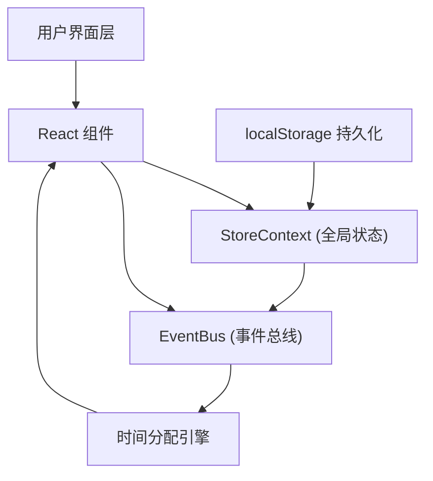
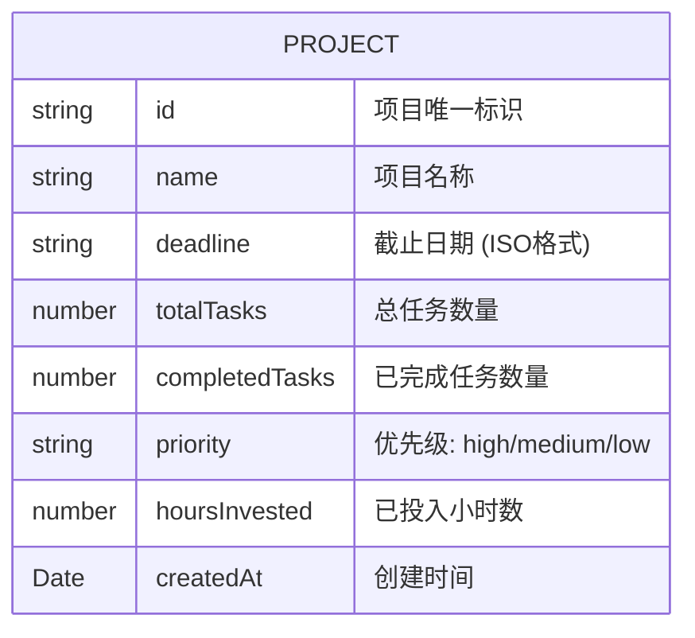

## 1. 架构设计

本应用采用纯前端架构，使用React Context进行全局状态管理，事件总线实现模块间解耦通信，localStorage实现数据持久化。



## 2. 技术描述

- **前端框架**：React@18 + TypeScript@5
- **构建工具**：Vite@5 + @vitejs/plugin-react
- **路由管理**：react-router-dom@6
- **动画库**：framer-motion@11
- **状态管理**：React.createContext + useReducer
- **事件通信**：自定义EventBus
- **数据持久化**：浏览器localStorage
- **样式方案**：CSS Modules / 内联样式 + CSS变量

## 3. 目录结构

```
src/
├── main.tsx                          # 应用入口
├── modules/
│   ├── projects/
│   │   ├── ProjectPanel.tsx          # 项目面板组件
│   │   └── ProjectForm.tsx           # 项目表单组件
│   ├── scheduler/
│   │   ├── TimeAllocator.ts          # 时间分配引擎
│   │   └── BudgetBar.tsx             # 预算可视化组件
│   └── shared/
│       ├── EventBus.ts               # 事件总线
│       └── StoreContext.tsx          # 全局状态上下文
```

## 4. 核心模块说明

### 4.1 全局状态上下文 (StoreContext)
- 管理项目列表、每日可用总时长
- 提供自定义Hook `useAppStore` 访问状态
- 支持添加、编辑、删除项目
- 支持更新项目投入时间

### 4.2 事件总线 (EventBus)
- 提供 `emit` 和 `on` 方法
- 项目数据变更时发布 `PROJECTS_UPDATED` 事件
- 预算组件订阅事件触发重新计算
- 实现模块解耦

### 4.3 时间分配引擎 (TimeAllocator)
- 纯函数模块，单一export函数 `allocateTime`
- 算法：最早截止时间优先 + 优先级加权 + 剩余任务量估算
- 输入：项目数组、每日可用总时长
- 输出：分配结果数组（精确到0.5小时）
- 性能：<20个项目时计算时间<50ms

### 4.4 BudgetBar 组件
- 使用framer-motion实现条形图动画
- 颜色渐变：绿色(0-10%偏差) → 橙色(10-30%偏差) → 红色(>30%偏差)
- 点击显示详细对比数据
- 显示项目名称缩写、实际/推荐小时数

## 5. 数据模型

### 5.1 项目数据模型



### 5.2 TypeScript 类型定义

```typescript
type Priority = 'high' | 'medium' | 'low';

interface Project {
  id: string;
  name: string;
  deadline: string;
  totalTasks: number;
  completedTasks: number;
  priority: Priority;
  hoursInvested: number;
  createdAt: string;
}

interface AllocationResult {
  projectId: string;
  projectName: string;
  recommendedHours: number;
  actualHours: number;
  deviationPercent: number;
}

interface AppState {
  projects: Project[];
  dailyAvailableHours: number;
}
```

## 6. 路由定义

| 路由 | 页面组件 | 功能描述 |
|------|----------|----------|
| / | ProjectPanel + BudgetBar | 主看板页面 |

## 7. 性能优化策略

1. **时间分配引擎**：
   - 纯函数设计，无副作用
   - 避免嵌套循环，时间复杂度O(n log n)
   - 计算结果缓存，相同输入直接返回

2. **React 渲染优化**：
   - 使用 useMemo 缓存计算结果
   - 使用 useCallback 缓存事件处理函数
   - 列表项使用稳定的key属性
   - AnimatePresence 仅在必要时重渲染

3. **数据持久化**：
   - 异步写入 localStorage
   - 防抖处理，避免频繁写入
   - 初始化时并行恢复数据

4. **动画性能**：
   - 使用 transform 和 opacity 动画
   - 避免触发 layout/reflow
   - 移动端降低动画复杂度
