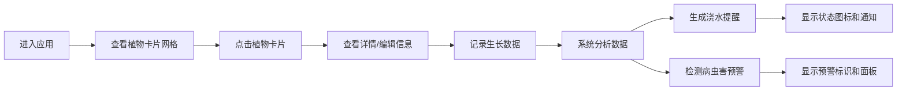

## 1. 产品概述

社区花园智能管理应用，帮助小型社区花园成员记录和共享植物生长数据、自动生成浇水提醒和病虫害预警，解决信息分散导致植物被过度或不足照顾、以及病虫害发现不及时的问题。

- 面向社区花园成员，提供植物全生命周期管理
- 通过数据驱动的智能提醒，提升植物养护效率和质量

## 2. 核心功能

### 2.1 用户角色

| 角色 | 注册方式 | 核心权限 |
|------|----------|----------|
| 社区成员 | 无需注册，本地使用 | 录入植物信息、记录生长数据、查看智能提醒、管理病虫害预警 |

### 2.2 功能模块

1. **植物档案管理**：植物卡片展示、信息录入、卡片翻转动画
2. **生长数据记录**：每日数据录入、7天/30天趋势折线图
3. **智能浇水提醒**：浇水状态判断、状态图标、滚动通知栏
4. **病虫害预警**：异常检测、预警标识、预警面板
5. **响应式布局**：三栏桌面布局、移动端堆叠布局

### 2.3 页面详情

| 页面名称 | 模块名称 | 功能描述 |
|----------|----------|----------|
| 主页面 | 顶部导航栏 | 显示应用标题，移动端汉堡菜单 |
| 主页面 | 左栏筛选区 | 植物分类筛选、病虫害预警面板 |
| 主页面 | 中栏卡片区 | 植物卡片网格展示、翻转动画、浇水状态图标 |
| 主页面 | 右栏详情区 | 生长趋势图、编辑表单、浇水记录时间线 |
| 主页面 | 滚动通知栏 | 智能浇水提醒轮播展示 |

## 3. 核心流程

用户打开应用后，可以浏览所有植物卡片，点击查看详情，录入生长数据，系统自动分析并生成浇水提醒和病虫害预警。

## 4. 用户界面设计

### 4.1 设计风格

- **主色调**：深绿 #2E7D32、主绿 #4CAF50、浅绿 #E8F5E9
- **背景色**：极浅绿 #F1F8E9
- **按钮风格**：圆角8px，主按钮 #4CAF50，次要按钮 #A5D6A7，悬停亮度+20%，点击缩放0.95倍
- **字体**：Google Fonts - Quicksand，导航18px居中白色文字
- **卡片风格**：180×220px，圆角12px，浅绿背景，2px虚线边框 #A5D6A7，悬停实线边框 #4CAF50 并上浮4px（0.3s过渡）
- **图标**：使用 Lucide React 图标库，水滴、三角形、圆点、感叹号等

### 4.2 页面设计概览

| 页面名称 | 模块名称 | UI元素 |
|----------|----------|---------|
| 主页面 | 导航栏 | 深绿背景，白色标题，移动端汉堡菜单 |
| 主页面 | 左栏 | 240px宽，分类筛选，病虫害预警面板（毛玻璃效果，内发光 #E53935） |
| 主页面 | 中栏 | 自适应宽度，卡片网格（gap 16px，平板2列、桌面3列） |
| 主页面 | 右栏 | 300px宽，折线图（500×200px），编辑表单，时间线（8px圆点，颜色区分操作类型） |
| 主页面 | 通知栏 | 浅黄 #FFF9C4 背景，深褐 #5D4037 文字，淡入淡出动画 |

### 4.3 响应式设计

- **桌面端（>1024px）**：三栏布局，左240px + 中自适应 + 右300px
- **平板端（768px-1024px）**：卡片网格2列，保持三栏
- **移动端（<768px）**：导航栏变为汉堡菜单，三栏堆叠为上下结构，毛玻璃面板全宽显示
- **触控优化**：按钮最小触控区域44px，卡片点击反馈清晰

### 4.4 动画效果

- 卡片加载：0.3s从底部向上滑入并淡入（GPU加速）
- 卡片翻转：3D翻转动画
- 卡片悬停：上浮4px，边框变实线（0.3s过渡）
- 通知栏：0.5s淡入淡出切换
- 预警图标：脉动动画周期1s
- 所有动画使用 transform 和 opacity 启用GPU加速
