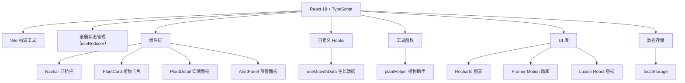

## 1. 架构设计



## 2. 技术描述

- **前端框架**：React 18 + TypeScript
- **构建工具**：Vite
- **状态管理**：React useReducer（全局状态）
- **图表库**：Recharts（折线图）
- **动画库**：Framer Motion（交互动画）
- **图标库**：Lucide React
- **数据存储**：localStorage（本地持久化）
- **CSS方案**：全局CSS + CSS变量
- **唯一ID**：uuid库

## 3. 项目文件结构

```
d:\Pro\tasks\auto156\
├── package.json
├── index.html
├── vite.config.js
├── tsconfig.json
└── src/
    ├── main.tsx          # React入口
    ├── App.tsx           # 主应用组件，三栏布局，全局状态
    ├── components/
    │   ├── PlantCard.tsx    # 植物卡片（翻转、状态图标）
    │   ├── PlantDetail.tsx  # 详情面板（图表、时间线、表单）
    │   ├── Navbar.tsx       # 导航栏（响应式、汉堡菜单）
    │   └── AlertPanel.tsx   # 病虫害预警面板
    ├── hooks/
    │   └── useGrowthData.ts # 生长数据Hook
    ├── utils/
    │   └── plantHelper.ts   # 工具函数（浇水判断、病虫害检测）
    └── styles/
        └── global.css       # 全局样式
```

## 4. 数据模型定义

### 4.1 TypeScript 类型定义

```typescript
// 植物基本信息
interface Plant {
  id: string;
  name: string;
  variety: string;
  plantDate: string;
  location: string;
  waterPreference: 'low' | 'medium' | 'high';
  photo?: string;
  growthLogs: GrowthLog[];
  waterRecords: WaterRecord[];
  alerts: Alert[];
}

// 生长日志
interface GrowthLog {
  id: string;
  date: string;
  height: number;
  leafCount: number;
  soilMoisture: number;
  leafColor: 'green' | 'yellow' | 'brown' | 'spotted';
  markedAbnormal: boolean;
}

// 浇水记录
interface WaterRecord {
  id: string;
  date: string;
  type: 'water' | 'fertilize' | 'prune';
  amount?: number;
  note?: string;
}

// 预警信息
interface Alert {
  id: string;
  plantId: string;
  type: 'pest' | 'disease' | 'water';
  description: string;
  suggestion: string;
  date: string;
  resolved: boolean;
}

// 浇水状态
type WaterStatus = 'normal' | 'need-water-soon' | 'need-water-now';

// 图表数据点
interface ChartDataPoint {
  date: string;
  height: number;
  leafCount: number;
  soilMoisture: number;
}

// 全局应用状态
interface AppState {
  plants: Plant[];
  selectedPlantId: string | null;
  alerts: Alert[];
  filterCategory: string;
  mobileMenuOpen: boolean;
}
```

### 4.2 核心算法

1. **浇水状态判断**：
   - 计算最近3天土壤湿度平均值
   - 根据植物品种偏好（低/中/高）设定阈值
   - 平均值 > 60%：正常（绿色水滴）
   - 平均值 40-60%：即将需水（黄色三角）
   - 平均值 < 40%：已缺水（红色圆点）

2. **病虫害检测规则**：
   - 连续3天叶片数量减少超过10%
   - 用户手动标记异常
   - 叶片颜色异常（yellow/brown/spotted）

3. **数据持久化**：
   - 使用 localStorage 存储植物列表
   - 数据变更时自动保存
   - 应用启动时从 localStorage 恢复

## 5. 性能要求

- 折线图渲染和数据更新延迟 ≤ 100ms
- 卡片网格滚动帧率 ≥ 50fps
- 所有动画使用 transform 和 opacity 启用GPU加速
- 组件懒加载和数据分页（如需要）
