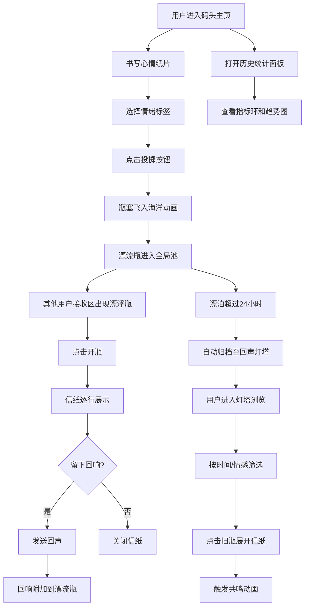

## 1. 产品概述

微型匿名情绪漂流瓶与时空回响——一个沉浸式虚拟海洋网页应用，用户可以写下匿名心情纸片装入漂流瓶掷入大海，瓶子随随机洋流漂向其他海岸（其他用户的屏幕），接收者可打开瓶中信并留下回响回声。超过24小时的漂流瓶自动归档至回声灯塔，用户可按时间和情感主题筛选重读旧瓶，每次重读触发共鸣动画。

- 目标用户：寻求情感表达与匿名共鸣的互联网用户
- 核心价值：以沉浸式海洋视觉体验包裹匿名情绪交互，创造"跨越时空的心灵回响"

## 2. 核心功能

### 2.1 用户角色

| 角色 | 注册方式 | 核心权限 |
|------|----------|----------|
| 匿名用户 | 无需注册 | 投掷漂流瓶、接收漂流瓶、留下回响、浏览回声灯塔、查看统计 |

### 2.2 功能模块

1. **码头主页**：投掷区（书写+情绪选择+投掷动画）、接收区（漂浮瓶+开瓶动画+信纸展示）、洋流指示带
2. **回声灯塔页**：夜光照明效果、圆柱灯塔塔身+旋转灯光、环绕漂浮旧瓶（按情感分类着色）、点击展开历史信纸
3. **历史统计面板**：毛玻璃覆盖层、三个指标环（已投掷/已接收/已归档）、一周情绪趋势柱状图

### 2.3 页面详情

| 页面名称 | 模块名称 | 功能描述 |
|----------|----------|----------|
| 码头主页 | 投掷区 | 亮木色码头面板，内嵌文本编辑框（获焦渐变边框）、圆形漂流瓶投掷按钮（悬停倾斜+点击瓶塞飞入动画）、情绪拾取滑块 |
| 码头主页 | 接收区 | 半透明面板，中央漂浮瓶身SVG（2px/2s浮动），悬停放大+裂纹特效，点击开瓶动画→信纸逐行显示 |
| 码头主页 | 洋流指示带 | 底部半透明带，显示最近5条漂流瓶投掷时间和情感标签，新瓶蓝色光晕闪烁0.5s |
| 码头主页 | 导航锚点 | 两个半透明圆形按钮跳转至回声灯塔和历史统计面板 |
| 回声灯塔 | 夜光照明 | 2秒渐入照亮效果 |
| 回声灯塔 | 灯塔塔身 | 圆柱形塔身+顶部红白条纹旋转灯光2s周期闪烁 |
| 回声灯塔 | 环绕旧瓶 | 按情感分类颜色（快乐黄/悲伤蓝/思考绿/惊奇紫）的小瓶围绕塔身旋转，2分钟一圈 |
| 回声灯塔 | 历史信纸 | 点击旧瓶展开信纸，0.3s快速展开动画 |
| 历史统计面板 | 指标环 | 3个80x80渐变填充圆环（投掷黄/接收蓝/归档绿），中央显示数值 |
| 历史统计面板 | 情绪趋势图 | 一周柱状图，柱色对应情感分类色，柱顶显示数值 |

## 3. 核心流程

用户打开页面→看到虚拟海洋码头→在投掷区写下心情选择情绪→点击投掷按钮→瓶塞飞入海洋动画→瓶子进入全局池→其他用户接收区出现漂浮瓶→点击开瓶→信纸逐行显示→可留下回响→超过24小时瓶子自动归档到回声灯塔→用户可进入灯塔浏览/筛选旧瓶→重读触发共鸣动画→查看统计面板了解历史数据

## 4. 用户界面设计

### 4.1 设计风格

- **主色调**：深蓝#0B192C到墨蓝#1A2B4C渐变海洋背景
- **辅助色**：亮木色#DEB887（投掷区）、琥珀色#E6B800（按钮）、金色#D4AF37（导航锚点边线）
- **情感色彩**：快乐黄#FFD700、悲伤蓝#4A90D9、思考绿#2ECC71、惊奇紫#9B59B6
- **字体**：Google Fonts选用，深蓝字色16px
- **布局风格**：中央900px码头区，左右对称分区，底部洋流带
- **按钮风格**：圆形按钮（直径40-48px），半透明导航锚点
- **动画风格**：CSS关键帧+framer-motion，浮动/渐变/旋转/裂纹特效

### 4.2 页面设计概览

| 页面名称 | 模块名称 | UI元素 |
|----------|----------|--------|
| 码头主页 | 背景层 | 深蓝→墨蓝渐变，左上角0.6s周期浪潮波纹canvas动画 |
| 码头主页 | 投掷区 | 400×320px亮木色#DEB887圆角16px面板，内嵌360×180px浅米白#FEF9E7文本框，获焦0.4s渐变边框#FFD700→#FF6F61，下方48px琥珀色圆形投掷按钮+情绪滑块 |
| 码头主页 | 接收区 | 400×320px半透明#1A2B4C/0.85圆角16px面板，200px高SVG瓶身渐变#4A90D9→#8A5C00，2px/2s浮动，悬停1.1倍+裂纹0.5s，点击开瓶0.4s→300×200px信纸逐行0.2s |
| 码头主页 | 导航锚点 | 2个40px直径圆形，#1A2B4C背景#D4AF37边线 |
| 码头主页 | 洋流带 | 30px高半透明#1A2B4C，12px白色文字缓慢左滚，新瓶0.5s蓝色光晕 |
| 回声灯塔 | 照明效果 | 2秒渐入夜光 |
| 回声灯塔 | 灯塔塔身 | 200×400px浅灰→深灰渐变圆柱，顶部红白条纹2s周期闪烁旋转灯光 |
| 回声灯塔 | 环绕旧瓶 | 20×12px小瓶，按情感分类色，随机位置2分钟一圈旋转 |
| 回声灯塔 | 信纸展开 | 0.3s快速展开（与接收区一致但更快） |
| 统计面板 | 毛玻璃面板 | 360×400px模糊8px白色0.1背景 |
| 统计面板 | 指标环 | 3个80×80px圆环，8px粗渐变填充 |
| 统计面板 | 趋势图 | 180px高柱状图，20px宽10px间距，情感分类色柱顶数值 |

### 4.3 响应式设计

- **桌面优先**：标准布局900px码头区
- **768px以下**：码头和接收区垂直堆叠（每区域宽100%），所有圆形按钮缩放1.2倍适配触控
- **帧率**：所有动画保持60fps，交互响应<200ms

### 4.4 3D场景指引

不适用——本应用采用2D SVG+CSS动画实现沉浸式海洋效果，不使用3D渲染。
