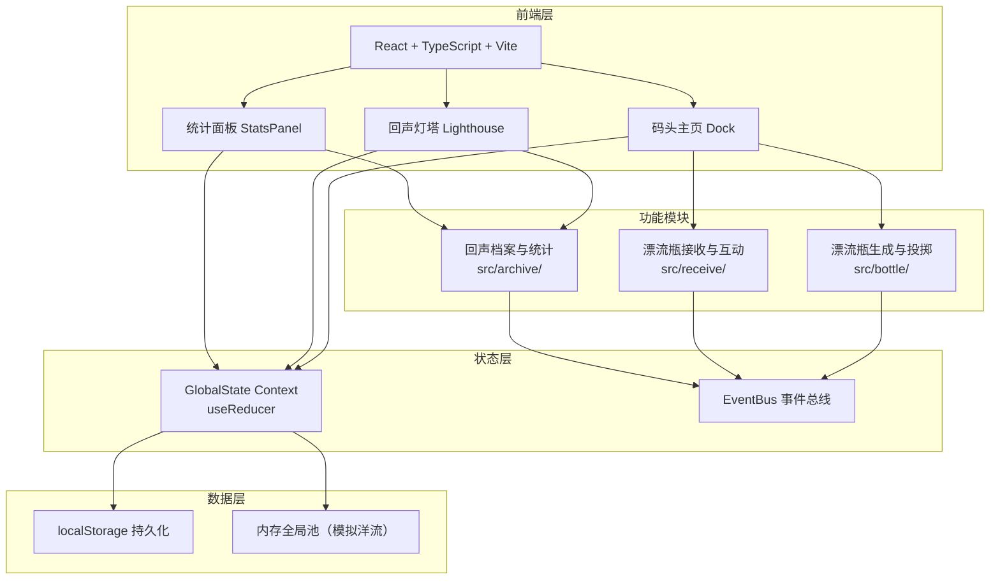
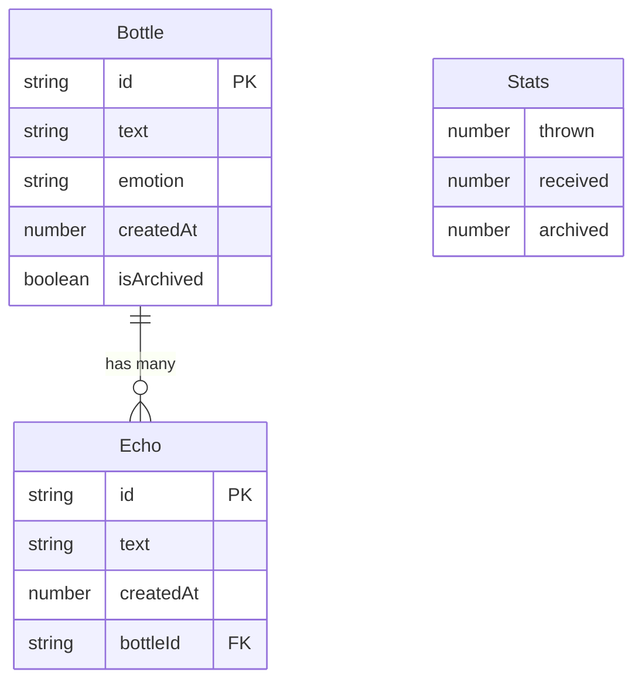

## 1. 架构设计



## 2. 技术说明

- **前端**：React@18 + TypeScript + Vite + framer-motion
- **初始化工具**：vite-init（react-ts模板）
- **后端**：无（纯前端应用，使用localStorage模拟持久化，内存模拟洋流全局池）
- **数据库**：无（localStorage + 内存状态）
- **状态管理**：React Context + useReducer（用户指定） + EventBus事件总线（模块间解耦）
- **路由**：react-router-dom
- **动画**：framer-motion + CSS关键帧 + Canvas（波浪动画）
- **样式**：CSS Modules / 内联样式（用户未指定Tailwind，按需使用）

## 3. 路由定义

| 路由 | 用途 |
|------|------|
| `/` | 码头主页——投掷区和接收区 |
| `/lighthouse` | 回声灯塔——归档漂流瓶浏览 |
| `/stats` | 历史统计面板（作为覆盖层） |

## 4. API定义

无后端API。所有数据通过以下方式管理：

### 4.1 EventBus事件类型

| 事件名 | 载荷 | 说明 |
|--------|------|------|
| `BOTTLE_THROWN` | `{ id, text, emotion, createdAt }` | 新漂流瓶投掷 |
| `BOTTLE_RECEIVED` | `{ id }` | 漂流瓶被接收 |
| `BOTTLE_OPENED` | `{ id }` | 漂流瓶被打开 |
| `ECHO_SENT` | `{ bottleId, echoText }` | 回响发送 |
| `BOTTLE_ARCHIVED` | `{ id }` | 漂流瓶归档 |

### 4.2 GlobalState数据结构

```typescript
interface Bottle {
  id: string;
  text: string;
  emotion: 'happy' | 'sad' | 'think' | 'surprise';
  createdAt: number;
  isArchived: boolean;
  echoes: Echo[];
}

interface Echo {
  id: string;
  text: string;
  createdAt: number;
}

interface GlobalState {
  bottles: Bottle[];
  currentBottle: Bottle | null;
  stats: {
    thrown: number;
    received: number;
    archived: number;
    weeklyEmotions: Record<string, number[]>;
  };
  currentEvents: CurrentEvent[];
}

interface CurrentEvent {
  id: string;
  time: string;
  emotion: string;
  isNew: boolean;
}
```

## 5. 服务器架构图

不适用——纯前端应用。

## 6. 数据模型

### 6.1 数据模型定义



### 6.2 数据存储

- **localStorage键**：`driftbottle_bottles`（所有漂流瓶JSON）、`driftbottle_stats`（统计数据JSON）
- **自动归档**：应用启动和定时器（每分钟检查一次）将创建时间超过24小时的漂流瓶标记为`isArchived: true`
