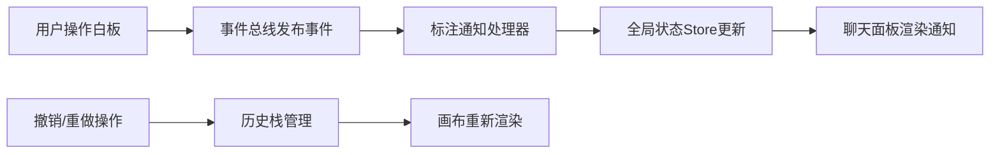

## 1. 产品概述
微型远程协作白板与即时标注反馈应用，让团队成员在共享画布上绘制草图、添加便签和高亮标注，并通过消息通道实时同步变更和发起讨论。
- 核心价值：提供轻量级的远程协作工具，支持实时图形绘制和即时沟通反馈
- 目标用户：需要快速头脑风暴和协作设计的团队成员

## 2. 核心特性

### 2.1 用户角色
| 角色 | 注册方式 | 核心权限 |
|------|----------|----------|
| 普通用户 | 模拟用户登录 | 使用白板绘制、发送消息、接收通知 |

### 2.2 功能模块
1. **白板绘制模块**：矢量图形绘制（笔、矩形、圆形）、便签管理、撤销/重做、缩放平移
2. **即时通讯模块**：消息列表、消息输入、标注通知推送
3. **会话管理**：会话显示、在线用户、新建会话

### 2.3 页面详情
| 页面名称 | 模块名称 | 功能描述 |
|---------|----------|----------|
| 主页面 | 左侧工具栏 | 工具选择（笔/矩形/圆形/便签）、颜色选择、笔触宽度 |
| 主页面 | 顶部工具栏 | 撤销/重做、会话名称、在线用户、新建会话 |
| 主页面 | 中央画布 | 900x600白色画布、网格线、矢量图形渲染、缩放平移 |
| 主页面 | 右侧聊天面板 | 消息列表、输入框、标注通知卡片 |

## 3. 核心流程
用户打开应用 → 选择绘制工具 → 在画布上绘制图形 → 系统通过事件总线发送标注事件 → 聊天模块接收事件并生成通知 → 通知推送到聊天面板

## 4. 用户界面设计
### 4.1 设计风格
- 主色调：深灰#2C3E50、中灰#34495E、蓝色#3498DB
- 辅助色：红色#E74C3C、绿色#2ECC71、黄色#F1C40F、紫色等8种预设色
- 按钮风格：圆角8px，悬停过渡0.2s ease-out，点击缩放反馈
- 字体：系统默认无衬线字体，清晰可读
- 布局：左侧垂直工具栏+顶部水平工具栏+中央画布+右侧聊天面板
- 图标风格：简约线性图标，白色20px

### 4.2 页面设计概述
| 页面名称 | 模块名称 | UI元素 |
|---------|----------|--------|
| 主页面 | 左侧工具栏 | 深色背景#2C3E50，宽60px，工具图标白色20px，色板圆点24px |
| 主页面 | 顶部工具栏 | 深灰#34495E，高50px，撤销重做按钮40x40px圆角8px |
| 主页面 | 画布区域 | 白色#FFFFFF背景，浅灰#E0E0E0 1px网格线，900x600px |
| 主页面 | 便签 | 宽150px高120px，默认#FFF9C4黄色，圆角8px，虚线边框#F0E68C |
| 主页面 | 聊天面板 | 宽320px，浅灰#F8F9FA背景，消息卡片浅蓝#ECF0F1背景 |
| 主页面 | 通知卡片 | 左边框3px彩色实线，从右侧滑入动画0.4s |

### 4.3 响应式
- 桌面端优先设计
- 宽度低于1024px时，聊天面板折叠为浮动圆形按钮（直径50px，蓝色#3498DB）
- 点击浮动按钮弹出全屏覆盖层显示聊天

### 4.4 动画效果
- 所有交互元素带0.2s ease-out过渡
- 按钮点击缩放scale 0.95→1.05
- 通知卡片从右侧滑入translateX(30px)→0，持续0.4s
- 便签删除动画
- 画布网格线缩放时保持1px宽度
