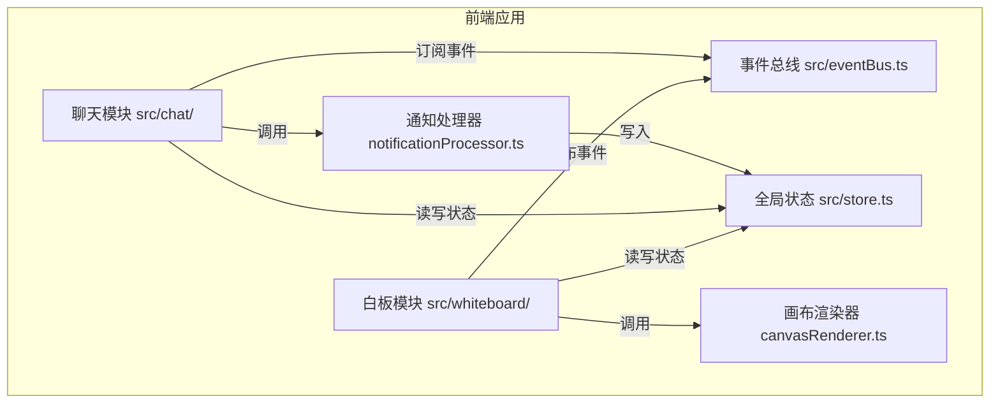

## 1. 架构设计


## 2. 技术选型
- 前端框架：React 18 + TypeScript
- 构建工具：Vite
- 路由：react-router-dom
- 动画：framer-motion
- 状态管理：自定义 Store（结合 React Context + useReducer 模式）
- 事件通信：自定义 EventBus（发布订阅模式）
- 画布渲染：HTML5 Canvas API

## 3. 文件结构
```
src/
├── main.tsx              # 应用入口，初始化路由和全局状态
├── eventBus.ts           # 自定义事件总线
├── store.ts              # 全局状态管理
├── whiteboard/
│   ├── Whiteboard.tsx    # 白板组件
│   └── canvasRenderer.ts # 画布渲染器（纯函数）
└── chat/
    ├── ChatPanel.tsx     # 聊天面板组件
    └── notificationProcessor.ts # 通知处理器
```

## 4. 数据模型

### 4.1 图形类型定义
```typescript
interface BaseShape {
  id: string;
  type: 'pen' | 'rectangle' | 'circle' | 'sticky';
  color: string;
  strokeWidth: number;
  createdAt: number;
  createdBy: string;
}

interface PenShape extends BaseShape {
  type: 'pen';
  points: { x: number; y: number }[];
}

interface RectangleShape extends BaseShape {
  type: 'rectangle';
  x: number;
  y: number;
  width: number;
  height: number;
}

interface CircleShape extends BaseShape {
  type: 'circle';
  x: number;
  y: number;
  radius: number;
}

interface StickyNote extends BaseShape {
  type: 'sticky';
  x: number;
  y: number;
  text: string;
  bgColor: string;
  width: number;
  height: number;
}
```

### 4.2 用户类型
```typescript
interface User {
  id: string;
  name: string;
  avatarColor: string;
  isOnline: boolean;
}
```

### 4.3 消息类型
```typescript
interface ChatMessage {
  id: string;
  type: 'text' | 'notification';
  userId: string;
  content: string;
  timestamp: number;
  shapeInfo?: {
    shapeType: string;
    color: string;
    x: number;
    y: number;
  };
}
```

## 5. 事件总线定义
```typescript
// 事件类型
type EventType = 
  | 'shape:add'
  | 'shape:move'
  | 'shape:delete'
  | 'shape:update'
  | 'chat:message'
  | 'session:new'
  | 'user:join';

// 事件总线接口
interface EventBus {
  on(event: EventType, callback: (data: any) => void): () => void;
  emit(event: EventType, data: any): void;
  off(event: EventType, callback: (data: any) => void): void;
}
```

## 6. 核心模块职责

### 6.1 白板模块 (whiteboard/)
- Whiteboard.tsx：画布交互、工具管理、事件监听、状态同步
- canvasRenderer.ts：纯函数渲染，接收图形数组返回Canvas绘制命令，处理坐标变换

### 6.2 聊天模块 (chat/)
- ChatPanel.tsx：消息列表展示、输入框、通知渲染
- notificationProcessor.ts：处理白板事件，生成格式化通知文本

### 6.3 状态管理 (store.ts)
- 图形数组管理
- 用户列表管理
- 消息历史管理
- 撤销/重做历史栈
- 画布变换状态（缩放、平移）

### 6.4 事件总线 (eventBus.ts)
- 发布订阅模式
- 模块间解耦通信
- 支持多事件类型

## 7. 性能优化策略
- Canvas 批量渲染，使用 requestAnimationFrame
- 图形数据使用引用优化，避免不必要的重绘
- 撤销/重做使用快照或命令模式，限制历史栈大小（20步）
- 聊天消息虚拟滚动（如需要）
- 事件防抖/节流处理
