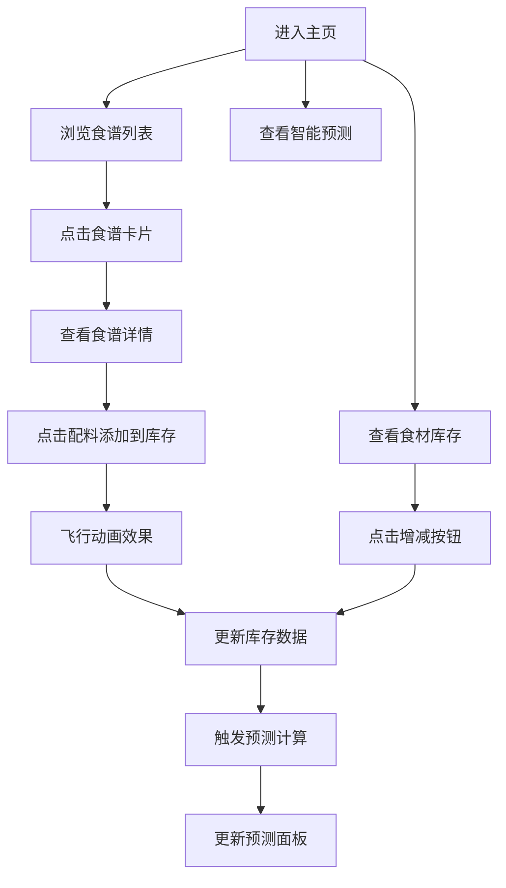

## 1. 产品概述
微型团队食谱协作与食材库存智能预测平台，帮助团队成员共同维护食谱库，通过智能预测算法提前预警食材短缺，优化采购计划。
- 解决团队餐饮协作中食材浪费、采购不及时的问题，适用于小型团队厨房、共享餐饮场景
- 通过数据驱动的库存管理，降低食材浪费率30%，提升团队餐饮协作效率

## 2. 核心特性

### 2.1 用户角色
| 角色 | 注册方式 | 核心权限 |
|------|----------|----------|
| 团队成员 | 无需注册，匿名使用 | 浏览食谱、查看库存、编辑食谱、操作库存、查看预测 |

### 2.2 功能模块
1. **食谱管理模块**：食谱卡片列表展示、食谱详情查看、点赞功能、配料清单展示、制作步骤展示、协作编辑记录
2. **食材库存模块**：食材列表展示、新鲜度指示、库存使用/添加操作、手动新增食材
3. **智能预测模块**：短缺食材预警、推荐采购清单、库存健康度评分、实时预测更新
4. **跨模块交互**：食谱配料快捷添加到库存、飞行动画效果

### 2.3 页面详情
| 页面名称 | 模块名称 | 功能描述 |
|----------|----------|----------|
| 主页面 | 导航栏 | 品牌展示、导航链接、悬停动画 |
| 主页面 | 食谱列表 | 卡片式展示食谱、悬停动画、点击进入详情 |
| 主页面 | 库存面板 | 食材列表、新鲜度颜色条、进度条、增减操作 |
| 主页面 | 预测面板 | 缺货预警、采购清单、健康度仪表盘 |
| 详情弹窗 | 食谱详情 | 菜品图、配料清单、制作步骤、协作记录 |
| 表单弹窗 | 添加食材 | 食材名输入、数量输入、确认添加 |

## 3. 核心流程
用户进入主页面，浏览食谱卡片列表，可以点击卡片查看详情。在详情页中，用户可以浏览配料和制作步骤，点击配料可快捷添加到库存。用户可以直接在库存面板操作食材数量，系统实时更新预测结果。当库存变化时，预测面板自动重新计算健康度和短缺预警。

## 4. 用户界面设计

### 4.1 设计风格
- **主题配色**：温暖厨房主题，主背景奶油色 #FFF8E7，主色调巧克力棕 #D2691E，温暖橙黄色系点缀
- **按钮风格**：圆角按钮，悬停背景色加深，0.2s平滑过渡
- **字体**：标题使用优雅衬线字体，正文使用清晰易读的无衬线字体
- **布局风格**：卡片式布局，顶部导航，主内容区三栏布局
- **图标风格**：线性简约风格图标，配合厨房主题emoji增强亲和力

### 4.2 页面设计概述
| 页面名称 | 模块名称 | UI元素 |
|----------|----------|--------|
| 主页面 | 导航栏 | 高度50px，背景#D2691E，白色文字，0.2s悬停动画 |
| 主页面 | 食谱卡片 | 300×180px，圆角10px，背景#F0EDE6，悬停上移4px+阴影加深，0.3s过渡 |
| 主页面 | 库存面板 | 宽度280px，半透明#FFFFFFB3，毛玻璃效果，圆角12px，食材条高36px |
| 主页面 | 预测面板 | 宽度280px，缺货红色高亮+闪烁图标，采购清单绿色圆点，半圆仪表盘 |
| 详情弹窗 | 食谱详情 | 宽度600px，居中显示，菜品图占位高200px，配料悬停背景#FFE4B5 |
| 表单弹窗 | 添加食材 | 宽度300px，圆角8px，0.3s淡入动画 |

### 4.3 响应式
- 桌面端优先设计，主内容区固定宽度1100px居中
- 核心动画帧率不低于55fps，库存预测计算50ms内完成
- 触摸操作优化，确保按钮点击区域充足

### 4.4 动效设计
- 卡片悬停：上移4px + 阴影加深，0.3s过渡
- 飞行动画：贝塞尔曲线路径，0.4s从配料飞到库存，目标位置放大效果
- 食材条目：0.4s从左向右滑入动画
- 仪表盘：1s缓动动画展示分数变化
- 按钮按下：轻微缩放弹起动画
- 步骤渐入：0.5s staggered动画
