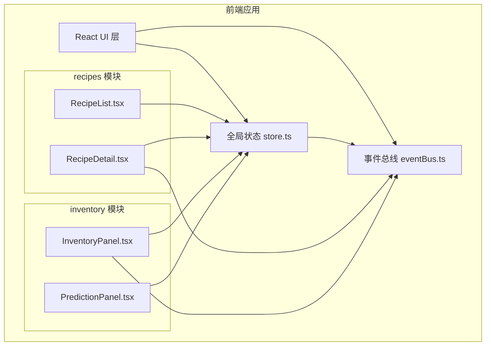
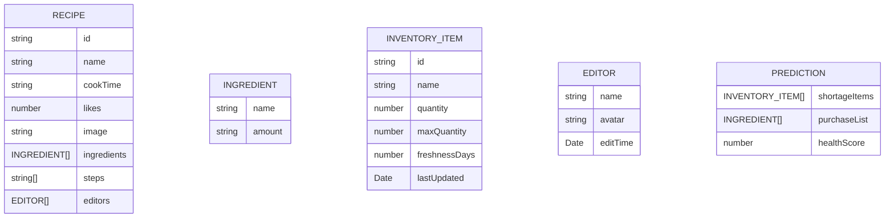

## 1. 架构设计



## 2. 技术描述
- **前端框架**: React 18 + TypeScript 5
- **构建工具**: Vite 5
- **动画库**: framer-motion 11
- **状态管理**: useReducer + Context API (自定义全局store)
- **事件通信**: 自定义事件总线 eventBus.ts
- **样式方案**: 原生 CSS + CSS 变量 + framer-motion 动画

## 3. 数据模型

### 3.1 数据模型定义


### 3.2 TypeScript 类型定义
```typescript
// 食谱相关类型
interface Ingredient {
  name: string;
  amount: string;
}

interface Editor {
  name: string;
  avatar: string;
  editTime: Date;
}

interface Recipe {
  id: string;
  name: string;
  cookTime: string;
  likes: number;
  image: string;
  ingredients: Ingredient[];
  steps: string[];
  editors: Editor[];
}

// 库存相关类型
interface InventoryItem {
  id: string;
  name: string;
  quantity: number;
  maxQuantity: number;
  freshnessDays: number;
  lastUpdated: Date;
}

interface PredictionResult {
  shortageItems: InventoryItem[];
  purchaseList: { name: string; recommendedAmount: number }[];
  healthScore: number;
}

// 全局状态
interface AppState {
  recipes: Recipe[];
  inventory: InventoryItem[];
}
```

## 4. 模块划分

### 4.1 目录结构
```
src/
├── main.tsx                 # React 入口
├── App.tsx                  # 根组件
├── store.ts                 # 全局状态管理 (useReducer)
├── eventBus.ts              # 自定义事件总线
├── recipes/                 # 食谱管理模块
│   ├── RecipeList.tsx       # 食谱列表组件
│   └── RecipeDetail.tsx     # 食谱详情组件
├── inventory/               # 食材库存与预测模块
│   ├── InventoryPanel.tsx   # 库存面板组件
│   └── PredictionPanel.tsx  # 预测面板组件
└── types/                   # 类型定义
    └── index.ts
```

### 4.2 模块职责
1. **recipes 模块**：负责食谱的展示、详情查看、点赞、配料点击事件触发
2. **inventory 模块**：负责食材库存的增删改查、新鲜度计算、短缺预测
3. **eventBus**：模块间解耦通信，支持 `emit` 和 `on` 方法
4. **store**：全局单一数据源，使用 useReducer 管理状态更新

## 5. 核心算法

### 5.1 新鲜度计算
```typescript
function getFreshnessLevel(item: InventoryItem): 'green' | 'yellow' | 'red' {
  const days = item.freshnessDays;
  if (days > 3) return 'green';
  if (days >= 1) return 'yellow';
  return 'red';
}
```

### 5.2 短缺预测算法
```typescript
function predictShortage(inventory: InventoryItem[], recipes: Recipe[]): PredictionResult {
  // 计算食谱使用频率（根据点赞数模拟）
  const usageFrequency = recipes.reduce((acc, recipe) => {
    recipe.ingredients.forEach(ing => {
      acc[ing.name] = (acc[ing.name] || 0) + recipe.likes;
    });
    return acc;
  }, {} as Record<string, number>);

  // 预测未来一周需求
  const shortageItems = inventory.filter(item => {
    const predictedUsage = (usageFrequency[item.name] || 0) * 0.1;
    return item.quantity - predictedUsage < item.maxQuantity * 0.2;
  });

  // 计算健康度分数
  const totalItems = inventory.length;
  const healthyItems = inventory.filter(
    item => item.quantity > item.maxQuantity * 0.3 && item.freshnessDays > 1
  ).length;
  const healthScore = Math.round((healthyItems / totalItems) * 100);

  return {
    shortageItems,
    purchaseList: shortageItems.map(item => ({
      name: item.name,
      recommendedAmount: item.maxQuantity - item.quantity
    })),
    healthScore
  };
}
```

### 5.3 性能约束
- 预测计算必须在 50ms 内完成
- 使用 `useMemo` 缓存预测结果
- 动画使用 GPU 加速属性（transform, opacity）
- 所有动画帧率不低于 55fps

## 6. 事件定义
```typescript
// 事件类型
enum EventType {
  INGREDIENT_CLICK = 'ingredient:click',
  INVENTORY_UPDATED = 'inventory:updated',
  RECIPE_LIKED = 'recipe:liked',
}

// 事件总线接口
interface EventBus {
  on(event: string, callback: (data: any) => void): () => void;
  emit(event: string, data: any): void;
}
```

## 7. 性能优化策略
1. 使用 `React.memo` 避免不必要的重渲染
2. 使用 `useCallback` 缓存回调函数
3. 使用 `useMemo` 缓存计算密集型结果（如预测计算）
4. 动画使用 `will-change` 提示浏览器优化
5. 列表使用稳定的 `key` 属性
6. 预测计算使用惰性求值，仅在依赖变化时重新计算
