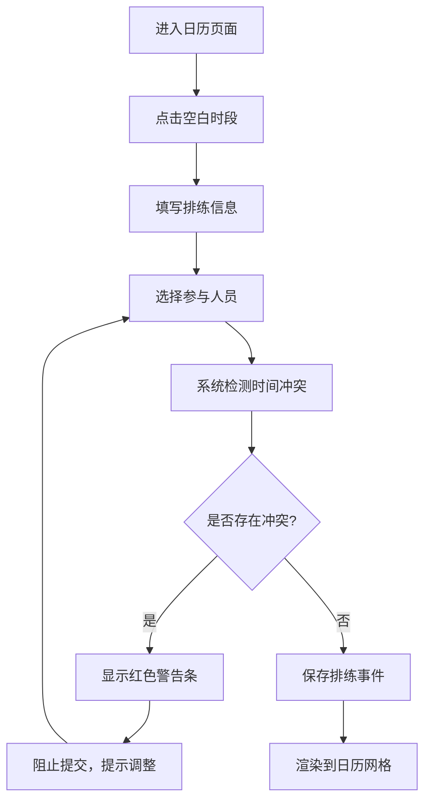
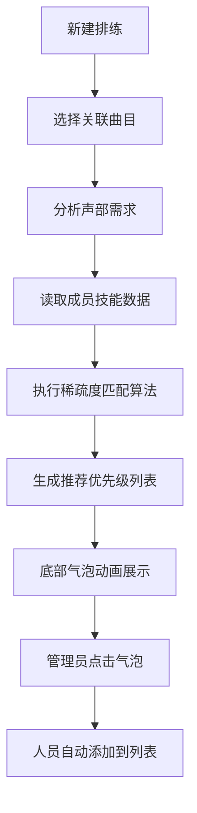

# 音乐社团管理系统 - 产品需求文档 (PRD)

## 1. 产品概述

面向小型音乐社团（合唱团、管弦乐队等）的排练管理Web应用，解决传统纸质排期容易冲突、合奏时声部分配不合理以及练习进度无法追溯的问题。通过智能声部分配算法和可视化进度追踪，提升社团排练效率。

- 核心价值：排练时间零冲突、声部分配最优化、练习进度可视化
- 目标用户：音乐社团指挥、团长、声部长及普通团员

## 2. 核心功能

### 2.1 用户角色

| 角色 | 注册方式 | 核心权限 |
|------|----------|----------|
| 社团管理员 | 内置账户 | 创建排练、管理曲目、成员管理、查看全部数据 |
| 普通成员 | 管理员添加 | 查看排期、更新个人练习进度、查看声部匹配结果 |

### 2.2 功能模块

1. **排练日历模块**：日历网格视图、排练事件创建/编辑、人员冲突实时检测、冲突可视化警告
2. **曲目管理模块**：曲目库CRUD、声部练习进度追踪、按多维度（BPM/调号/完成度）排序
3. **声部推荐引擎**：基于声部稀疏度与技能等级的成员匹配算法、浮动气泡式推荐展示、一键添加到排练
4. **成员管理模块**：成员信息维护（主声部、技能等级、可用时间）

### 2.3 页面详情

| 页面名称 | 模块名称 | 功能描述 |
|----------|----------|----------|
| 排练日历页 | 日历网格 | 按周/月视图展示排练事件，支持拖拽调整时间，冲突事件红色脉动边框 |
| 排练日历页 | 事件创建表单 | 弹窗表单：标题、日期、时长、参与人员选择，实时冲突检测 |
| 排练详情页 | 曲目卡片列表 | 展示本次排练涉及曲目，卡片正反面翻转显示进度详情 |
| 排练详情页 | 声部推荐气泡 | 底部浮动气泡动画展示推荐成员，支持一键添加 |
| 曲目库页面 | 曲目列表 | 网格布局展示所有曲目，支持BPM/调号/完成度排序，搜索过滤 |
| 曲目库页面 | 曲目编辑弹窗 | 编辑曲目信息（名称、作曲家、调号、BPM、声部分配要求） |
| 成员管理页 | 成员列表 | 展示成员信息，维护声部/技能等级/可用时间表 |

## 3. 核心流程

### 3.1 排练创建与冲突检测流程

管理员进入日历页 → 点击空白时段创建排练 → 填写基本信息并选择参与人员 → 系统实时检测人员时间冲突 → 若冲突则显示红色警告条并阻止提交 → 修改人员或时间后提交成功 → 事件渲染到日历网格

### 3.2 声部匹配推荐流程

新建排练并选择曲目 → 系统分析曲目声部分配要求 → 读取成员技能等级与可用时间 → 执行声部稀疏度算法 → 生成推荐名单 → 底部浮动气泡动画展示 → 管理员点击气泡一键添加 → 人员自动填充到参与列表

### 3.3 练习进度追踪流程

成员登录 → 进入曲目详情 → 选择所属声部 → 更新累计练习时长 → 系统按权重计算完成百分比 → 进度条实时更新 → 完成时显示绿色对号

## 4. 用户界面设计

### 4.1 设计风格

- **主色调**：深灰蓝 #1A237E（背景）、金色 #FFD54F（强调色/品牌色）
- **辅助色**：#263238（卡片毛玻璃背景）、#2E2E2E（事件卡片）、#3D5AFE（推荐气泡）、#E53935（冲突警告）、#4CAF50（完成状态）、#B0BEC5（未完成状态）
- **按钮风格**：圆角8px，悬停时背景从#FFD54F渐变到#FFC107，0.2s过渡
- **字体方案**：标题使用 'Noto Serif SC' 衬线字体体现音乐艺术感，正文使用 'PingFang SC' 无衬线确保可读性
- **布局风格**：顶部导航栏 + 中央内容区（1000px居中，毛玻璃效果），卡片式网格布局
- **图标风格**：音乐主题线条图标（高音谱号、音符、节拍器等），2px线宽

### 4.2 页面设计概述

| 页面名称 | 模块名称 | UI 元素 |
|----------|----------|----------|
| 排练日历页 | 顶部导航 | 高度56px，金色#FFD54F强调色，白色文字悬停高亮0.2s过渡 |
| 排练日历页 | 日历网格 | 7列布局，单元格最小高度120px，悬停0.3s上移4px阴影增大 |
| 排练日历页 | 事件卡片 | 宽180px高120px，圆角8px，深灰#2E2E2E背景白字，冲突时左侧3px红边+0.4s脉动动画 |
| 排练详情页 | 曲目卡片 | 圆角12px毛玻璃背景，正反面翻转3D效果（0.6s rotateY），背面进度条 |
| 排练详情页 | 推荐气泡 | 圆角24px，半透明#3D5AFE背景白字，底部渐入0.5s动画，悬停放大1.05倍 |
| 曲目库页面 | 曲目列表 | 响应式网格（桌面3列/平板2列/手机1列），间距24px |
| 曲目库页面 | 排序控件 | 金色边框下拉框，选项包含BPM升序/降序、调号、完成度 |

### 4.3 响应式适配

- **桌面端（>1024px）**：1000px固定宽度主区域，日历7列，曲目网格3列
- **平板端（768px-1024px）**：主区域宽度95%，日历保持7列但可横向滚动，曲目网格2列
- **手机端（<768px）**：日历变为单列滚动，导航栏收缩为汉堡菜单，曲目网格1列，事件卡片全宽展示
- **触摸优化**：最小点击区域44x44px， swipe手势切换日历周/月

## 5. 非功能需求

| 指标 | 要求 |
|------|------|
| 曲目库排序性能 | 100首曲目按BPM排序响应≤200ms |
| 日历渲染性能 | 30个事件同时渲染帧率≥50FPS |
| 动画流畅度 | 所有过渡动画60FPS，无掉帧卡顿 |
| 浏览器兼容 | Chrome 90+、Firefox 88+、Safari 14+、Edge 90+ |
| 无障碍支持 | WCAG 2.1 AA对比度，键盘导航完整支持 |
