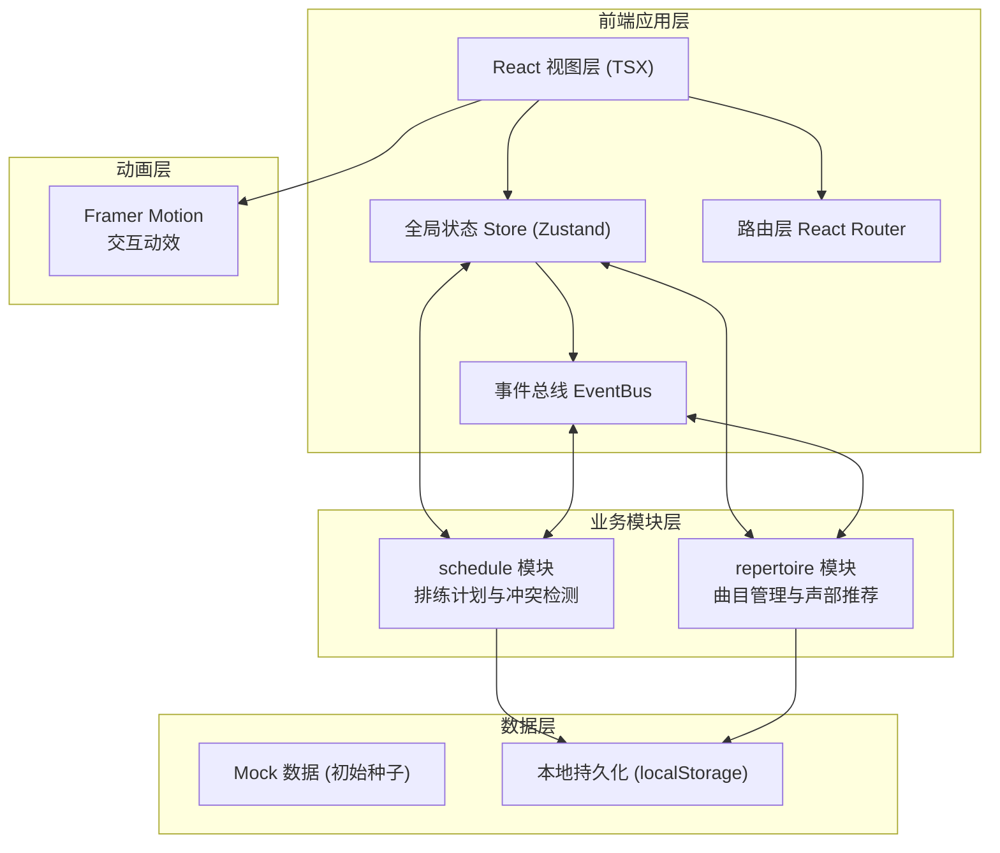
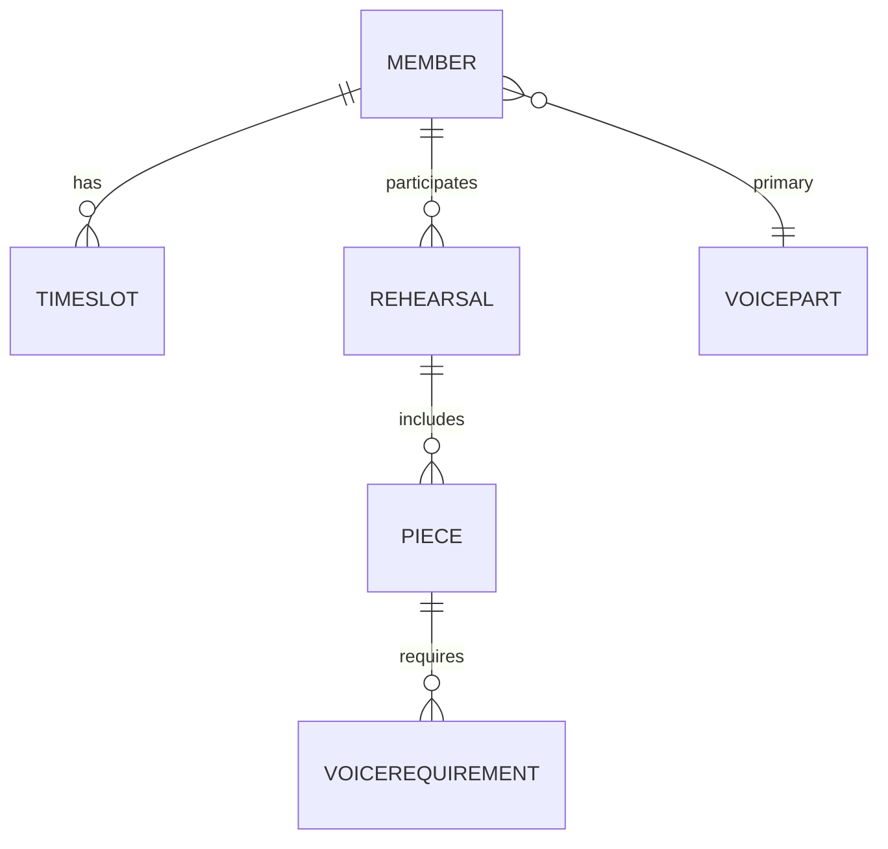

# 音乐社团管理系统 - 技术架构文档

## 1. 架构设计



## 2. 技术选型说明

| 技术栈 | 版本 | 用途说明 |
|--------|------|----------|
| React | ^18.2.0 | 核心UI框架，函数组件+Hooks |
| TypeScript | ^5.0.0 | 静态类型检查，strict模式 |
| Vite | ^5.0.0 | 构建工具，开发热更新，@vitejs/plugin-react |
| React Router DOM | ^6.20.0 | 路由管理，嵌套路由与动态参数 |
| Zustand | ^4.4.0 | 轻量级全局状态管理，替代Redux |
| Framer Motion | ^10.16.0 | 动画引擎，驱动气泡渐入、卡片翻转、冲突脉动 |
| localStorage | - | 浏览器本地持久化，模拟数据存储 |

## 3. 路由定义

| 路由路径 | 页面组件 | 功能用途 |
|----------|----------|----------|
| `/` | Calendar.tsx | 排练日历首页，默认着陆页 |
| `/rehearsal/:id` | RehearsalDetail.tsx | 排练详情页，含曲目列表和声部推荐 |
| `/repertoire` | RepertoirePage.tsx | 曲目库管理页，列表/搜索/排序 |
| `/members` | MembersPage.tsx | 成员管理页（附带实现） |

## 4. 数据模型定义

### 4.1 核心类型接口

```typescript
// 声部类型
type VoicePart = 'Soprano' | 'Alto' | 'Tenor' | 'Bass';

// 技能等级 1-5
type SkillLevel = 1 | 2 | 3 | 4 | 5;

// 成员接口
interface Member {
  id: string;
  name: string;
  primaryPart: VoicePart;
  secondaryPart?: VoicePart;
  skillLevel: SkillLevel;
  availableSlots: TimeSlot[]; // 可用时间段
  avatar?: string;
}

// 时间段
interface TimeSlot {
  dayOfWeek: number; // 0-6 周日到周六
  startTime: string; // "HH:mm" 格式
  endTime: string;
}

// 曲目接口
interface Piece {
  id: string;
  name: string;
  composer: string;
  key: string;        // 调号，如 "C Major", "a minor"
  bpm: number;
  requiredParts: VoicePart[]; // 需要的声部
  practiceProgress: ProgressRecord;
}

// 进度记录 - 按声部记录练习时长(分钟)
interface ProgressRecord {
  [part: string]: { practicedMinutes: number; targetMinutes: number };
}

// 排练事件接口
interface Rehearsal {
  id: string;
  title: string;
  date: string;        // "YYYY-MM-DD"
  startTime: string;   // "HH:mm"
  durationMinutes: number;
  participantIds: string[];
  pieceIds: string[];
  conflicts: ConflictRecord[];
}

// 冲突记录
interface ConflictRecord {
  memberId: string;
  conflictingRehearsalId: string;
}

// 成员推荐结果
interface MemberRecommendation {
  memberId: string;
  voicePart: VoicePart;
  score: number;       // 匹配分数，用于排序
  reason: string;      // 推荐理由
}
```

### 4.2 ER数据关系



## 5. 模块划分与文件结构

```
src/
├── main.tsx                 # 应用入口，挂载ReactDOM
├── App.tsx                  # 主组件，路由配置与全局布局
├── store.ts                 # Zustand全局状态Store
├── eventBus.ts              # 发布订阅事件总线
├── types/
│   └── index.ts             # 全局类型定义
├── schedule/                # 排练计划模块
│   ├── Calendar.tsx         # 日历网格组件
│   ├── ConflictBadge.tsx    # 冲突警告徽章
│   ├── RehearsalCard.tsx    # 排练事件卡片
│   ├── RehearsalDetail.tsx  # 排练详情页
│   ├── RehearsalForm.tsx    # 创建/编辑表单
│   └── utils.ts             # 冲突检测算法
├── repertoire/              # 曲目管理模块
│   ├── RepertoirePage.tsx   # 曲目库主页
│   ├── PieceCard.tsx        # 曲目卡片（翻转效果）
│   ├── PieceForm.tsx        # 曲目编辑表单
│   ├── MemberBubble.tsx     # 成员推荐浮动气泡
│   ├── ProgressBar.tsx      # 进度条组件
│   └── engine.ts            # 声部匹配推荐引擎
├── members/                 # 成员管理模块
│   ├── MembersPage.tsx
│   └── MemberForm.tsx
├── components/              # 通用组件
│   ├── Navbar.tsx           # 顶部导航
│   ├── Modal.tsx            # 通用弹窗
│   └── Button.tsx           # 通用按钮
├── data/
│   └── seed.ts              # Mock种子数据
└── styles/
    └── globals.css          # 全局样式与CSS变量
```

## 6. 核心算法设计

### 6.1 排练冲突检测算法 (schedule/utils.ts)

```
检测流程：
1. 遍历目标排练的参与人员列表
2. 对每个人员，检索其参与的所有其他排练
3. 检查时间区间是否重叠：
   - 排练A: [startA, startA + durationA]
   - 排练B: [startB, startB + durationB]
   - 重叠判定: startA < endB AND startB < endA
4. 若重叠，则记录冲突 (memberId + conflictingRehearsalId)
5. 事件总线 emit('conflict:detected', conflicts) 通知UI更新
```

### 6.2 声部稀疏度匹配推荐算法 (repertoire/engine.ts)

```
评分公式：
score = (0.4 * 声部稀疏度权重) + (0.3 * 技能匹配度) + (0.3 * 时间可用性)

1. 声部稀疏度 S = (当前该声部已分配人数) / (曲目声部需求人数)
   - S越小表示该声部越缺人，权重越高 (1 - S)
2. 技能匹配度 K = 成员技能等级 / 5
   - 若为主声部则 ×1.0，为副声部则 ×0.7
3. 时间可用性 T：成员可用时间完全覆盖排练时段则为1.0，部分覆盖按比例
4. 按score降序排列，取Top-5展示为推荐气泡
```

## 7. 性能优化策略

| 优化点 | 策略 |
|--------|------|
| 曲目排序性能 | 使用Array.sort原生实现，BPM字段为number避免类型转换，预先缓存排序结果 |
| 日历渲染性能 | React.memo包裹事件卡片，useMemo计算冲突状态，虚拟滚动处理大量事件 |
| 动画性能 | Framer Motion使用transform而非layout属性，will-change提示浏览器合成层 |
| 状态更新 | Zustand selector避免不必要的re-render，批量更新减少通知次数 |
| 首屏加载 | 路由懒加载 React.lazy + Suspense，种子数据延迟加载 |

## 8. 事件总线通信事件清单

| 事件名称 | 触发时机 | 载荷数据 | 订阅方 |
|----------|----------|----------|--------|
| `rehearsal:created` | 新排练创建成功 | Rehearsal对象 | 曲目模块、成员模块 |
| `rehearsal:updated` | 排练信息修改 | Rehearsal对象 | 日历组件重渲染 |
| `conflict:detected` | 冲突检测完成 | ConflictRecord[] | ConflictBadge显示警告 |
| `participant:added` | 添加参与人员 | {rehearsalId, memberId} | 推荐引擎重新计算 |
| `progress:updated` | 练习进度更新 | {pieceId, part, minutes} | 曲目卡片进度条 |
| `recommendation:generate` | 触发重新推荐 | {rehearsalId, pieceIds} | MemberBubble刷新列表 |
