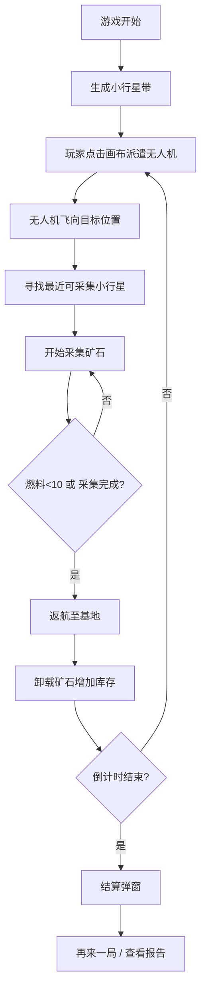

## 1. 产品概述

微型星际矿工小行星带资源采集与无人机调度游戏，玩家在有限时间内派遣无人机采集不同种类矿石并最大化收益。

- 核心玩法：策略调度无人机进行资源采集，平衡燃料消耗与采集效率
- 目标用户：策略游戏爱好者、休闲游戏玩家
- 产品价值：提供快节奏、高策略性的微型游戏体验

## 2. 核心特性

### 2.1 功能模块

1. **游戏主场景**：800x600px画布，小行星带渲染、星空背景、基地标识
2. **无人机管理面板**：左侧无人机状态列表、收回按钮、实时监控
3. **资源统计栏**：顶部资金、矿石库存、倒计时进度条
4. **游戏结算弹窗**：结束时展示收益、再来一局、详尽报告

### 2.2 页面详情

| 页面名称 | 模块名称 | 功能描述 |
|---------|---------|---------|
| 游戏主界面 | 小行星带 | 随机生成20-30颗小行星，自转，不重叠分布 |
| 游戏主界面 | 无人机飞行系统 | 派遣、飞行、采集、返航、燃料消耗计算 |
| 游戏主界面 | 无人机状态面板 | 显示编号、坐标、燃料条、状态文字、收回按钮 |
| 游戏主界面 | 资源统计栏 | 资金、铁/铜/水晶库存、2分钟倒计时 |
| 游戏主界面 | 结算弹窗 | 最终收益展示、再来一局、查看报告 |
| 游戏主界面 | 飘字动画 | 采集时+5飘字、坠毁图标动画 |

## 3. 核心流程

玩家点击画布派遣无人机 → 无人机飞向目标 → 自动寻找最近小行星采集 → 采集完成/燃料不足返航 → 基地卸载矿石 → 循环直到倒计时结束 → 结算收益

## 4. 用户界面设计

### 4.1 设计风格

- **主色调**：深空蓝黑 #0B0B1A 背景
- **高亮色**：青色 #00E5FF、金色 #FFD700
- **矿石色**：铁 #A0522D、铜 #CD7F32、水晶 #7FFFD4
- **按钮/状态色**：绿色 #00C853、蓝色 #2979FF、黄色 #FFD600、红色 #FF1744
- **面板风格**：半透明深色 + 毛玻璃效果、圆角设计
- **动画**：过渡动画 0.2s、自转、飘字、淡入淡出、缩放
- **字体**：现代无衬线字体，数字使用等宽字体增强科技感

### 4.2 页面设计概览

| 页面名称 | 模块名称 | UI元素 |
|---------|---------|--------|
| 游戏主界面 | 星空背景 | 数十颗1-2px白点，2-4秒周期闪烁，透明度0.5-1 |
| 游戏主界面 | 小行星带 | 圆形，25-45px直径，矿石色半透明0.9，1.5s一周自转 |
| 游戏主界面 | 基地 | 左下角绿色 #00FF00 十字符号 |
| 游戏主界面 | 无人机面板 | 左侧280px宽 #1A1A2E 半透明面板，圆角12px，毛玻璃 |
| 游戏主界面 | 无人机卡片 | 240x100px #0B0B1A 卡片，燃料渐变条、状态彩色文字、收回按钮 |
| 游戏主界面 | 资源统计栏 | 顶部50px高横条，资金金色数字、彩色矿石圆点、倒计时进度条 |
| 游戏主界面 | 结算弹窗 | 400x300px #1A1A2E 弹窗，48px加粗资金数字，0.5s淡入上移动画 |
| 游戏主界面 | 结算按钮 | 主按钮蓝色 #2979FF、副按钮透明边框，悬停过渡 |

### 4.3 响应式设计

- 桌面端优先设计，画布固定800x600px居中显示
- 面板和统计栏采用绝对定位布局，不受窗口大小影响
- 弹窗居中显示，适配不同屏幕尺寸

### 4.4 性能要求

- 游戏循环 60FPS 运行
- 所有动画（自转、飞行、飘字）流畅无卡顿
- 状态更新每1秒执行一次逻辑计算
- 渲染层使用 requestAnimationFrame 优化
