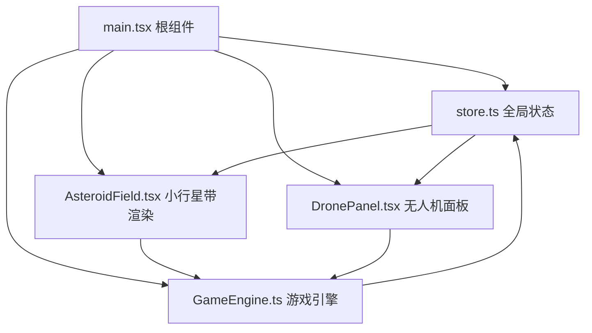
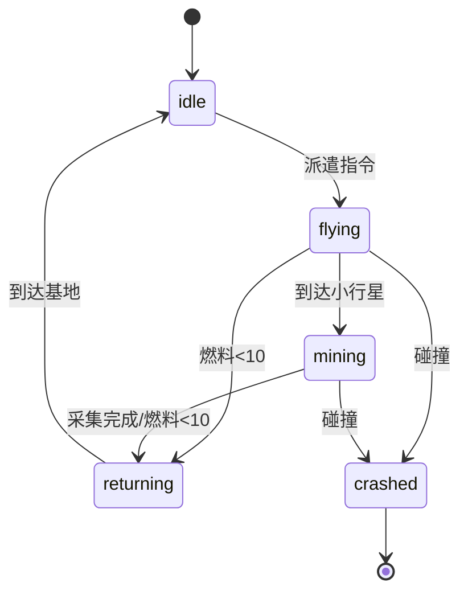

## 1. 架构设计



## 2. 技术说明

- **前端框架**：React@18 + TypeScript
- **构建工具**：Vite + @vitejs/plugin-react
- **状态管理**：自定义轻量级 store（Context + useReducer 或 React useState）
- **动画库**：framer-motion（组件动画）、Canvas API（游戏场景渲染）
- **无后端**：纯前端游戏，所有数据内存存储

**依赖清单**：
```json
{
  "react": "^18",
  "react-dom": "^18",
  "vite": "^5",
  "@vitejs/plugin-react": "^4",
  "typescript": "^5",
  "@types/react": "^18",
  "@types/react-dom": "^18",
  "framer-motion": "^11"
}
```

## 3. 文件结构

```
auto164/
├── package.json
├── index.html
├── vite.config.js
├── tsconfig.json
└── src/
    ├── main.tsx          # 根组件，布局与模块协调
    ├── store.ts          # 全局状态管理（无人机、矿石、燃料、资金）
    ├── AsteroidField.tsx # 小行星带 Canvas 渲染组件
    ├── DronePanel.tsx    # 无人机管理 UI 面板
    └── GameEngine.ts     # 游戏引擎逻辑（循环、碰撞、采集、燃料）
```

## 4. 数据模型定义

### 4.1 核心类型

```typescript
type OreType = 'iron' | 'copper' | 'crystal';

type DroneStatus = 'idle' | 'flying' | 'mining' | 'returning' | 'crashed';

interface Asteroid {
  id: string;
  x: number;
  y: number;
  diameter: number;
  oreType: OreType;
  oreReserve: number;
  maxReserve: number;
  rotationAngle: number;
  rotationSpeed: number;
}

interface Drone {
  id: string;
  number: number;
  x: number;
  y: number;
  targetX: number | null;
  targetY: number | null;
  fuel: number;
  maxFuel: number;
  status: DroneStatus;
  currentAsteroidId: string | null;
  cargoType: OreType | null;
  cargoAmount: number;
}

interface FloatingText {
  id: string;
  x: number;
  y: number;
  text: string;
  createdAt: number;
}

interface CrashEffect {
  id: string;
  x: number;
  y: number;
  createdAt: number;
}

interface Inventory {
  iron: number;
  copper: number;
  crystal: number;
}

interface GameState {
  asteroids: Asteroid[];
  drones: Drone[];
  inventory: Inventory;
  money: number;
  timeRemaining: number;
  totalTime: number;
  isGameOver: boolean;
  floatingTexts: FloatingText[];
  crashEffects: CrashEffect[];
}
```

### 4.2 常量配置

```typescript
// 画布尺寸
const CANVAS_WIDTH = 800;
const CANVAS_HEIGHT = 600;

// 基地位置（左下角）
const BASE_X = 40;
const BASE_Y = CANVAS_HEIGHT - 40;

// 游戏时间
const GAME_DURATION = 120; // 秒

// 无人机配置
const DRONE_COUNT = 3;
const DRONE_SPEED = 80; // px/秒
const DRONE_MAX_FUEL = 100;
const FUEL_PER_PIXEL = 0.01;
const MINING_RATE = 5; // 单位/秒
const FUEL_THRESHOLD = 10; // 低于此值自动返航

// 小行星配置
const ASTEROID_MIN_COUNT = 20;
const ASTEROID_MAX_COUNT = 30;
const ASTEROID_MIN_DIAMETER = 25;
const ASTEROID_MAX_DIAMETER = 45;
const ASTEROID_MIN_RESERVE = 80;
const ASTEROID_MAX_RESERVE = 150;
const ASTEROID_ROTATION_PERIOD = 1.5; // 秒/周
const BOUNDARY_MARGIN = 30;

// 矿石单价
const ORE_PRICES: Record<OreType, number> = {
  iron: 1,
  copper: 2,
  crystal: 5,
};

// 矿石颜色
const ORE_COLORS: Record<OreType, string> = {
  iron: '#A0522D',
  copper: '#CD7F32',
  crystal: '#7FFFD4',
};
```

## 5. 游戏引擎设计

### 5.1 主循环

使用 `requestAnimationFrame` 进行 60FPS 渲染，使用独立的 1Hz 逻辑更新定时器：

1. **渲染层 (60fps)**：Canvas 绘制小行星自转、无人机位置、飘字动画、星空闪烁
2. **逻辑层 (1fps)**：更新无人机位置、燃料消耗、采集进度、倒计时、碰撞检测

### 5.2 无人机状态机



### 5.3 关键算法

1. **小行星生成**：随机位置 + 碰撞检测（圆形不重叠）
2. **无人机寻路**：直线飞行到目标点，然后寻找距离最近且有储量的小行星
3. **碰撞检测**：无人机与小行星圆心距离 < 两者半径之和
4. **返航计算**：计算返回基地所需燃料，提前触发返航

## 6. 性能优化策略

- Canvas 分层渲染（背景星空、小行星、无人机、特效）
- 使用 `requestAnimationFrame` 统一渲染调度
- 状态更新最小化，只修改变化数据
- 飘字和特效使用对象池，避免频繁 GC
- 逻辑更新与渲染分离，逻辑只在 1s 间隔执行
