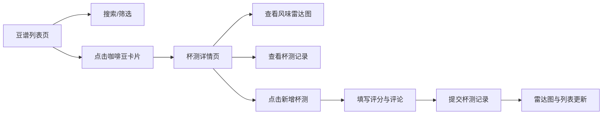

## 1. 产品概述

咖啡风味图谱是一款面向独立咖啡师社群的轻量级应用，用于赛博展示各地精品咖啡豆的烘焙曲线和风味标签，支持社群成员在虚拟杯测表上打分和留言，促进咖啡知识共享与交流。

- 目标用户：独立咖啡师、咖啡爱好者、精品咖啡豆从业者
- 核心价值：构建咖啡豆风味知识图谱，通过社群杯测数据沉淀，形成可复用的风味参考体系

## 2. 核心功能

### 2.1 用户角色

| 角色 | 注册方式 | 核心权限 |
|------|----------|----------|
| 社群成员 | 无需注册（模拟环境） | 浏览豆谱、查看杯测记录、添加新豆子、发布杯测评分 |

### 2.2 功能模块

1. **豆谱列表页**：咖啡豆卡片网格展示、搜索筛选、空状态展示
2. **杯测详情页**：豆子信息展示、风味雷达图、杯测记录列表、新增杯测表单
3. **全局导航**：顶部导航栏、返回按钮、添加新豆子入口

### 2.3 页面详情

| 页面名称 | 模块名称 | 功能描述 |
|----------|----------|----------|
| 豆谱列表页 | 卡片网格 | 以网格形式展示咖啡豆卡片，卡片支持翻转动画，显示产地、烘焙度、处理法等信息 |
| 豆谱列表页 | 搜索筛选 | 顶部搜索框支持关键词搜索，下拉菜单支持按产地/处理法/烘焙度筛选 |
| 豆谱列表页 | 空状态 | 无搜索结果时展示空杯子插画及提示文字 |
| 杯测详情页 | 豆子信息 | 左侧展示产地、海拔、处理法、烘焙日期等详细信息 |
| 杯测详情页 | 风味雷达图 | 中间Canvas绘制5维雷达图，动态展示评分数据 |
| 杯测详情页 | 杯测记录列表 | 下方按时间倒序展示杯测记录卡片，支持展开查看完整评论 |
| 杯测详情页 | 新增杯测 | 底部浮动按钮弹出表单，5个评分维度滑动条+评论文本框 |

## 3. 核心流程

用户从豆谱列表页浏览咖啡豆卡片，通过搜索或筛选找到感兴趣的豆子，点击进入杯测详情页查看风味雷达图和历史杯测记录。用户可以点击底部浮动按钮新增杯测记录，提交评分和评论后，雷达图和记录列表实时更新。

## 4. 用户界面设计

### 4.1 设计风格

- **主色调**：暖棕色系，营造咖啡氛围
  - 主背景：暖灰 `#F5F0EB`
  - 导航栏：深棕 `#4E342E`
  - 强调色：焦糖色 `#D2691E`、深焙棕 `#3E2723`
  - 卡片背景：浅米色 `#FAF0E6`
  - 边框色：浅棕 `#D2B48C`

- **按钮风格**：圆角按钮，悬停有阴影和上浮效果，过渡动画 0.2-0.3s

- **字体**：使用系统无衬线字体，标题粗体，正文常规字重

- **布局风格**：卡片式布局，顶部导航，内容区域最大宽度1200px居中

- **图标风格**：简洁线性图标，使用 lucide-react 图标库

### 4.2 页面设计概述

| 页面名称 | 模块名称 | UI元素 |
|----------|----------|--------|
| 豆谱列表页 | 顶部导航 | 深棕色背景、白色标题、左右图标按钮 |
| 豆谱列表页 | 搜索栏 | 圆角搜索框、下拉筛选菜单、放大镜图标 |
| 豆谱列表页 | 卡片网格 | 响应式网格布局、卡片翻转动画、悬停上浮阴影 |
| 杯测详情页 | 信息区 | 左侧豆子信息卡片、右侧风味雷达图 |
| 杯测详情页 | 记录列表 | 时间倒序排列、评分色标竖线、展开动画 |
| 杯测详情页 | 浮动按钮 | 圆形深棕色按钮、白色加号、悬停放大效果 |
| 杯测详情页 | 表单面板 | 底部弹出、深色背景、滑动条评分、文本评论框 |

### 4.3 响应式

- 桌面端（≥768px）：卡片多列网格，详情页左右布局
- 移动端（<768px）：卡片单列，搜索框100%宽度，详情页上下堆叠布局
- 触摸优化：按钮最小尺寸48px，滑动条触摸区域扩大

### 4.4 动效设计

- 卡片悬停：上浮6px + 阴影扩散，0.3s过渡
- 卡片翻转：3D翻转动画，背面渐入0.4s
- 表单弹出：从底部滑入，0.3s ease-out
- 按钮点击：微震动/缩放动画0.2s
- 列表展开：高度过渡 + 透明度变化0.2s
- 搜索框聚焦：边框变色 + 阴影扩散0.3s
