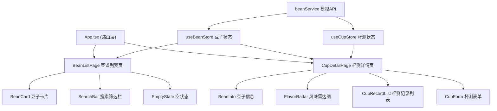

## 1. 架构设计



## 2. 技术描述

- **前端框架**：React 18 + TypeScript
- **构建工具**：Vite 5
- **路由管理**：react-router-dom v6
- **状态管理**：自定义 React Hooks (useReducer + Context)
- **动画库**：framer-motion
- **图形绘制**：Canvas API
- **图标库**：lucide-react

**项目初始化方式**：使用 vite-init 脚手架创建 react-ts 模板项目，然后按需求调整依赖和配置。

## 3. 路由定义

| 路由 | 页面 | 用途 |
|------|------|------|
| `/` | BeanListPage | 豆谱列表页，展示所有咖啡豆卡片 |
| `/bean/:id` | CupDetailPage | 杯测详情页，展示豆子详情和杯测记录 |

## 4. 数据模型

### 4.1 类型定义

```typescript
// 咖啡豆
interface CoffeeBean {
  id: string;
  origin: string;        // 产地
  altitude: string;      // 海拔
  process: string;       // 处理法
  roastLevel: 'light' | 'medium' | 'dark';  // 烘焙度
  roastDate: string;     // 烘焙日期
  density: number;       // 生豆密度
  flavorNotes: string[]; // 风味标签
}

// 杯测评分维度
interface CupScores {
  acidity: number;      // 酸度 1-5
  sweetness: number;    // 甜度 1-5
  bitterness: number;   // 苦度 1-5
  body: number;         // 醇厚度 1-5
  aftertaste: number;   // 余韵 1-5
}

// 杯测记录
interface CupRecord {
  id: string;
  beanId: string;
  scores: CupScores;
  comment: string;
  createdAt: string;
  author: string;
}
```

### 4.2 数据流向

1. **组件 dispatch** → **store 更新** → **触发重渲染**
2. **App.tsx** 在 useEffect 中调用 `beanService.fetchBeans()` 初始化数据
3. **杯测表单** 提交时调用 `useCupStore` 的 `addCupRecord` dispatch
4. **雷达图组件** 订阅 `useCupStore` 中当前豆子的评分数据，动态重绘

## 5. 文件结构

```
src/
├── main.tsx              # 应用入口
├── App.tsx               # 路由管理与布局
├── global.css            # 全局样式
├── store.ts              # 全局状态管理 (useBeanStore, useCupStore)
├── api/
│   └── beanService.ts    # 模拟API，mock数据
├── components/
│   ├── BeanCard.tsx      # 豆子卡片组件
│   ├── FlavorRadar.tsx   # 风味雷达图 (Canvas)
│   ├── CupForm.tsx       # 杯测表单组件
│   ├── SearchBar.tsx     # 搜索筛选栏
│   ├── CupRecordCard.tsx # 杯测记录卡片
│   ├── EmptyState.tsx    # 空状态组件
│   └── Navbar.tsx        # 顶部导航栏
├── pages/
│   ├── BeanListPage.tsx  # 豆谱列表页
│   └── CupDetailPage.tsx # 杯测详情页
└── types/
    └── index.ts          # TypeScript 类型定义
```

### 文件调用关系

- `main.tsx` → 引入 `App.tsx` 和 `global.css`，挂载到 DOM
- `App.tsx` → 配置路由，使用 `useBeanStore` 和 `useCupStore`，调用 `beanService`
- `store.ts` → 导出 `BeanProvider`、`CupProvider`、`useBeanStore`、`useCupStore`
- `api/beanService.ts` → 提供 `fetchBeans`、`fetchCupRecords` 等模拟接口
- `pages/BeanListPage.tsx` → 使用 `SearchBar`、`BeanCard`、`EmptyState`
- `pages/CupDetailPage.tsx` → 使用 `BeanInfo`、`FlavorRadar`、`CupRecordList`、`CupForm`

## 6. 性能优化

1. **Canvas 重绘节流**：使用 requestAnimationFrame 控制雷达图重绘频率在 30fps 以内
2. **列表虚拟滚动/分批加载**：杯测记录首次加载最多20条，点击"显示更多"分批加载10条
3. **React.memo**：对纯展示组件使用 memo 优化重渲染
4. **useCallback / useMemo**：合理使用缓存回调和计算结果
5. **CSS 动画优先**：使用 transform 和 opacity 属性实现动画，触发 GPU 加速
