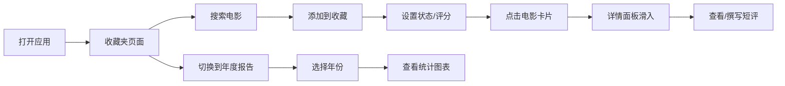

## 1. 产品概述
CineCollect 是一款面向电影爱好者的私人影片收藏与排行应用，帮助用户管理观影记录、自定义评分、撰写短评，并自动生成年度观影报告和趣味统计。
- 核心目标：提供沉浸式的电影收藏管理体验，通过精美的数据可视化让用户回顾观影历程
- 目标用户：热爱电影、注重观影记录与分享的影迷群体
- 产品价值：将零散的观影记忆转化为结构化的个人影库，通过数据洞察发现个人观影偏好

## 2. 核心功能

### 2.1 用户角色
| 角色 | 注册方式 | 核心权限 |
|------|----------|----------|
| 普通用户 | 本地使用（无需注册） | 完整使用所有功能，数据存储于本地 |

### 2.2 功能模块
1. **收藏夹页面**：电影搜索、三列状态展示、卡片交互、评分动画
2. **详情面板**：电影信息展示、评分分布图表、短评列表与管理
3. **年度报告页面**：多维度统计数据、可视化图表、年份切换
4. **导航系统**：左侧窄导航栏、页面切换

### 2.3 页面详情
| 页面名称 | 模块名称 | 功能描述 |
|-----------|-------------|---------------------|
| 收藏夹页面 | 搜索模块 | 从300部预置电影库中搜索，200ms内展示下拉结果 |
| 收藏夹页面 | 三列布局 | 按「想看」「已看」「二刷」状态分列展示电影卡片 |
| 收藏夹页面 | 评分组件 | 10分制星星评分，点击时星星逐个放大带0.2s弹性动画 |
| 收藏夹页面 | 电影卡片 | 海报缩略图、片名、评分，悬停时阴影加深上浮8px，0.3s过渡 |
| 详情面板 | 电影信息 | 片名、导演、年份、类型标签、简介 |
| 详情面板 | 评分分布 | 柱状图展示各分数段数量分布 |
| 详情面板 | 短评管理 | 撰写50-300字短评，添加1-3个自定义标签，按时间倒序排列 |
| 年度报告 | 统计卡片 | 观影总数、平均分（环形图）、最爱类型、最高分Top3（横向条形图） |
| 年度报告 | 年份选择 | 下拉框切换年份，报告内容淡入淡出过渡（0.3s opacity动画） |
| 导航栏 | 侧边导航 | 60px宽固定导航，图标悬停半透明圆角背景 |

## 3. 核心流程
用户打开应用后，默认进入收藏夹页面，可通过顶部搜索框搜索电影并添加到收藏。点击电影卡片弹出详情面板，可设置观看状态、评分、撰写短评。切换到年度报告页面可查看各年度观影统计。

## 4. 用户界面设计

### 4.1 设计风格
- **主色调**：深色主题，主背景 `#1a1a2e`，卡片背景 `#16213e`，强调色 `#e94560`
- **按钮样式**：圆角矩形，强调色填充，hover时轻微放大
- **字体**：系统无衬线字体（system-ui, -apple-system, sans-serif）
- **布局风格**：卡片式布局，左侧固定导航栏，内容区自适应
- **图标风格**：线性简约图标，使用 lucide-react 图标库

### 4.2 页面设计概述
| 页面名称 | 模块名称 | UI 元素 |
|-----------|-------------|-------------|
| 收藏夹页面 | 搜索框 | 圆角输入框，左侧搜索图标，200ms防抖搜索 |
| 收藏夹页面 | 三列卡片 | 响应式网格（桌面3列、平板2列、手机1列），卡片间距20px |
| 收藏夹页面 | 评分星星 | 10颗星星，点击放大动画（scale 1.2），0.2s弹性过渡 |
| 详情面板 | 滑入动画 | translateX 从 100% 到 0，0.4s ease-out |
| 详情面板 | 评分直方图 | recharts BarChart，柱状图颜色为强调色渐变 |
| 年度报告 | 统计卡片 | 并排四张卡片，每张包含图标、数值、图表 |
| 年度报告 | 环形图 | recharts PieChart，环形显示平均分 |
| 年度报告 | 横向条形图 | recharts BarChart，横向展示Top3电影 |
| 侧边导航 | 导航图标 | 垂直排列，hover时背景 `rgba(233, 69, 96, 0.2)`，圆角8px |

### 4.3 响应式设计
- **桌面端（≥1200px）**：三列卡片布局，侧边导航60px固定
- **平板端（768px-1199px）**：两列卡片布局，侧边导航保持60px
- **手机端（<768px）**：单列卡片布局，侧边导航转为底部导航

### 4.4 动效规范
- 卡片悬停：`transform: translateY(-8px)`，`box-shadow` 加深，`transition: all 0.3s ease`
- 星星评分：`transform: scale(1.2)`，`transition: transform 0.2s cubic-bezier(0.68, -0.55, 0.265, 1.55)`
- 详情面板：`transform: translateX(0)` 从 `translateX(100%)`，`transition: transform 0.4s ease-out`
- 年份切换：`opacity` 从 0 到 1，`transition: opacity 0.3s ease`
