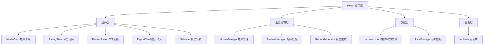
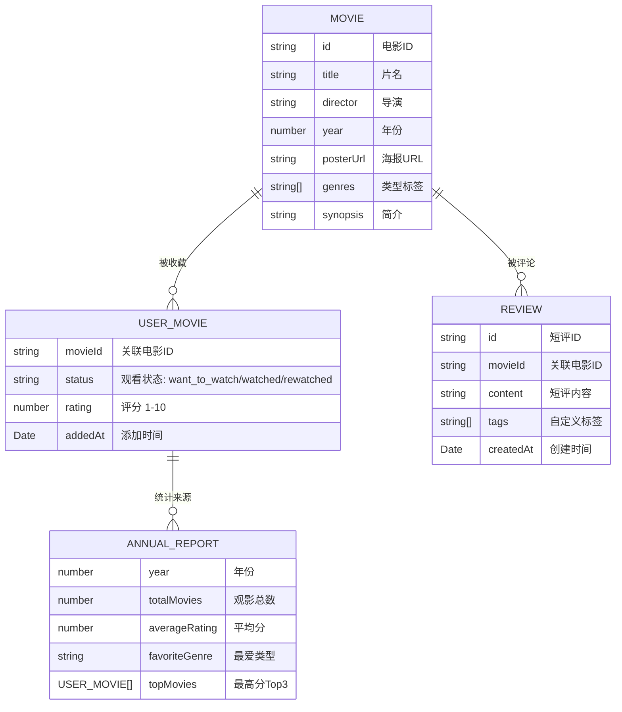

## 1. 架构设计


## 2. 技术描述
- **前端框架**：React 18 + TypeScript 5 + Vite 5
- **构建工具**：Vite 5 + @vitejs/plugin-react
- **图表库**：recharts 2.12
- **状态管理**：React useState/useEffect + 模块化 Manager 类
- **数据存储**：localStorage 持久化用户数据
- **图标库**：lucide-react
- **样式方案**：原生 CSS + CSS 变量 + CSS Modules

## 3. 路由定义
| 路由 | 页面组件 | 功能描述 |
|-------|---------|---------|
| `/` | CollectionPage | 收藏夹首页，三列状态展示 |
| `/reports` | ReportsPage | 年度观影报告页面 |

## 4. 数据模型

### 4.1 数据模型定义


### 4.2 TypeScript 类型定义
```typescript
interface Movie {
  id: string;
  title: string;
  director: string;
  year: number;
  posterUrl: string;
  genres: string[];
  synopsis: string;
}

type WatchStatus = 'want_to_watch' | 'watched' | 'rewatched';

interface UserMovie {
  movieId: string;
  status: WatchStatus;
  rating: number;
  addedAt: string;
}

interface Review {
  id: string;
  movieId: string;
  content: string;
  tags: string[];
  createdAt: string;
}

interface AnnualReportData {
  year: number;
  totalMovies: number;
  averageRating: number;
  favoriteGenre: string;
  topMovies: { movie: Movie; rating: number }[];
  ratingDistribution: { range: string; count: number }[];
}
```

## 5. 项目结构
```
src/
├── main.tsx                    # 应用入口
├── App.tsx                     # 根组件，路由管理
├── styles/
│   └── theme.css               # 全局主题变量、动效类
├── modules/
│   ├── movies/
│   │   ├── MovieManager.ts     # 电影数据管理类
│   │   ├── MovieCard.tsx       # 电影卡片组件
│   │   └── RatingStars.tsx     # 评分星星组件
│   ├── reviews/
│   │   ├── ReviewManager.ts    # 短评管理类
│   │   ├── ReviewPanel.tsx     # 详情面板组件
│   │   └── ReviewForm.tsx      # 短评表单组件
│   └── reports/
│       ├── ReportGenerator.ts  # 报告生成器
│       ├── ReportsPage.tsx     # 报告页面
│       └── ReportCharts.tsx    # 图表组件
├── data/
│   └── movies.json             # 预置300部电影数据
├── pages/
│   └── CollectionPage.tsx      # 收藏夹页面
├── components/
│   ├── SideNav.tsx             # 侧边导航
│   ├── SearchBar.tsx           # 搜索框
│   └── MovieColumn.tsx         # 状态列组件
└── hooks/
    └── useDebounce.ts          # 防抖Hook
```

## 6. 性能优化策略
1. **搜索防抖**：200ms debounce 减少搜索请求
2. **组件懒渲染**：使用 React.memo 优化卡片组件
3. **虚拟滚动**：长列表使用虚拟滚动（如需要）
4. **本地缓存**：电影数据一次性加载到内存
5. **CSS 硬件加速**：transform 动画使用 GPU 加速
6. **状态批量更新**：减少不必要的重渲染
