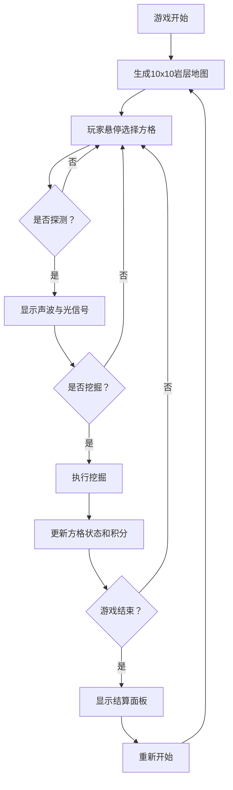

## 1. 产品概述
微型地下矿工探测器与宝石挖掘小游戏，玩家使用探测器在随机生成的地下岩层中寻找并挖掘隐藏的宝石，通过分析声波和光信号判断宝石位置。
- 核心玩法：策略性探测 + 运气挖掘，收集宝石获得积分与图鉴
- 目标用户：休闲游戏玩家，喜欢探索与收集类游戏的用户

## 2. 核心功能

### 2.1 功能模块
1. **岩层网格系统**：10x10方格地图，包含岩石、宝石、空穴三种类型
2. **探测器系统**：声波波形动画、光信号强度条、坐标显示
3. **挖掘系统**：宝石挖掘动画、空穴惩罚、岩石破碎效果
4. **积分与图鉴系统**：积分统计、宝石收藏图鉴
5. **游戏结算系统**：结束判定、结算面板展示

### 2.2 页面详情
| 页面名称 | 模块名称 | 功能描述 |
|-----------|-------------|---------------------|
| 游戏主页面 | 积分状态栏 | 显示当前积分、已探测次数，高60px毛玻璃效果 |
| 游戏主页面 | 岩层网格区域 | 10x10方格，每格60x60px，间距4px，悬停金色边框 |
| 游戏主页面 | 探测器信号面板 | 声波波形Canvas、光信号强度条、探测/挖掘按钮 |
| 游戏主页面 | 结算弹窗 | 半透明毛玻璃背景，总积分、宝石图鉴卡片、重新开始 |

## 3. 核心流程
玩家悬停方格选择目标 → 点击探测按钮查看信号反馈 → 根据声波频率和光强度判断宝石位置 → 决定是否挖掘 → 挖掘后显示结果并更新积分 → 所有宝石挖出或全部非空穴方格挖掘完后游戏结束 → 展示结算面板

## 4. 用户界面设计

### 4.1 设计风格
- 主色调：深棕色#3E2723 到 黑色#121212 渐变（地下环境）
- 强调色：金色#FFD700（选中边框）、绿色#4CAF50（探测器边框）
- 宝石颜色：粉色#FF6F91、紫色#845EC2、青色#00C9A7等
- 按钮风格：圆角，悬停微缩放过渡
- 字体：现代无衬线字体，数字使用等宽字体
- 图标风格：简洁几何图形，宝石使用多边形SVG图标

### 4.2 页面设计概述
| 页面名称 | 模块名称 | UI元素 |
|-----------|-------------|-------------|
| 游戏主页面 | 积分状态栏 | 深色毛玻璃背景，左对齐积分，右对齐探测次数，高60px |
| 游戏主页面 | 岩层网格区域 | 宽500px，10x10方格60x60px间距4px圆角4px，悬停金色边框上浮2px |
| 游戏主页面 | 探测器信号面板 | 深灰#263238背景宽240px高180px圆角12px，1px#4CAF50边框，内边距16px |
| 游戏主页面 | 结算弹窗 | 半透明黑色毛玻璃，圆角16px，宝石卡片80x100px圆角8px |

### 4.3 响应式
- 桌面端优先布局，中央网格固定宽度
- 探测器面板固定右下角
- 积分栏顶部全宽

### 4.4 动画设计
- 探测反馈动画：0.5秒framer-motion spring缓动
- 宝石闪光：0.4秒缩放+旋转
- 空穴挖掘：碎石掉落动画
- 方格悬停：边框变金色+上浮2px过渡0.2s
