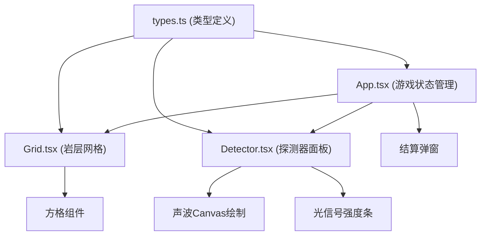

## 1. 架构设计



## 2. 技术说明
- 前端：React@18 + TypeScript + Vite
- 动画库：framer-motion
- 状态管理：React useState/useReducer（简单场景，无需额外状态库）
- 图形绘制：原生Canvas API（声波波形）
- 构建工具：Vite
- 样式方案：内联样式 + CSS变量

## 3. 项目文件结构
```
├── package.json
├── index.html
├── vite.config.js
├── tsconfig.json
└── src/
    ├── main.tsx        # React入口
    ├── App.tsx         # 主组件，游戏状态管理
    ├── Grid.tsx        # 10x10岩层网格
    ├── Detector.tsx    # 探测器和信号面板
    └── types.ts        # 类型定义
```

## 4. 数据模型

### 4.1 核心类型定义

```typescript
// 宝石类型
interface GemType {
  id: string;
  name: string;
  color: string;
  rarity: number; // 1-3，影响积分
}

// 方格类型
type CellType = 'rock' | 'gem' | 'cavity';

// 方格状态
interface Cell {
  type: CellType;
  gem?: GemType;
  explored: boolean;  // 是否已探测
  dug: boolean;       // 是否已挖掘
}

// 探测信号
interface DetectionSignal {
  frequency: number;  // 声波频率 0-100，距离越近值越高
  lightIntensity: number; // 光信号强度 0-100
}

// 游戏状态
interface GameState {
  grid: Cell[][];
  score: number;
  detectionCount: number;
  selectedPosition: { x: number; y: number } | null;
  collectedGems: GemType[];
  totalGems: number;
  isGameOver: boolean;
}
```

## 5. 核心算法

### 5.1 地图生成
- 10x10网格，初始化为普通岩石
- 随机生成5-8颗宝石，位置不重叠
- 随机生成10-15个空穴，位置不与宝石重叠

### 5.2 探测信号计算
- 计算选中位置到最近宝石的曼哈顿距离
- frequency = max(0, 100 - distance * 12)
- lightIntensity = max(0, 100 - distance * 12)
- 距离0（宝石位置）时为100，距离越远值越低

### 5.3 游戏结束判定
- 所有宝石被挖出 → 游戏结束
- 所有非空穴方格被挖掘 → 游戏结束
