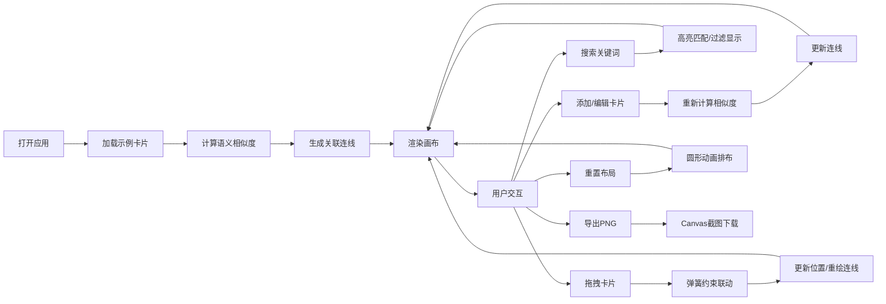

## 1. 产品概述
知识星图是一款个人知识碎片整理与语义关联可视化工具，帮助用户通过交互式画布发现不同想法之间隐藏的联系，让零散的灵感和知识片段形成有机的知识网络。

- 核心价值：将碎片化的知识可视化，通过自动语义关联帮助用户发现知识间的隐藏联系
- 目标用户：学生、研究者、创意工作者、知识管理者
- 产品定位：轻量级、沉浸式的个人知识管理工具

## 2. 核心 Features

### 2.1 Feature Module

1. **画布主界面**：知识卡片浮动展示、语义关联连线可视化、拖拽交互
2. **知识卡片管理**：卡片创建、编辑、删除、颜色标签、拖拽定位
3. **语义关联引擎**：自动计算卡片间文本相似度、动态生成关联连线
4. **搜索与过滤**：关键词实时搜索、匹配高亮、卡片过滤显示
5. **布局与导出**：圆形自动布局重置、画布导出为PNG图片
6. **状态信息展示**：实时显示卡片数、连线数、平均相似度

### 2.3 Page Details

| Page Name | Module Name | Feature description |
|-----------|-------------|---------------------|
| 主画布页 | 顶部工具栏 | 显示"知识星图"标题、重置布局按钮、导出PNG按钮 |
| 主画布页 | 搜索输入框 | 左上角300x40px搜索框，实时高亮匹配文本并过滤卡片 |
| 主画布页 | 画布区域 | 1200x800px深灰画布，展示浮动的知识卡片和关联连线 |
| 主画布页 | 知识卡片 | 240x160px半透明白色卡片，支持拖拽、右键菜单、颜色标签 |
| 主画布页 | 关联连线 | 带箭头的动态连线，粗细和透明度随相似度变化 |
| 主画布页 | 底部状态栏 | 显示当前卡片数、连线数、平均相似度统计 |

## 3. Core Process

### 用户主要流程

1. 用户打开应用，看到预置的示例知识卡片和关联连线
2. 用户双击空白区域添加新的知识卡片，填写标题和内容
3. 系统自动计算新卡片与现有卡片的文本相似度，生成关联连线
4. 用户拖拽卡片调整位置，关联卡片随之弹性移动
5. 用户右键点击卡片，可编辑标题/内容、删除卡片或更改颜色标签
6. 用户在搜索框输入关键词，匹配的卡片高亮显示，其他卡片淡出
7. 用户点击"重置布局"按钮，所有卡片按圆形自动排布
8. 用户点击"导出为PNG"按钮，将当前画布保存为图片下载

### Mermaid Flowchart

## 4. User Interface Design

### 4.1 Design Style

- **设计基调**：极简主义、深色主题、科技感、沉浸式体验
- **主背景**：深灰色 `#1E1E2E`
- **卡片风格**：半透明白色 `#FFFFFFCC`，圆角12px，细边框 `#3E3E5E`
- **主色调**：紫色系 `#7C7CF0`（交互强调色）
- **颜色标签**：8种预设色（红、橙、黄、绿、蓝、紫、粉、靛蓝）
- **字体**：现代无衬线字体，清晰易读
- **动效**：平滑过渡、弹性动画、微交互反馈

### 4.2 Page Design Overview

| Page Name | Module Name | UI Elements |
|-----------|-------------|-------------|
| 主画布页 | 顶部工具栏 | 高度40px，背景`#2A2A3E`，左侧标题文字，右侧两个功能按钮 |
| 主画布页 | 搜索框 | 左上角300x40px，圆角8px，深色背景`#2A2A3E`，白色文字，placeholder`#666` |
| 主画布页 | 知识卡片 | 240x160px，半透明白色，左上角2px拖拽圆点，标题栏背景随颜色标签变化 |
| 主画布页 | 关联连线 | Canvas绘制带箭头连线，相似度>0.6显示，粗细2-6px，透明度0.3-1.0 |
| 主画布页 | 右键菜单 | 气泡式菜单，四个选项：编辑标题、编辑内容、删除、改变颜色标签 |
| 主画布页 | 底部状态栏 | 灰色分隔线`#3E3E5E`，卡片数/连线数/平均相似度统计文字 |

### 4.3 交互动效

- **卡片悬停**：边框变为`#7C7CF0`，0.3s过渡动画
- **颜色变换**：标题栏背景渐变动画，0.4s平滑过渡
- **卡片拖拽**：弹簧约束效果，关联卡片随之弹性移动
- **重置布局**：圆形排布动画，0.6s弹性缓动
- **搜索过滤**：非匹配卡片淡出至透明，匹配文本黄色高亮加粗
- **连线更新**：位置变化时平滑重绘，避免突兀跳动

### 4.4 Responsiveness

- 桌面端优先设计，固定画布尺寸1200x800px
- 内容居中显示，适配常见桌面分辨率
- 不做移动端适配，专注桌面端沉浸式体验

### 4.5 性能指标

- 100张卡片、500条连线时，拖拽响应延迟≤200ms
- 搜索过滤实时响应，无明显卡顿
- 动画帧率保持60fps，流畅不抖动
