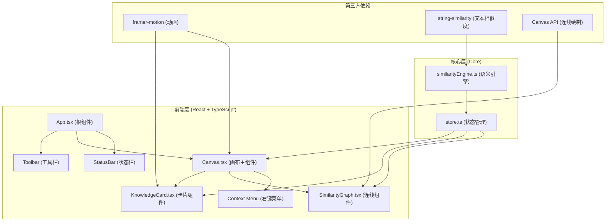
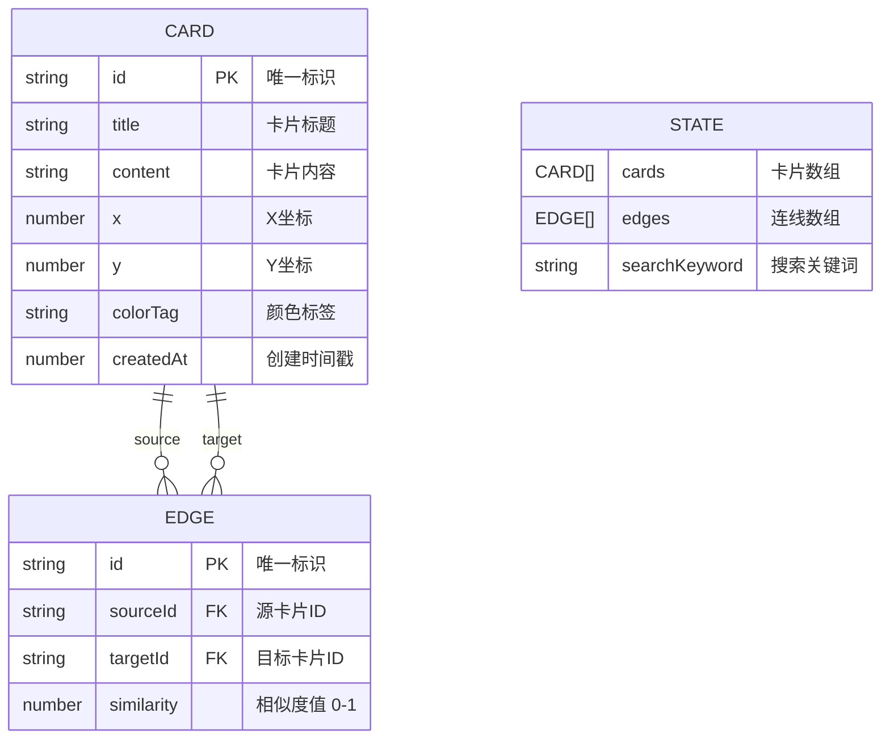

## 1. Architecture Design



## 2. Technology Description

- **前端框架**：React 18 + TypeScript 5
- **构建工具**：Vite 5 + @vitejs/plugin-react
- **动画库**：framer-motion 11（拖拽、弹簧动画、过渡效果）
- **文本相似度**：string-similarity 4（Dice系数算法计算文本相似度）
- **状态管理**：React Context + useReducer（轻量级全局状态）
- **图形绘制**：HTML5 Canvas API（绘制关联连线和箭头）
- **导出功能**：Canvas toDataURL / html2canvas（画布导出PNG）

### 目录结构

```
d:\Pro\tasks\auto171\
├── package.json
├── index.html
├── vite.config.js
├── tsconfig.json
└── src/
    ├── core/
    │   ├── store.ts          # 全局状态管理
    │   └── similarityEngine.ts  # 语义关联引擎
    ├── components/
    │   ├── Canvas.tsx        # 画布主组件
    │   ├── KnowledgeCard.tsx # 知识卡片组件
    │   └── SimilarityGraph.tsx # 连线绘制组件
    └── App.tsx               # 应用根组件
```

## 3. 核心数据模型

### 6.1 Data Model Definition



### 6.2 TypeScript 类型定义

```typescript
// 知识卡片
interface Card {
  id: string;
  title: string;
  content: string;
  x: number;
  y: number;
  colorTag: string;
  createdAt: number;
}

// 关联连线
interface Edge {
  id: string;
  sourceId: string;
  targetId: string;
  similarity: number;
}

// 全局状态
interface AppState {
  cards: Card[];
  edges: Edge[];
  searchKeyword: string;
}

// Action 类型
type Action =
  | { type: 'ADD_CARD'; payload: Omit<Card, 'id' | 'createdAt'> }
  | { type: 'UPDATE_CARD'; payload: Partial<Card> & { id: string } }
  | { type: 'REMOVE_CARD'; payload: string }
  | { type: 'SET_KEYWORD'; payload: string }
  | { type: 'UPDATE_EDGES'; payload: Edge[] }
  | { type: 'RESET_LAYOUT' };
```

## 4. 核心模块说明

### 4.1 similarityEngine.ts (语义关联引擎)

- **输入**：Card[] 卡片数组，threshold 相似度阈值（默认0.6）
- **处理**：使用 string-similarity 库的 compareTwoStrings 方法计算两两卡片标题+内容的相似度
- **输出**：Edge[] 符合阈值条件的连线列表，包含 sourceId、targetId、similarity
- **数据流**：store.cards → similarityEngine → store.edges

### 4.2 store.ts (状态管理)

- 使用 React Context 提供全局状态
- useReducer 处理状态更新
- 提供 dispatch 方法和 action creators
- 卡片增删改时自动触发相似度重新计算

### 4.3 Canvas.tsx (画布主组件)

- 管理卡片和连线的整体渲染
- 处理双击添加新卡片
- 提供 resetLayout() 圆形布局函数
- 提供 exportPNG() 导出函数
- 监听搜索关键词变化，过滤显示
- 使用 framer-motion 的 useSpring 实现拖拽时的弹簧约束

### 4.4 KnowledgeCard.tsx (卡片组件)

- framer-motion/motion.div 实现拖拽
- 拖拽时更新 store 中的坐标
- 右键触发自定义菜单
- 颜色标签变化时 0.4s 渐变动画
- 悬停边框 0.3s 过渡动画
- 搜索匹配时文本高亮

### 4.5 SimilarityGraph.tsx (连线组件)

- Canvas 2D 绘制带箭头的贝塞尔曲线
- 根据相似度动态调整：
  - 线宽：2 + similarity * 4 （2-6px）
  - 透明度：0.3 + similarity * 0.7 （0.3-1.0）
  - 箭头大小：8 + similarity * 8 （8-16px）
  - 颜色：使用源卡片的颜色标签
- requestAnimationFrame 平滑重绘

## 5. 性能优化策略

1. **Canvas 批量绘制**：所有连线一次性绘制到离屏Canvas，避免频繁DOM操作
2. **useMemo 缓存计算**：相似度计算、过滤后的卡片列表使用 useMemo 缓存
3. **防抖处理**：搜索输入防抖100ms，避免频繁重渲染
4. **requestAnimationFrame**：动画和重绘使用RAF，确保60fps
5. **Spring 物理动画**：framer-motion 的 spring 动画硬件加速
6. **避免不必要重渲染**：React.memo 包裹组件，精准控制依赖
7. **离屏Canvas**：连线绘制使用离屏Canvas，提升渲染性能
8. **相似度计算优化**：新增卡片时只计算与现有卡片的相似度，不重复计算全部

## 6. 初始化数据

应用启动时预置6-8张示例卡片，内容涵盖不同主题但存在部分关联，展示语义关联效果：
- 前端框架相关（React、Vue、Angular）
- 编程语言相关（JavaScript、TypeScript、Python）
- 设计相关（UI设计、用户体验、交互设计）
- 人工智能相关（机器学习、神经网络、自然语言处理）
