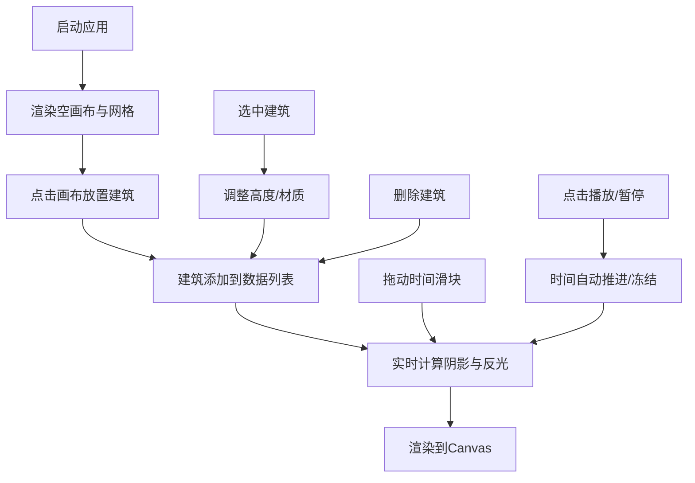

## 1. 产品概述

高层建筑群日照阴影与材料反光模拟应用，为城市建筑设计师团队提供轻量级的方案可视化工具，在初步设计阶段直观评估不同高层建筑方案在晨昏时段的光影遮挡和立面材料反光效果。

- 主要用途：快速放置不同高度和材质的方块建筑，实时模拟日照阴影与立面反光效果
- 目标用户：城市建筑设计师团队
- 产品价值：在初步设计阶段即可直观评估方案视觉影响，提升设计决策效率

## 2. 核心功能

### 2.1 功能模块

1. **天际线3D画布**：HTML5 Canvas绘制建筑群、地面网格、动态阴影、材质反光效果
2. **控制面板**：时间滑块、播放/暂停、材质选择器、建筑高度调节、建筑列表管理
3. **阴影计算引擎**：根据太阳高度角和方位角实时计算建筑投影多边形
4. **反光效果系统**：玻璃高亮反射、金属镜面高光、石材无反光的差异化渲染

### 2.3 页面详情

| 页面名称 | 模块名称 | 功能描述 |
|-----------|-------------|---------------------|
| 主页面 | 天际线画布 | 2D俯视+等轴测视角渲染建筑群，支持点击放置建筑，900×650像素 |
| 主页面 | 控制面板 | 时间控制（8:00-18:00）、播放/暂停、建筑管理（增删改材质/高度）、280px宽侧栏 |
| 主页面 | HUD信息层 | 左上角显示当前时间、太阳仰角/方位角，右上角播放/暂停按钮 |

## 3. 核心流程

用户打开应用 → 查看默认画布和网格 → 点击网格放置建筑 → 选中建筑调整高度/材质 → 拖动时间滑块或播放动画 → 实时观察阴影与反光变化 → 删除或继续添加建筑进行方案对比

## 4. 用户界面设计

### 4.1 设计风格

- **主色调**：深灰背景 #1E1E2E，深蓝灰面板 #2A2A3E
- **强调色**：亮蓝 #00BFFF（滑块激活、高亮边框），红 #FF4444（删除悬停）
- **材质色**：玻璃 #87CEEB，金属 #B0C4DE，石材 #A0522D
- **阴影色**：深灰半透明 #00000055，叠加混合
- **网格色**：浅灰 #CCCCCC
- **按钮风格**：圆角8px，控制面板圆角8px，播放按钮圆形40px直径
- **字体**：现代无衬线字体，科技感、克制简洁
- **布局风格**：桌面端左右分栏（画布左中+右侧控制面板），<1000px时控制面板置顶横条
- **图标**：简洁几何图标（播放三角形、暂停双竖线）

### 4.2 页面设计概览

| 页面名称 | 模块名称 | UI元素 |
|-----------|-------------|-------------|
| 主页面 | 天际线画布 | 等轴测透视、半透明建筑方块、动态阴影多边形、反光高亮、网格线、选中高亮边框 |
| 主页面 | 时间控件 | 定制滑块（轨道4px #444，滑块14px圆点，激活#00BFFF发光动画0.2s） |
| 主页面 | 建筑卡片 | 折叠卡片（高50px，展开120px），材质下拉，删除按钮（悬停变红#FF4444缩放0.3s） |
| 主页面 | 播放按钮 | 圆形40px，图标翻转旋转过渡0.4s |
| 主页面 | HUD层 | 左上角HH:MM时间+仰角/方位角文字 |

### 4.3 响应式

桌面优先设计，窗口宽度<1000px时控制面板从右侧移至顶部形成横条布局，画布高度自适应剩余空间。触摸设备优化滑块和按钮的点击区域。

### 4.4 Canvas渲染指引

- **视角**：等轴测（isometric）2.5D视角，固定相机角度
- **光照**：单方向太阳光，根据时间计算高度角（0°-90°）和方位角（-90°到+90°）
- **渲染顺序**：地面网格 → 阴影多边形 → 建筑方块（远→近深度排序）→ 反光高亮
- **后处理**：阴影叠加混合、透明度处理
- **性能预算**：80栋建筑≥45FPS，阴影计算≤8ms/帧
