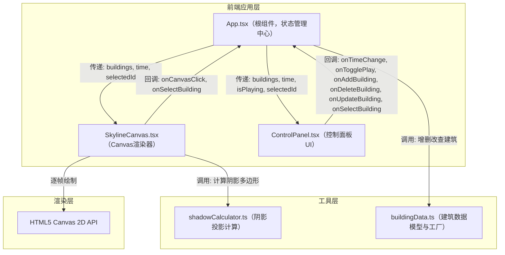

## 1. 架构设计



## 2. 技术描述

- **前端框架**：React@18 + TypeScript（ES2020目标，严格模式）
- **构建工具**：Vite@5 + @vitejs/plugin-react
- **状态管理**：React useState/useReducer（组件内轻量状态，无需额外状态库）
- **动画库**：framer-motion（UI微交互：面板展开、按钮悬停、图标旋转）
- **渲染引擎**：HTML5 Canvas 2D（自实现等轴测投影、阴影多边形、反光效果）
- **后端**：无（纯前端应用）
- **数据库**：无（内存状态）

## 3. 项目结构

```
auto172/
├── package.json
├── vite.config.js
├── tsconfig.json
├── index.html
└── src/
    ├── App.tsx                    # 根组件：布局、全局状态、事件分发
    ├── components/
    │   ├── SkylineCanvas.tsx      # 3D画布渲染组件
    │   └── ControlPanel.tsx       # 控制面板组件
    └── utils/
        ├── shadowCalculator.ts    # 阴影计算工具
        └── buildingData.ts        # 建筑数据结构与工厂
```

**调用关系与数据流**：
1. `App.tsx` 持有全局状态（buildings、timeMinutes、isPlaying、selectedBuildingId）
2. `App.tsx` 将状态作为 props 向下传递给 `SkylineCanvas` 和 `ControlPanel`
3. `ControlPanel` 触发用户操作回调（onTimeChange、onAddBuilding 等）→ `App.tsx` 更新状态
4. `SkylineCanvas` 接收新 props → 调用 `shadowCalculator` 计算阴影 → Canvas重绘
5. `buildingData.ts` 提供建筑工厂函数、CRUD操作和类型定义

## 4. 数据模型

### 4.1 类型定义

```typescript
// 建筑材质类型
type MaterialType = 'glass' | 'metal' | 'stone';

// 建筑材质颜色映射
const MATERIAL_COLORS: Record<MaterialType, string> = {
  glass: '#87CEEB',
  metal: '#B0C4DE',
  stone: '#A0522D',
};

// 单个建筑数据
interface Building {
  id: string;
  x: number;           // 网格X坐标（单位）
  z: number;           // 网格Z坐标（单位，深度方向）
  width: number;       // 底宽（默认1.2）
  depth: number;       // 进深（默认1.2）
  height: number;      // 高度（0.5-5.0，步长0.1）
  material: MaterialType;
}

// 太阳位置
interface SunPosition {
  elevation: number;   // 仰角（弧度，0=地平线，π/2=头顶）
  azimuth: number;     // 方位角（弧度，0=正南，负=东，正=西）
}

// 3D点
interface Point3D {
  x: number;
  y: number;
  z: number;
}

// 2D点（Canvas像素或世界坐标）
interface Point2D {
  x: number;
  y: number;
}

// 阴影多边形
interface ShadowPolygon {
  points: Point2D[];   // 地面投影顶点
  buildingId: string;
}

// 反光区域
interface HighlightArea {
  type: 'glass' | 'metal';
  position: Point2D;   // Canvas中心位置
  size: { w: number; h: number };
  opacity: number;     // 0.3-0.7
  rotation?: number;   // 金属高光旋转角度
}
```

## 5. 核心算法

### 5.1 太阳位置计算

```
时间范围: 8:00-18:00（共600分钟）
仰角 elevation = sin((minutes - 480) / 600 * π) * (π/2 - 0.1) + 0.1
  - 8:00和18:00时 ≈ 5.7°（接近地平线）
  - 12:00时 ≈ 84.3°（接近头顶）
方位角 azimuth = ((minutes - 480) / 600 - 0.5) * (π * 0.8)
  - 8:00时 ≈ -72°（东方）
  - 12:00时 = 0°（正南）
  - 18:00时 ≈ +72°（西方）
```

### 5.2 阴影投影算法

1. 取建筑顶面4个顶点（x, y=height, z）
2. 对每个顶点P，计算地面投影点P'：
   - shadowLength = height / tan(elevation)
   - dx = -sin(azimuth) * shadowLength
   - dz = -cos(azimuth) * shadowLength
   - P' = (P.x + dx, 0, P.z + dz)
3. 将顶面4投影点与底面4顶点合并，取凸包或按顺序构造8点多边形
4. 等轴测投影转换为Canvas 2D坐标

### 5.3 等轴测投影

```
世界坐标 (x, y, z) → Canvas坐标 (cx, cy):
cx = originX + (x - z) * cos(30°) * scale
cy = originY + (x + z) * sin(30°) * scale - y * scale
scale ≈ 60px/单位，originX=450, originY=400
```

### 5.4 反光强度计算

- **玻璃**：计算太阳方向与立面法线夹角 → 0.3-0.7线性映射透明度
- **金属**：镜面反射方向与视线夹角最小处 → 径向渐变圆形高光
- **石材**：无反光

## 6. 性能优化

- **requestAnimationFrame** 驱动渲染循环，仅状态变化时重绘
- **阴影计算缓存**：同一时间戳下建筑位置不变则复用阴影结果
- **深度排序**：建筑按(x+z)排序后绘制，保证正确遮挡
- **离屏Canvas**：地面网格预渲染为ImageBitmap复用
- **避免GC**：渲染循环中不创建临时对象，复用Point数组
