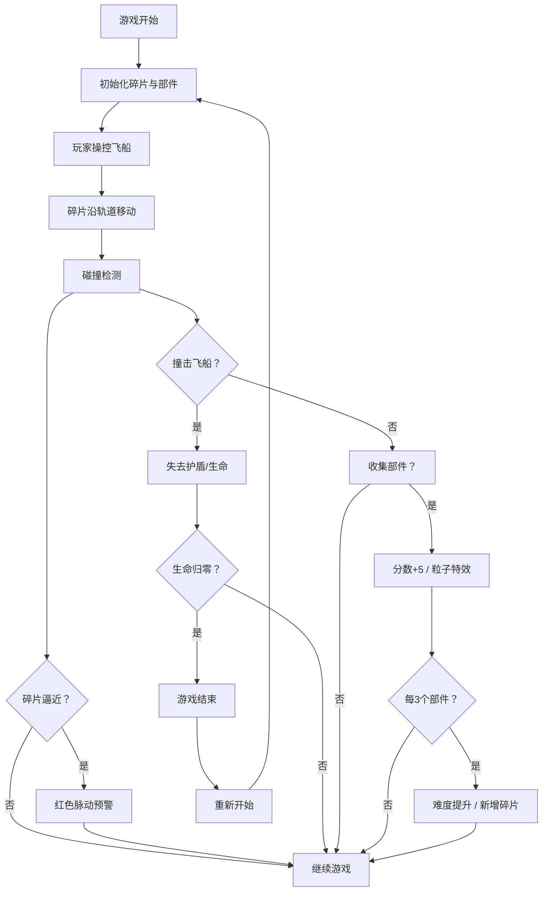

## 1. 产品概述

太空垃圾回收与轨道碎片碰撞预警游戏，玩家操控回收飞船在近地轨道上躲避高速碎片云并收集废旧卫星部件，系统自动计算碰撞风险并生成预警。

- 核心玩法：飞船操控 + 碎片躲避 + 部件收集 + 碰撞预警
- 目标用户：对太空主题和休闲游戏感兴趣的玩家
- 产品价值：寓教于乐，通过游戏体验了解太空垃圾问题

## 2. 核心功能

### 2.1 功能模块

1. **轨道碎片模拟系统**：随机生成多形态碎片，沿椭圆轨道动态运动
2. **碰撞预警系统**：实时预测碎片轨迹，高危碎片显示红色脉动预警
3. **部件收集与计分**：牵引光束收集卫星部件，积分系统与最高分记录
4. **难度递增系统**：随收集进度提升碎片速度与数量
5. **玩家状态管理**：生命值、护盾、游戏结束与重新开始
6. **视觉装饰系统**：星际背景、星星、银河带、粒子特效
7. **HUD 界面**：计分板、生命值、护盾进度、预警面板、迷你地图

### 2.2 页面详情

| 页面名称 | 模块名称 | 功能描述 |
|---------|---------|---------|
| 游戏主页面 | 游戏画布 | 1200×800 Canvas 渲染，飞船、碎片、部件、背景 |
| 游戏主页面 | 左上角状态区 | 生命值（3格红色三角）、护盾冷却圆形进度条 |
| 游戏主页面 | 左侧计分板 | 半透明黑底，显示当前分数 |
| 游戏主页面 | 右上角预警面板 | 深红背景，显示3个高危碎片信息 |
| 游戏主页面 | 右下角迷你地图 | 圆形，缩小比例显示全部碎片和飞船位置 |
| 游戏主页面 | 底部操作提示栏 | 提示 WASD 移动和鼠标左键发射 |
| 游戏结束弹窗 | 结束画面 | 深灰背景，显示最终得分和重新开始按钮 |

## 3. 核心流程

## 4. 用户界面设计

### 4.1 设计风格

- **主色调**：深蓝 `#0A192F` 作为背景主色，亮蓝 `#2196F3` 作为强调色
- **高亮色**：金色 `#FFD700` 用于收集部件和分数，红色 `#FF5252` 用于危险指示
- **整体风格**：科幻 HUD 风格，半透明面板，发光效果，数据可视化
- **按钮风格**：圆角矩形，悬停放大 0.2s 过渡，绿色 `#4CAF50` 主按钮
- **动画效果**：所有 UI 元素 0.3s 淡入，交互反馈 0.2-0.3s 过渡
- **视觉层次**：发光边框、半透明背景、阴影深度

### 4.2 页面设计概述

| 页面名称 | 模块名称 | UI 元素 |
|---------|---------|---------|
| 游戏主页面 | 游戏画布 | 深空渐变背景，静态星星，旋转银河带，碎片多边形，三角飞船，六边形部件 |
| 游戏主页面 | 状态面板 | 半透明深蓝底，圆角 8px，红色三角生命图标，圆形护盾进度条 |
| 游戏主页面 | 预警面板 | 深红 `#B71C1C` 背景，白色文字，圆角 8px，列出高危碎片 |
| 游戏主页面 | 迷你地图 | 圆形，半透明黑底，深灰边框 2px，绿色三角飞船，红色圆点碎片 |
| 游戏结束弹窗 | 结束画面 | 深灰 `#333333` 背景，圆角 16px，白色文字，绿色按钮 |

### 4.3 响应式

- 桌面端优先设计，最小宽度 900px
- 窗口小于 1200px 时画布等比缩小至窗口宽度
- UI 元素随画布尺寸自动调整位置
- 保持所有 UI 元素在可视区域内

### 4.4 性能要求

- 游戏运行帧率不低于 50fps
- 碎片数量不超过 120 个
- Canvas 渲染优化，避免不必要的重绘
