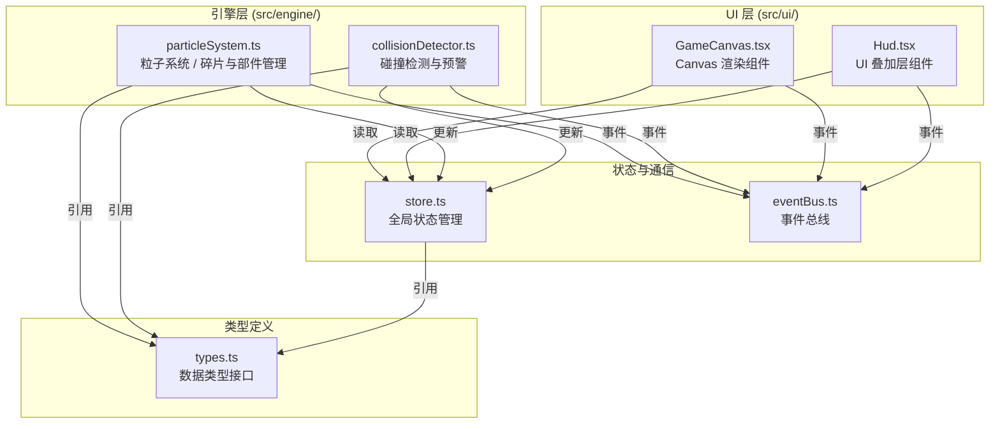

## 1. 架构设计



## 2. 技术描述

- **前端框架**：React 18 + TypeScript
- **构建工具**：Vite
- **样式方案**：内联样式 + framer-motion 动画
- **游戏渲染**：Canvas 2D API
- **状态管理**：轻量级自定义 store（非 zustand，按需求使用简单订阅模式）
- **事件通信**：自定义 EventBus 事件总线
- **包管理器**：npm

### 依赖包
- react, react-dom
- vite, @vitejs/plugin-react
- typescript, @types/react, @types/react-dom
- framer-motion

## 3. 模块结构

```
src/
├── main.tsx              # 根组件入口
├── eventBus.ts           # 事件总线
├── store.ts              # 全局状态管理
├── engine/
│   ├── types.ts          # 类型定义
│   ├── particleSystem.ts # 粒子系统
│   └── collisionDetector.ts # 碰撞检测
└── ui/
    ├── GameCanvas.tsx    # Canvas 游戏画布
    └── Hud.tsx           # HUD UI 叠加层
```

## 4. 数据模型

### 4.1 核心类型定义

**碎片 (Debris)**
- id: string - 唯一标识
- x, y: number - 位置坐标
- vx, vy: number - 速度分量
- radius: number - 半径 (2-8px)
- vertices: number - 多边形顶点数 (2-5)
- rotation: number - 当前旋转角度
- rotationSpeed: number - 旋转速度
- color: string - 颜色 (#555555-#999999)
- orbitA, orbitB: number - 椭圆轨道参数
- orbitAngle: number - 轨道角度
- orbitSpeed: number - 轨道速度

**飞船 (Ship)**
- x, y: number - 位置
- angle: number - 朝向角度
- speed: number - 移动速度
- lives: number - 剩余生命 (3)
- shieldCooldown: number - 护盾冷却时间
- isInvincible: boolean - 是否无敌状态
- invincibleTimer: number - 无敌计时器

**部件 (SatellitePart)**
- id: string - 唯一标识
- x, y: number - 位置
- collected: boolean - 是否已收集
- glowPhase: number - 光晕动画相位

**预警信息 (Warning)**
- debrisId: string - 碎片 ID
- distance: number - 距离
- direction: string - 方向描述
- timeToCollision: number - 预计碰撞时间（秒）

### 4.2 游戏状态
- debrisList: Debris[] - 碎片列表
- satelliteParts: SatellitePart[] - 卫星部件列表
- ship: Ship - 飞船状态
- score: number - 当前分数
- highScore: number - 最高分（本地存储）
- warnings: Warning[] - 预警列表
- gameStatus: 'playing' | 'gameover' - 游戏状态
- beamActive: boolean - 牵引光束是否激活
- beamTimer: number - 光束持续时间
- beamCooldown: number - 光束冷却时间
- difficultyMultiplier: number - 难度倍数
- partsCollected: number - 已收集部件数

## 5. 核心数据流

### 5.1 游戏循环
```
requestAnimationFrame → particleSystem.update(dt) 
→ 更新碎片位置/旋转 → 更新飞船位置 
→ collisionDetector.detect() → 计算碰撞与预警
→ store 更新 → GameCanvas 重绘 → HUD 重新渲染
```

### 5.2 玩家输入
```
键盘事件 (WASD) → store 更新飞船速度向量
鼠标事件 (左键) → 触发牵引光束 → store 更新光束状态
```

### 5.3 事件通信
- `score:add` - 得分增加事件
- `collision:hit` - 飞船被撞击事件
- `part:collect` - 部件收集事件
- `game:over` - 游戏结束事件
- `game:restart` - 重新开始事件
- `warning:update` - 预警更新事件

## 6. 性能优化策略

1. **Canvas 渲染优化**：使用 requestAnimationFrame，避免 DOM 操作
2. **对象池**：碎片和部件对象复用，减少 GC
3. **空间分区**：碰撞检测使用简单距离筛选，避免 O(n²) 全量计算
4. **帧率控制**：稳定 60fps，必要时降低粒子数
5. **最小化重绘**：UI 组件使用 React.memo 优化
6. **离屏画布**：背景星空预渲染缓存

## 7. 构建与运行

- 开发启动：`npm run dev`
- 生产构建：`npm run build`
- 类型检查：`npx tsc --noEmit`
