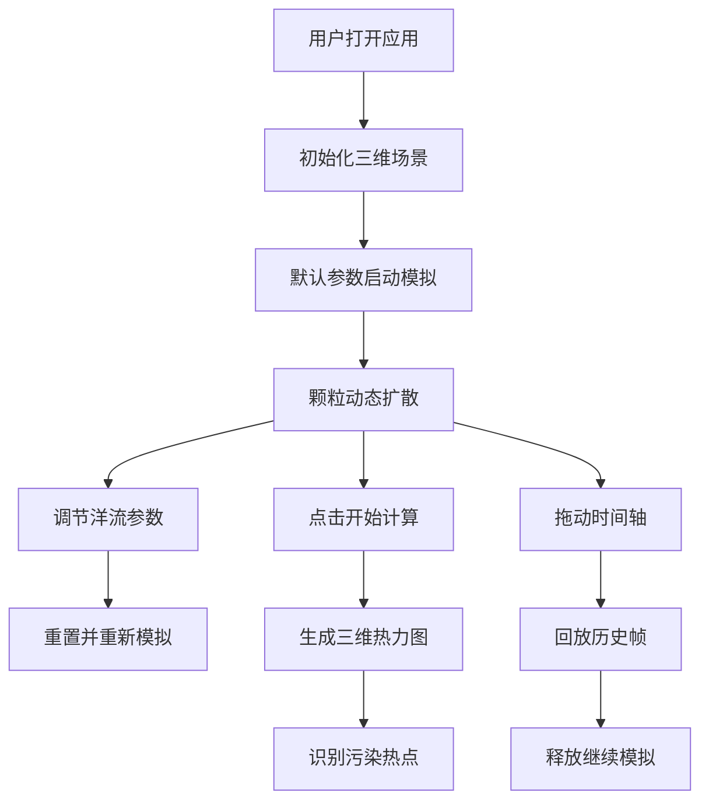

## 1. 产品概述

微型洋流塑料颗粒扩散模拟与热点预测应用是一款面向海洋学研究人员的三维可视化工具。

- 主要用途：通过直观的三维可视化展示不同洋流层中微型塑料颗粒的扩散路径与聚集密度，快速识别污染热点并辅助制定清理策略。
- 目标用户：海洋学研究小组、环境科学家。
- 核心价值：将抽象的洋流扩散过程具象化，提供可交互的参数调节与时间回放功能，辅助科研决策。

## 2. 核心功能

### 2.1 功能模块

1. **主场景页：三维洋流模拟画布、参数控制面板、热力图展示、时间轴控制。

### 2.2 页面详情

| 页面名称 | 模块名称 | 功能描述 |
|-----------|-------------|---------------------|
| 主场景页 | 参数控制面板 | 三个滑动条控制洋流速度、涡旋强度、颗粒释放量 |
| 主场景页 | 三维颗粒渲染 | 数千个发光球体颗粒在三维水域中动态迁移 |
| 主场景页 | 热力图可视化 | 颗粒密度投影到三维网格，半透明立方体叠层显示 |
| 主场景页 | 时间帧回放 | 底部时间轴滑块拖动回看历史帧 |
| 主场景页 | 视角交互 | 鼠标拖拽旋转、双指缩放、OrbitControls |

## 3. 核心流程

用户打开应用 → 查看默认参数下的颗粒扩散模拟 → 调节洋流速度/涡旋强度/释放量参数 → 观察颗粒迁移路径 → 点击开始计算 → 生成热力图 → 识别污染热点 → 拖动时间轴回放历史帧 → 旋转缩放查看细节

## 4. 用户界面设计

### 4.1 设计风格

- **主色调**：深海洋基调，渐变从深蓝`#0A1128`到墨蓝`#1B2D54`
- **辅助色**：青色`#00FFFF`（颗粒色）、蓝色`#0000FF`到红色`#FF0000`（热力图渐变）
- **控件色**：面板背景`#2A3A5ACC`（带模糊效果）、悬停`#3A4A6A`
- **按钮风格**：圆角12px，带阴影，点击缩放反馈`transform: scale(0.95)` 0.15s过渡
- **字体**：系统无衬线字体
- **布局风格**：沉浸式3D场景为主，控制面板悬浮式UI叠加层

### 4.2 页面设计概述

| 页面名称 | 模块名称 | UI元素 |
|-----------|-------------|-------------|
| 主场景页 | 三维画布 | Three.js渲染、OrbitControls、网格辅助线、水下粒子背景 |
| 主场景页 | 左上角控制面板 | 半透明玻璃态面板、三个滑块标签组、开始计算按钮 |
| 主场景页 | 左下角统计 | 实时帧率、颗粒总数 |
| 主场景页 | 底部时间轴 | 全宽滑块、圆形拖拽头、滑动动画 |
| 主场景页 | 右上角切换按钮 | 热力图开关、淡入淡出过渡 |

### 4.3 响应式

- Desktop-first 设计
- 屏幕宽度 < 768px 时，操作面板折叠为底部固定条（高度50px），点击展开滑块
- 3D画布自适应宽度，高度 `calc(100vh - 80px)`

### 4.4 3D场景指引

- **环境**：深海氛围，深色调，水下粒子背景增强沉浸感
- **光照**：环境光 + 点光源，颗粒发光效果（BlendMode叠加）
- **相机**：透视相机，OrbitControls环绕，距离限制30-100单位
- **交互**：鼠标拖拽旋转、滚轮/双指缩放
- **后期处理**：颗粒发光光晕效果
- **性能目标**：颗粒模拟稳定45fps以上，热力图开启时不低于30fps
