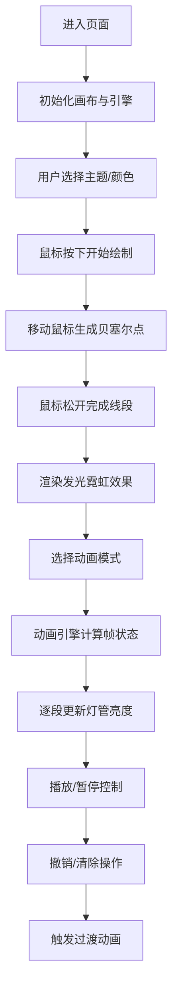

## 1. 产品概述

霓虹灯艺术工作室是一款基于Web的创意工具，让用户在虚拟工坊环境中自由绘制霓虹灯管并生成动态动画效果。通过Canvas绘制技术与Web动画引擎结合，用户可以体验真实霓虹灯牌的制作过程，创造独特的发光艺术作品。

- **核心价值**：将复杂的霓虹灯光效制作简化为直观的鼠标绘制操作，结合多种预设动画模式，让任何人都能快速创作专业级霓虹灯艺术作品
- **目标用户**：设计师、艺术家、创意爱好者、霓虹灯效果学习者

## 2. 核心功能

### 2.1 用户角色

| 角色 | 注册方式 | 核心权限 |
|------|----------|----------|
| 访客用户 | 无需注册 | 自由绘制、切换颜色、应用动画、保存作品截图 |

### 2.2 功能模块

1. **主工作区**：中央画布绘制区域，支持鼠标绘制贝塞尔曲线，自动转换为发光霓虹灯管
2. **工具面板**：左侧垂直工具栏，包含颜色选择、撤销/清除、动画模式切换
3. **主题切换器**：顶部色彩主题切换，4种预设主题一键应用
4. **状态控制条**：底部状态显示与动画播放控制
5. **动画引擎**：独立的时间轴调度系统，支持静态/闪烁/追逐/呼吸四种模式

### 2.3 页面详情

| 页面名称 | 模块名称 | 功能描述 |
|----------|----------|----------|
| 主工作页 | 画布绘制区 | 1000x700px深灰网格背景，鼠标绘制贝塞尔曲线，圆头端点6px宽发光灯管 |
| 主工作页 | 颜色选择器 | 6种预设霓虹色块，16px圆角按钮，点击偏移动画，0.6秒颜色渐变过渡 |
| 主工作页 | 撤销按钮 | 最后一笔0.3秒淡出动画移除 |
| 主工作页 | 清除画布 | 所有灯管0.8秒向内收缩至中心消失 |
| 主工作页 | 动画下拉菜单 | 静态/闪烁/追逐/呼吸四种模式选择 |
| 主工作页 | 闪烁模式 | 每段灯管独立随机延迟0.2-1.2秒，亮0.5秒灭0.3秒循环 |
| 主工作页 | 追逐模式 | 按绘制顺序从左到右逐段亮起再熄灭，每段间隔0.15秒波浪效果 |
| 主工作页 | 呼吸模式 | 整体亮度0.5-1.0之间2秒周期正弦波动 |
| 主工作页 | 状态条 | 实时显示线段数量、动画模式名称 |
| 主工作页 | 播放/暂停按钮 | 32px圆形按钮，0.2秒图标旋转过渡动画 |
| 主工作页 | 主题切换区 | 4个预设主题按钮（赛博朋克/霓虹都市/极光幻境/熔岩暗夜） |
| 主工作页 | 主题渐变 | 灯管颜色0.8秒渐变，画布背景0.2秒透明度过渡 |

## 3. 核心流程

用户进入页面后看到暗黑工坊风格界面，中央画布就绪。用户可先选择主题或颜色，然后在画布上用鼠标绘制任意曲线，每段绘制完成后自动呈现发光霓虹效果。绘制完成后，用户可切换动画模式查看动态效果，通过播放/暂停按钮控制动画状态。所有操作（撤销、清除、换色、换主题）都带有平滑过渡动画。

## 4. 用户界面设计

### 4.1 设计风格

- **主背景色**：#0A0A0A（极致暗黑，模拟真实工坊暗环境）
- **画布背景**：#1A1A1A（深灰）带微弱网格纹理
- **面板背景**：#222222（工具面板），#111111（主题切换区）
- **字体**：Google Fonts Orbitron（科技感未来风格，用于标题和面板文字）
- **按钮风格**：16px圆角色块，点击偏移动画，边框高亮反馈
- **动效风格**：全部使用framer-motion实现平滑过渡，颜色切换0.6s、撤销淡出0.3s、清除收缩0.8s、图标旋转0.2s

### 4.2 页面设计概述

| 模块区域 | 位置尺寸 | UI元素 | 视觉风格 |
|----------|----------|--------|----------|
| 主题切换区 | 顶部100%×60px | 4个主题按钮，两色预览圆点 | 背景#111111，按钮悬浮发光 |
| 工具面板 | 左侧200px宽，圆角12px | 6色块、撤销、清除、下拉菜单 | 背景#222222，垂直排列 |
| 绘制画布 | 中央1000×700px | Canvas元素 + 网格纹理 | 深灰#1A1A1A，辉光灯管绘制 |
| 状态条 | 底部100%×40px | 线段数文字、模式文字、播放按钮 | 半透明#000000AA，左对齐 |

### 4.3 响应式

- 采用固定尺寸桌面优先设计（画布1000×700px）
- 最小窗口宽度1400px以完整显示所有面板
- 触摸设备支持触摸绘制事件映射

### 4.4 性能指标

| 场景 | 帧率要求 | 优化策略 |
|------|----------|----------|
| 绘制过程 | ≥30fps | 使用requestAnimationFrame批量绘制，离屏缓冲 |
| 动画播放 | 稳定60fps | 独立AnimationEngine调度，亮度因子数组批量更新 |
| 大量线段(50+) | ≥45fps | 阴影层缓存，避免重复计算贝塞尔路径 |
