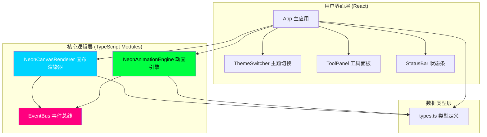

## 1. 架构设计



## 2. 技术描述

- **前端框架**：React 18 + TypeScript（严格模式）
- **构建工具**：Vite 5 + @vitejs/plugin-react
- **UI动画**：framer-motion（所有过渡动画、微交互）
- **渲染技术**：HTML5 Canvas 2D Context（离屏双缓冲渲染）
- **字体**：Google Fonts Orbitron 700/400
- **初始化方式**：npm create vite-init 基于 react-ts 模板

## 3. 项目文件结构

| 文件路径 | 职责 | 关键导出 |
|----------|------|----------|
| `/package.json` | 依赖管理、启动脚本 | dev: vite |
| `/index.html` | HTML入口，Orbitron字体加载 | root div |
| `/vite.config.js` | Vite构建配置 | react plugin |
| `/tsconfig.json` | TypeScript配置 | strict: true, target: ES2020 |
| `/src/main.tsx` | React根入口挂载 | createRoot |
| `/src/App.tsx` | 主应用组件，全局状态管理 | App组件 |
| `/src/CanvasRenderer.ts` | Canvas绘制模块 | NeonCanvasRenderer类 |
| `/src/AnimationEngine.ts` | 动画调度引擎 | NeonAnimationEngine类 |
| `/src/eventBus.ts` | 发布订阅事件总线 | EventBus单例 |
| `/src/types.ts` | 类型定义集合 | NeonSegment, AnimationMode, Theme |
| `/src/components/ToolPanel.tsx` | 左侧工具面板组件 | ToolPanel |
| `/src/components/StatusBar.tsx` | 底部状态条组件 | StatusBar |
| `/src/components/ThemeSwitcher.tsx` | 顶部主题切换组件 | ThemeSwitcher |

## 4. 核心模块设计

### 4.1 NeonCanvasRenderer 画布渲染器

```typescript
class NeonCanvasRenderer {
  constructor(canvas: HTMLCanvasElement)
  setSegments(segments: NeonSegment[]): void
  setTargetColors(primary: string, glow: string, duration: number): void
  drawStatic(brightnessFactors?: number[]): void
  drawAnimated(brightnessFactors: number[]): void
  fadeOutSegment(index: number, onComplete: () => void): void
  collapseAll(onComplete: () => void): void
}
```

**关键实现**：
- 双Canvas缓冲：主画布 + 离屏辉光层
- Bezier曲线：使用quadraticCurveTo根据采样点生成平滑路径
- 发光效果：两层shadowBlur（外层扩散+内层聚焦）+ 线条叠加
- 颜色插值：RGB分量线性插值实现0.6s平滑过渡
- 网格纹理：createPattern + 半透明叠加

### 4.2 NeonAnimationEngine 动画引擎

```typescript
class NeonAnimationEngine {
  setSegmentCount(count: number): void
  setMode(mode: AnimationMode): void
  setSpeed(factor: number): void
  play(): void
  pause(): void
  update(deltaTime: number): number[]  // 返回亮度因子数组
  get isPlaying(): boolean
}
```

**关键实现**：
- 内部使用requestAnimationFrame + performance.now()高精度计时
- 闪烁模式：为每段生成独立randomSeed，计算相位 = (t + delay) % 0.8
- 追逐模式：窗口位置 = t / 0.15 % (count*2)，用距离函数计算亮度
- 呼吸模式：globalBrightness = 0.75 + 0.25 * sin(t * PI)
- onFrameUpdate事件：每帧通过EventBus发出brightnessFactors数组

### 4.3 EventBus 事件总线

```typescript
class EventBus {
  static getInstance(): EventBus
  on(event: string, handler: Function): void
  off(event: string, handler: Function): void
  emit(event: string, payload?: any): void
}
```

**事件列表**：
- `frame:update`：引擎→渲染器，携带brightnessFactors
- `segment:added`：App→渲染器/引擎
- `segment:removed`：App→渲染器/引擎
- `theme:changed`：主题→渲染器
- `mode:changed`：面板→引擎

## 5. 数据模型

### 5.1 类型定义

```typescript
interface Point { x: number; y: number }

interface NeonSegment {
  id: string
  points: Point[]           // 原始采样点（至少3个）
  bezierControlPoints: {    // 预计算的贝塞尔控制点
    cp1x: number; cp1y: number
    cp2x: number; cp2y: number
  }[]
  color: string             // 当前显示颜色
  targetColor: string       // 目标颜色（用于插值过渡）
  colorProgress: number     // 颜色过渡进度0-1
  opacity: number           // 当前透明度（用于撤销淡出）
  targetOpacity: number
  scale: number             // 缩放因子（用于清除收缩）
  targetScale: number
}

type AnimationMode = 'static' | 'blink' | 'chase' | 'breathe'

interface Theme {
  id: string
  name: string
  primaryColor: string
  glowColor: string
  backgroundColor: string
  colorPalette: string[]  // 重新排列后的6色块
}
```

### 5.2 预设数据

```typescript
const NEON_COLORS = ['#FF007F', '#00FF41', '#FFFF00', '#00D4FF', '#FF6600', '#FF00FF']

const THEMES: Theme[] = [
  { id:'cyberpunk', name:'赛博朋克', primary:'#FF00FF', glow:'#00FFFF', bg:'#0F0F23', palette:['#FF00FF','#00FFFF','#FF007F','#00D4FF','#FF6600','#FFFF00'] },
  { id:'neon-city', name:'霓虹都市', primary:'#FF6600', glow:'#FFFF00', bg:'#1A1100', palette:['#FF6600','#FFFF00','#FF007F','#FF00FF','#00FF41','#00D4FF'] },
  { id:'aurora', name:'极光幻境', primary:'#00FF41', glow:'#00D4FF', bg:'#0B1A0B', palette:['#00FF41','#00D4FF','#FF00FF','#FFFF00','#FF007F','#FF6600'] },
  { id:'lava', name:'熔岩暗夜', primary:'#FF0000', glow:'#FF6600', bg:'#1A0B0B', palette:['#FF0000','#FF6600','#FF007F','#FFFF00','#FF00FF','#00D4FF'] }
]
```

## 6. 性能优化策略

| 优化点 | 技术方案 | 预期效果 |
|--------|----------|----------|
| 绘制帧率 | 使用path2D缓存贝塞尔路径，避免每帧重新计算 | 绘制≥30fps |
| 动画帧率 | 亮度因子数组批量计算一次，渲染器只做乘法 | 动画稳定60fps |
| 辉光效果 | shadowBlur只在离屏canvas计算一次，主画布做drawImage | 减少GPU填充率 |
| 颜色过渡 | RGB分量预计算delta，每帧线性插值而非每帧解析hex | 减少CPU开销 |
| 线段收缩 | 统一用transform scale，中心点预计算 | 批量变换高效 |
| 事件监听 | 鼠标移动使用throttle（16ms节流） | 防止高频事件阻塞 |
