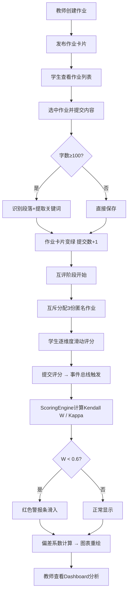

# 学生作业互评与评分一致性分析系统 - 产品需求文档

## 1. 产品概述

学生作业互评与评分一致性分析系统是一款面向教育场景的在线评分工具，帮助教师高效发布作业任务、组织学生匿名互评，并通过统计学方法自动分析评分者信度与评阅偏差。系统以Kendall协调系数和Cohen's Kappa系数为核心指标，可视化展示每位评阅者的偏差趋势，辅助教师发现评分异常、保障评价公平性。

---

## 2. 核心功能

### 2.1 用户角色

| 角色 | 核心权限 |
|------|----------|
| 教师 | 创建作业、设置评分维度、查看评分一致性分析、浏览偏差系数趋势图 |
| 学生 | 提交作业（文本/Markdown）、匿名互评3份作业、查看评分结果 |

### 2.2 功能模块

1. **作业管理模块**：作业创建、作业列表展示、作业卡片状态管理
2. **作业提交模块**：文本输入、Markdown粘贴、段落结构识别、关键词提取
3. **匿名互评模块**：互斥分配算法、5分制滑动条评分、多维度打分
4. **评分一致性分析模块**：Kendall W系数计算、Cohen's Kappa计算、一致性警报
5. **偏差系数分析模块**：个人偏差系数计算、按时间维度折线图、柱状图分布
6. **Dashboard面板**：图表展示、数据汇总、异常警报条

### 2.3 页面详情

| 页面名称 | 模块名称 | 功能描述 |
|----------|----------|----------|
| 主界面 | 顶部导航栏 | 校徽占位符、系统名称、角色标识 |
| 主界面 | 左侧作业列表 | 作业卡片展示、悬停动画、提交/评阅比例、选中状态切换 |
| 主界面 | 右侧详情面板 | 作业信息、提交区域、互评区域、评分分析图表 |
| 作业创建弹窗 | 表单模块 | 标题输入、截止日期、总分设置、评分维度描述 |
| 提交区域 | 编辑器 | 文本输入框、Markdown预览、关键词状态提示 |
| 互评区域 | 评分卡片 | 匿名作业展示、5分制滑动条、多维度评分、提交确认 |
| Dashboard | 警报条 | 一致性低红色警报、滑入动画 |
| Dashboard | 图表区 | 偏差系数折线图、分布柱状图、Tooltip交互 |

---

## 3. 核心流程

### 3.1 主要流程描述

1. 教师登录系统 → 创建新作业（填写标题、截止日期、总分、评分维度）
2. 系统生成作业卡片 → 学生在左侧列表查看作业
3. 学生选中作业 → 在右侧提交区域输入内容或粘贴Markdown → 系统自动识别段落、提取关键词（≥100字时）
4. 提交成功后，作业卡片边框变绿，提交人数+1
5. 互评阶段开始 → 系统为每位学生随机分配3份匿名作业（互斥算法）
6. 学生使用5分制滑动条逐维度评分 → 提交评分后自动配对标记
7. 评分提交事件触发 → ScoringEngine在200ms内计算Kendall W和Cohen's Kappa
8. 系统计算每位评阅者的偏差系数 → Dashboard更新折线图和柱状图
9. 教师查看Dashboard → 若W系数<0.6，顶部显示红色警报条
10. 教师浏览折线图 → 点击数据点查看具体偏差数值

### 3.2 核心流程图

---

## 4. 用户界面设计

### 4.1 设计风格

- **整体风格**：柔和学术风格，简洁专业，信息层次清晰
- **主色调**：深紫 `#4527A0`（导航栏）、淡紫渐变 `#E8E0F0 → #D8CCE8`（卡片）、浅灰背景 `#F9F8F6`
- **强调色**：绿色 `#4CAF50`（成功状态）、红色 `#F44336`（警报/低分）、紫色 `#7E57C2`（图表连线）
- **卡片样式**：圆角12px、2px边框 `#BDBDBD`、浅紫渐变背景
- **按钮/滑动条**：5分制滑动条轨道渐变色 `#F44336 → #4CAF50`、0.5步进刻度
- **字体**：衬线/无衬线组合，学术期刊感，标题加粗清晰
- **动画**：卡片悬停上浮5px（0.3s ease-out）、列表项背景渐变（0.2s）、警报条从左滑入（0.3s）

### 4.2 页面设计概览

| 页面/组件 | 模块 | UI元素与样式 |
|-----------|------|--------------|
| 主界面 | 顶部导航 | 高56px、深紫背景`#4527A0`、白字、左侧圆形校徽占位符(32px) |
| 主界面 | 内容区 | 宽1100px居中、左右分栏(左280px/右780px) |
| 作业列表 | 作业卡片 | 340×160px、圆角12px、浅紫渐变、悬停上浮+深阴影、右下角提交/评阅比例 |
| 右侧面板 | 提交区 | 宽800px、最大高度600px、可滚动、2px边框`#BDBDBD`、内间距24px |
| 互评模块 | 评分滑动条 | 5分制、0.5步进、拖动实时显示、轨道渐变色 |
| Dashboard | 警报条 | 高50px、背景`#FFEBEE`、左侧4px红框`#F44336`、文字`#C62828`、从左滑入动画 |
| Dashboard | 图表区 | 高350px、recharts折线图/柱状图、数据点半径6px、连线`#7E57C2` |

### 4.3 响应式设计

- **桌面端（≥768px）**：左右分栏布局，左侧280px作业列表，右侧780px详情与图表
- **移动端（<768px）**：上下堆叠布局，作业列表改为水平滑动卡片容器（overflow-x: auto），图表高度缩至250px
- **触控优化**：滑动条触控区域扩大，卡片最小触控区域44px

### 4.4 性能要求

- 评分一致性系数计算：提交评分后 **200ms内** 完成计算并更新显示
- 折线图重绘帧率：**不低于30fps**
- 关键词提取、段落识别：异步执行，不阻塞UI主线程

---

## 5. 技术约束

- 前端框架：**React 18 + TypeScript**（严格模式）
- 构建工具：**Vite + @vitejs/plugin-react**
- 图表库：**recharts**
- 动画库：**framer-motion**
- 状态管理：自定义全局Store + EventBus事件总线
- 运行方式：`npm install && npm run dev`

