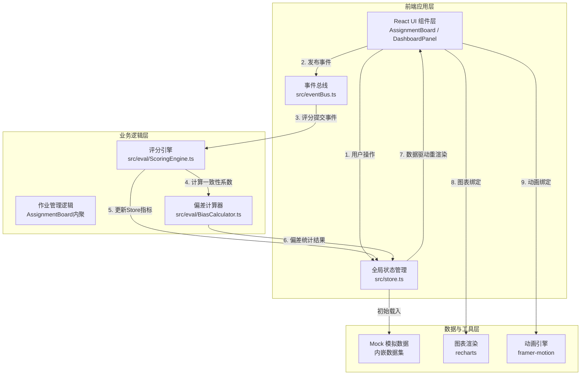
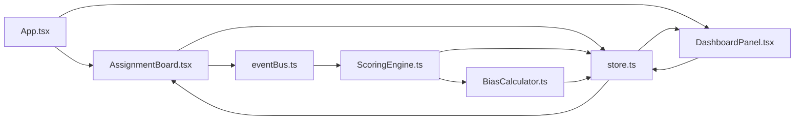

# 学生作业互评与评分一致性分析系统 - 技术架构文档

## 1. 架构设计



---

## 2. 技术选型说明

### 2.1 核心技术栈

| 类别 | 技术 | 版本说明 | 选型理由 |
|------|------|----------|----------|
| 前端框架 | React | ^18.x | 组件化开发，生态成熟，适合复杂交互界面 |
| 语言 | TypeScript | ^5.x | 严格类型检查（strict模式），避免评分计算中的类型错误 |
| 构建工具 | Vite | ^5.x | 极速HMR，开发体验优良，配置简单 |
| Vite插件 | @vitejs/plugin-react | ^4.x | 官方React支持，JSX转换，Fast Refresh |
| 图表库 | recharts | ^2.x | React原生图表组件，折线图/柱状图开箱即用，30fps+性能 |
| 动画库 | framer-motion | ^11.x | 声明式动画，警报条滑入/卡片上浮等复杂过渡轻松实现 |
| 类型定义 | @types/react / @types/react-dom | ^18.x | 完善的React类型支持 |

### 2.2 架构原则

1. **分层解耦**：UI组件(AssignmentBoard/Dashboard) → 事件总线(eventBus) → 业务引擎(ScoringEngine/BiasCalculator) → 全局状态(Store)
2. **事件驱动**：评分提交通过事件总线触发计算，UI与计算逻辑完全解耦
3. **单一职责**：每个模块职责清晰：
   - `ScoringEngine.ts` 仅负责统计系数计算
   - `BiasCalculator.ts` 仅负责偏差系数统计
   - `store.ts` 仅管理状态
4. **性能优先**：评分计算在200ms内完成，使用同步高效算法，避免不必要的重渲染

---

## 3. 目录结构与模块职责

```
auto177/
├── package.json                    # 依赖声明与启动脚本
├── index.html                      # Vite入口HTML
├── vite.config.js                  # Vite构建配置
├── tsconfig.json                   # TypeScript严格模式配置
└── src/
    ├── main.tsx                    # React应用入口
    ├── App.tsx                     # 根组件（导航+分栏布局）
    ├── index.css                   # 全局样式（设计Token、响应式）
    ├── store.ts                    # 全局状态（作业列表/评分记录/分析指标）
    ├── eventBus.ts                 # 事件总线（发布-订阅模式）
    ├── types.ts                    # 全局类型定义
    ├── assignment/
    │   └── AssignmentBoard.tsx     # 作业发布与提交界面
    ├── eval/
    │   ├── ScoringEngine.ts        # 评分一致性计算引擎
    │   └── BiasCalculator.ts       # 偏差系数计算器
    └── dashboard/
        └── DashboardPanel.tsx      # Dashboard图表面板
```

### 模块依赖关系



---

## 4. 数据模型定义

### 4.1 核心数据结构

```typescript
// 评分维度
interface ScoreDimension {
  id: string;
  name: string;        // 逻辑清晰度/格式规范/创新性
  weight: number;      // 维度权重
}

// 作业任务
interface Assignment {
  id: string;
  title: string;
  deadline: string;    // ISO日期
  totalScore: number;  // 总分
  dimensions: ScoreDimension[];
  createdAt: string;
  submittedCount: number;   // 已提交人数
  reviewedCount: number;    // 已评阅人数
  totalStudents: number;    // 班级总人数
  status: 'pending' | 'submitting' | 'reviewing' | 'finished';
}

// 学生作业提交
interface Submission {
  id: string;
  assignmentId: string;
  studentId: string;
  content: string;          // Markdown/文本内容
  paragraphs: string[];     // 识别后的段落
  keywords: string[];       // 提取的关键词
  submittedAt: string;
  hasSubmitted: boolean;
}

// 评分记录
interface ScoreRecord {
  id: string;
  assignmentId: string;
  submissionId: string;     // 被评阅的作业
  raterId: string;          // 评阅人ID
  scores: Record<string, number>;  // {dimensionId: 0-5分}
  totalScore: number;
  submittedAt: string;
}

// 评分一致性指标
interface ConsistencyMetrics {
  assignmentId: string;
  kendallW: number;         // Kendall协调系数 0-1
  cohenKappa: number;       // Cohen's Kappa系数
  isAlert: boolean;         // W<0.6则触发警报
  calculatedAt: string;
}

// 评阅者偏差数据
interface RaterBiasData {
  raterId: string;
  raterName: string;
  assignmentId: string;
  biasValue: number;        // 偏离均值的标准差倍数
  meanScore: number;        // 该评阅者给的平均分
  globalMean: number;       // 全体评阅者给的平均分
}

// 偏差趋势（折线图数据点）
interface BiasTrendPoint {
  assignmentId: string;
  assignmentTitle: string;
  biasValue: number;
  date: string;
}

// 全局状态
interface AppState {
  assignments: Assignment[];
  submissions: Submission[];
  scoreRecords: ScoreRecord[];
  consistencyMetrics: Record<string, ConsistencyMetrics>;
  raterBiasData: Record<string, RaterBiasData[]>;
  raterBiasTrends: Record<string, BiasTrendPoint[]>;
  selectedAssignmentId: string | null;
  currentUserId: string;
  userRole: 'teacher' | 'student';
}
```

### 4.2 事件总线事件定义

```typescript
// 事件类型
enum AppEventType {
  SCORE_SUBMITTED = 'SCORE_SUBMITTED',     // 评分提交 → 触发一致性计算
  ASSIGNMENT_CREATED = 'ASSIGNMENT_CREATED',
  SUBMISSION_SUBMITTED = 'SUBMISSION_SUBMITTED',
  CONSISTENCY_CALCULATED = 'CONSISTENCY_CALCULATED',
  BIAS_CALCULATED = 'BIAS_CALCULATED',
}

// 事件载荷
interface ScoreSubmittedPayload {
  assignmentId: string;
  submissionId: string;
  raterId: string;
}
```

---

## 5. 核心算法说明

### 5.1 Kendall 协调系数 W 计算算法

```
输入：n个评分者 × k个被评对象的评分矩阵 M[n][k]

1. 对每个被评对象j，计算所有评分者给分的和：R_j = Σ(M[i][j])
2. 计算总秩和平方和：S = Σ(R_j - R̄)²  其中 R̄ = (ΣR_j)/k
3. 计算最大可能的秩和平方和：S_max = n²(k³ - k) / 12
4. Kendall W = S / S_max

范围：0（完全不一致）~ 1（完全一致）
性能：O(n·k)，200ms内可处理1000+评分记录
```

### 5.2 Cohen's Kappa 系数计算算法

```
输入：两个评分者的评分序列

1. 构建混淆矩阵 C[c][c]，统计两评分者打分一致的频次
2. 观测一致性 P0 = ΣC[i][i] / N   （对角线元素和/总样本数）
3. 期望一致性 Pe = Σ(ΣC[i][·]/N)·(ΣC[·][j]/N)
4. Kappa = (P0 - Pe) / (1 - Pe)
```

### 5.3 互斥分配算法（每位学生3份匿名作业）

```
输入：待评阅作业列表S，目标学生t

1. 过滤：排除学生t自己提交的作业
2. 过滤：排除t已评阅过的作业
3. 按评阅次数升序排序（优先分配评阅少的作业，保证评阅均匀）
4. 随机打散前3×N条，取前3条
5. 返回3个匿名作业ID（评阅人不可见学生姓名）
```

### 5.4 偏差系数计算（BiasCalculator）

```
输入：作业A的所有评分记录

1. 计算作业A的全体评分均值：μ = Σ(all scores) / N
2. 计算作业A的评分标准差：σ = √(Σ(score - μ)² / N)
3. 对每个评阅者r：
   a. 计算r给A的平均给分：μ_r
   b. 偏差系数 Bias_r = (μ_r - μ) / σ
   c. 记录为该评阅者在作业A上的偏差数据点
4. 按作业时间维度排序，形成偏差趋势序列
```

---

## 6. 性能优化策略

| 优化点 | 策略 | 目标 |
|--------|------|------|
| 评分计算耗时 | 使用纯函数同步计算，避免异步开销，算法复杂度≤O(n·k) | ≤200ms |
| 图表重绘帧率 | 使用recharts的纯组件渲染，仅数据变化时重绘，避免整树重渲染 | ≥30fps |
| 关键词提取 | 使用Web Worker/requestIdleCallback异步执行，不阻塞主线程 | UI无卡顿 |
| 事件发布 | 评分提交事件使用microtask调度，与UI更新解耦 | 交互流畅 |
| 状态更新 | Store使用浅比较，仅变更引用时触发组件重渲染 | 减少不必要渲染 |
| 列表虚拟化 | 作业数>50时可启用虚拟滚动 | 长列表流畅 |

---

## 7. 运行与构建

```bash
# 安装依赖
npm install

# 启动开发服务器（Vite，默认端口5173）
npm run dev

# 生产构建
npm run build

# 预览生产构建
npm run preview
```

---

## 8. 初始Mock数据

系统启动时内置以下模拟数据，确保首次打开即可体验完整流程：

- **学生账号**：5个模拟学生（ID: S001~S005）
- **教师账号**：1个模拟教师（ID: T001）
- **作业**：3个已创建作业（含不同评分维度）
- **提交记录**：20份作业提交（含Markdown内容、段落、关键词）
- **评分记录**：60条互评评分数据（每作业每位学生评3份）
- **预计算指标**：Kendall W值、Cohen's Kappa、偏差系数趋势
