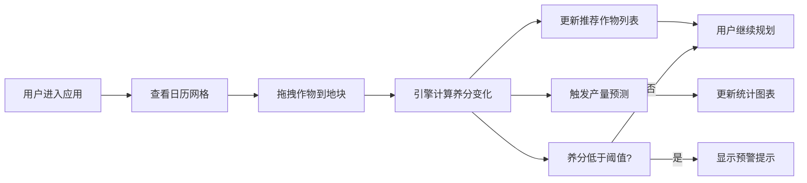

## 1. 产品概述

社区农场轮作规划与产量预测工具，帮助城市社区农场管理者通过可视化日历网格直观安排全年农作物轮作计划，自动计算土壤养分消耗并推荐最佳下季作物，同时基于历史数据预测产量趋势。

- **核心价值**：降低轮作规划复杂度，提升土地利用率和作物产量
- **目标用户**：社区农场管理者、农业爱好者、小型农场经营者
- **解决问题**：轮作规则复杂、养分管理困难、产量预测缺乏数据支撑

## 2. 核心功能

### 2.1 功能模块

1. **轮作日历规划**：12个月×3地块的网格布局，支持拖拽种植卡片
2. **智能轮作推荐**：基于轮作规则自动推荐兼容作物，排除不兼容选项
3. **产量趋势预测**：基于历史数据使用线性回归预测未来3个月产量
4. **土壤营养监控**：实时展示N/P/K养分变化，低于阈值时预警

### 2.2 页面详情

| 页面名称 | 模块名称 | 功能描述 |
|---------|---------|---------|
| 主页面 | 顶部导航栏 | 应用标题、品牌标识 |
| 主页面 | 日历网格区域 | 12月×3地块种植卡片、拖拽操作、养分条形图 |
| 主页面 | 推荐面板 | 推荐作物列表、不兼容提示、作物详情 |
| 主页面 | 统计面板 | 产量预测折线图、置信区间色带、养分消耗汇总 |

## 3. 核心流程

### 3.1 主要用户流程

用户进入应用后，查看全年12个月3个地块的轮作日历。用户可从推荐面板拖拽作物卡片到任意地块的月份中，系统自动计算该地块的土壤养分变化并更新推荐作物列表。用户可在统计面板查看产量预测趋势和养分预警。

### 3.2 流程图

## 4. 用户界面设计

### 4.1 设计风格

- **设计主题**：自然田园风格，温馨有机的视觉感受
- **主色调**：墨绿色 `#2E7D32`（代表生命力与自然）
- **辅助色**：浅米色 `#FDF5E6`（背景）、棕色 `#6D4C41`（分隔线）、金色 `#FFB300`（推荐高亮）
- **养分颜色**：氮 `#4CAF50`、磷 `#FF9800`、钾 `#03A9F4`
- **字体**：Caveat（手写风格标题）+ Inter（正文）
- **圆角**：统一10px圆角
- **阴影**：柔和阴影 `rgba(0,0,0,0.1)`
- **动效**：framer-motion 实现0.3s淡入/缩放动画

### 4.2 页面设计概览

| 页面名称 | 模块名称 | UI元素 |
|---------|---------|--------|
| 主页面 | 顶部导航栏 | 高60px，墨绿背景，白色文字，底部棕色分隔线 |
| 主页面 | 日历网格 | 每行4个月共3行，每列3地块，卡片宽200px高120px |
| 主页面 | 作物卡片 | 浅绿背景`#E8F5E9`，暗绿文字，角标显示月份范围，悬停上浮3px |
| 主页面 | 推荐面板 | 宽280px，推荐作物金色边框，轻微上浮动画 |
| 主页面 | 统计面板 | Recharts折线图，2.5px线条，半透明置信区间色带 |
| 主页面 | 养分预警 | 黄色三角闪烁图标（0.5s周期），点击弹出有机肥推荐 |

### 4.3 响应式设计

- **桌面端**（>1024px）：左侧日历网格920px，右侧面板340px，总宽1280px
- **平板端**（768px-1024px）：右侧面板折叠到下方，日历网格改为每行3个月
- **触摸优化**：拖拽区域增大，点击目标不小于44px

### 4.4 交互细节

- **拖拽**：拖拽时卡片缩小至80%，透明度0.8
- **悬停**：卡片上浮3px，阴影加深，0.25s过渡
- **推荐**：2px金色边框 + 轻微上浮动画
- **预警**：黄色三角0.5s闪烁周期
- **动画**：所有状态变更使用framer-motion 0.3s淡入缩放
