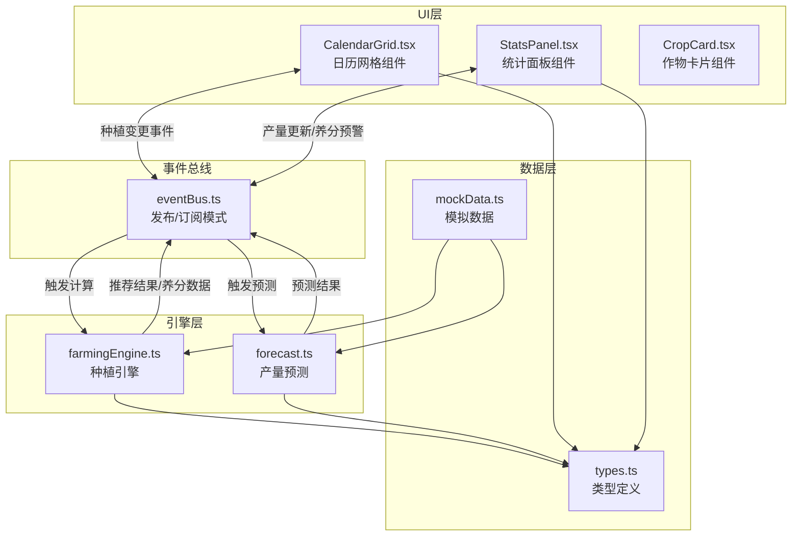
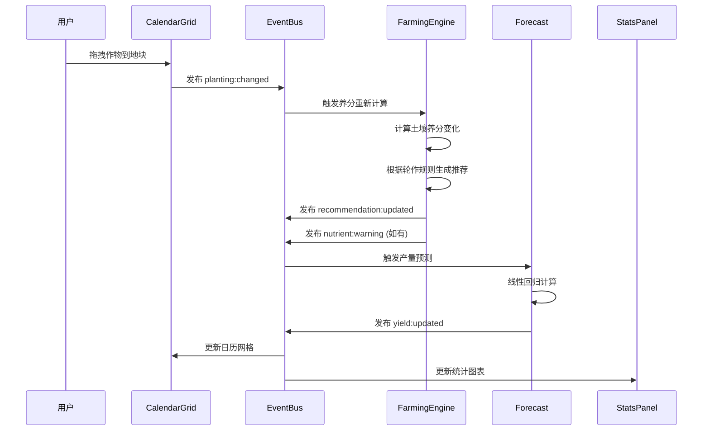

## 1. 架构设计

### 1.1 整体架构图



### 1.2 模块职责

- **UI层**：负责渲染和用户交互，通过事件总线与引擎通信，不直接依赖引擎实现
- **事件总线**：解耦UI与引擎，实现发布/订阅模式，支持种植变更、产量更新、养分预警等事件
- **引擎层**：纯业务逻辑计算，不依赖UI，包括轮作规则引擎和产量预测算法
- **数据层**：TypeScript类型定义和初始模拟数据

## 2. 技术描述

### 2.1 技术栈

| 类别 | 技术 | 版本 | 用途 |
|-----|------|------|------|
| 框架 | React | ^18 | UI构建 |
| 语言 | TypeScript | ^5 | 类型安全 |
| 构建 | Vite | ^5 | 构建工具 |
| 图表 | recharts | ^2 | 折线图/条形图 |
| 动画 | framer-motion | ^11 | 交互动画 |
| 样式 | CSS Modules / 内联样式 | - | 组件样式 |

### 2.2 初始化方式

使用 `vite-init` 脚手架创建 `react-ts` 模板项目

## 3. 文件结构

```
src/
├── engine/
│   ├── farmingEngine.ts    # 种植引擎：轮作规则、养分计算、作物推荐
│   └── forecast.ts         # 产量预测：线性回归算法
├── ui/
│   ├── CalendarGrid.tsx    # 日历网格组件
│   ├── StatsPanel.tsx      # 统计面板组件
│   ├── CropCard.tsx        # 可拖拽作物卡片
│   ├── NutrientBar.tsx     # 养分条形图
│   └── WarningTooltip.tsx  # 预警提示框
├── eventBus.ts             # 事件总线
├── types.ts                # 类型定义
├── mockData.ts             # 模拟数据
├── App.tsx                 # 主应用组件
├── main.tsx                # 入口文件
└── index.css               # 全局样式
```

## 4. 类型定义

### 4.1 核心接口

```typescript
// 作物类型
interface Crop {
  id: string;
  name: string;
  family: string;        // 科属，用于轮作规则判断
  color: string;         // 图表颜色
  nutrientConsumption: { // 养分消耗比例
    n: number;  // 氮
    p: number;  // 磷
    k: number;  // 钾
  };
  growthMonths: number;  // 生长周期（月）
  baseYield: number;     // 基础产量
}

// 地块
interface Plot {
  id: string;
  name: string;
  nutrients: {
    n: number;  // 0-100
    p: number;
    k: number;
  };
}

// 种植计划
interface PlantingPlan {
  plotId: string;
  month: number;      // 1-12
  cropId: string | null;
}

// 预测结果
interface ForecastResult {
  month: number;
  cropId: string;
  estimatedYield: number;
  confidenceLower: number;
  confidenceUpper: number;
}

// 历史产量数据
interface YieldHistory {
  plotId: string;
  cropId: string;
  month: number;
  year: number;
  yield: number;
}

// 事件类型
type EventType = 
  | 'planting:changed'
  | 'yield:updated'
  | 'nutrient:warning'
  | 'recommendation:updated';
```

## 5. 数据流向

### 5.1 种植变更数据流



### 5.2 事件总线API

```typescript
// 发布事件
eventBus.publish(eventType, payload);

// 订阅事件
eventBus.subscribe(eventType, handler);

// 取消订阅
eventBus.unsubscribe(eventType, handler);
```

## 6. 核心算法

### 6.1 轮作规则引擎

- **同科禁忌**：同科作物不能连续种植在同一地块（如茄科：番茄、茄子、辣椒）
- **养分消耗**：每种作物消耗不同比例的N/P/K，累计计算
- **推荐排序**：根据养分剩余量、轮作兼容性综合评分

### 6.2 产量预测算法

- **算法**：一元线性回归（最小二乘法）
- **输入**：过去两年同月份产量数据 + 当前种植方案
- **输出**：未来3个月预估产量 + 置信区间（±15%）

### 6.3 性能约束

| 操作 | 目标延迟 | 实现策略 |
|-----|---------|---------|
| 拖拽响应 | < 100ms | 原生HTML5拖拽 + CSS transform |
| 产量预测 | < 200ms | Web Worker / requestIdleCallback |
| 图表渲染 | < 300ms | Recharts 虚拟滚动 + memo优化 |

## 7. 事件定义

| 事件名 | 触发时机 | 载荷数据 |
|--------|---------|---------|
| `planting:changed` | 用户拖放作物后 | `{ plotId, month, cropId }` |
| `recommendation:updated` | 引擎计算推荐后 | `{ plotId, month, recommendations: Crop[] }` |
| `nutrient:warning` | 养分低于阈值时 | `{ plotId, nutrient: 'n'|'p'|'k', currentValue, threshold }` |
| `yield:updated` | 产量预测完成后 | `{ forecasts: ForecastResult[] }` |
