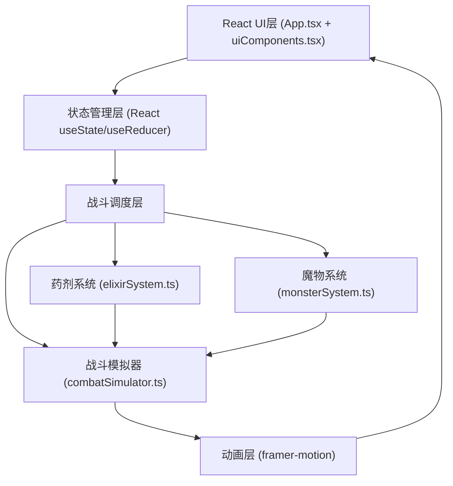

## 1. 架构设计



## 2. 技术说明

- **前端框架**：React@18 + TypeScript@5 (严格模式)
- **构建工具**：Vite@5 + @vitejs/plugin-react@4
- **动画库**：framer-motion@11
- **样式方案**：内联CSS-in-JS + CSS变量主题系统
- **无后端无数据库**：纯前端游戏，所有状态内存管理

## 3. 文件结构

| 路径 | 职责 |
|------|------|
| `package.json` | 依赖与脚本 (dev: vite) |
| `index.html` | Vite入口HTML |
| `vite.config.js` | Vite构建配置 (React插件) |
| `tsconfig.json` | TypeScript严格模式配置 |
| `src/App.tsx` | 主容器：回合状态机、战斗流程编排、组件组合 |
| `src/elixirSystem.ts` | 纯数据与纯函数：药剂定义、连锁合成表、合成链计算 |
| `src/monsterSystem.ts` | 魔物工厂：随机生成、属性计算、波次递增逻辑 |
| `src/combatSimulator.ts` | 战斗计算：药剂序列→连锁伤害→弱点判定→结果汇总 |
| `src/uiComponents.tsx` | UI组件：药剂面板、魔物卡、粒子动画、状态栏、连锁条 |

## 4. 核心数据类型定义

```typescript
// 元素类型
type ElementType = 'fire' | 'frost' | 'lightning' | 'life' | 'shadow';

// 药剂定义
interface Elixir {
  id: ElementType;
  name: string;
  emoji: string;
  color: string;
  baseDamage: number;
}

// 连锁产物
interface ChainProduct {
  id: string;
  name: string;
  emoji: string;
  color: string;
  damage: number;
  ingredients: [ElementType, ElementType] | [string, ElementType];
  description: string;
}

// 抗性档位
type ResistanceTier = 'weak' | 'medium' | 'strong';

// 魔物
interface Monster {
  id: string;
  name: string;
  emoji: string;
  maxHp: number;
  currentHp: number;
  resistances: Record<ElementType, ResistanceTier>;
  attackDamage: number;
}

// 连锁计算结果
interface ChainStep {
  inputs: string[];
  output: ChainProduct | null;
  damage: number;
  isWeakness: boolean;
  animationColor: string;
}

// 战斗结果
interface CombatResult {
  totalDamage: number;
  chainSteps: ChainStep[];
  finalProducts: ChainProduct[];
  weaknessHits: number;
  monsterDefeated: boolean;
}

// 游戏状态
type GamePhase = 'selecting' | 'animating' | 'monster_turn' | 'wave_cleared' | 'victory' | 'defeat';
```

## 5. 连锁反应合成表（≥10种）

| 产物ID | 名称 | 配方1 | 配方2 | 伤害 |
|--------|------|-------|-------|------|
| steam | 蒸汽 | 火焰+冰霜 | - | 25 |
| storm_cloud | 雷暴云 | 蒸汽+闪电 | - | 55 |
| inferno | 炼狱 | 火焰+生命 | - | 35 |
| blizzard | 暴风雪 | 冰霜+生命 | - | 30 |
| plasma | 等离子 | 闪电+生命 | - | 40 |
| void | 虚空 | 生命+暗影 | - | 45 |
| smog | 毒雾 | 火焰+暗影 | - | 30 |
| cryo_void | 冰蚀 | 冰霜+暗影 | - | 35 |
| spark_shadow | 幽雷 | 闪电+暗影 | - | 40 |
| holy_light | 圣光 | 炼狱+生命 | - | 80 |
| elemental_storm | 元素风暴 | 雷暴云+暴风雪 | - | 100 |

## 6. 性能约束实现方案

- **<16ms战斗计算**：所有战斗逻辑使用同步纯函数，避免DOM读取
- **30FPS+粒子动画**：framer-motion使用GPU加速transform属性，粒子数动态裁剪（低端设备50个，高端80个）
- **无感知切换**：药剂状态本地管理，确认后才提交计算，预计算合成表Map实现O(1)查找
- **合成链算法**：遍历药剂序列，滑动窗口两两查找合成表，命中则替换并回溯检查新组合
