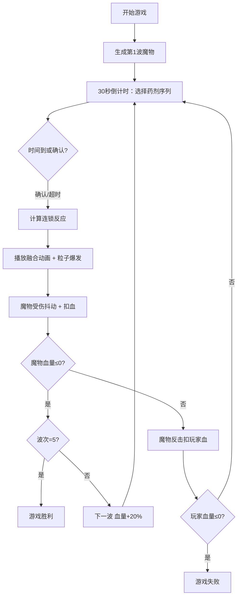

## 1. 产品概述

微型魔法药剂调配与咒语连锁反应模拟游戏，玩家在炼金实验室中组合基础药剂并触发连锁反应，在5波战斗中击败魔物。

- 核心玩法：策略性组合5种基础元素药剂，利用连锁反应最大化伤害输出
- 目标用户：喜欢策略小游戏、魔法炼金题材的休闲玩家
- 产品价值：提供10-15分钟单局沉浸式策略体验，探索元素组合乐趣

## 2. 核心功能

### 2.1 功能模块

1. **主战斗界面**：回合信息、战斗区域、药剂面板、魔物信息、连锁产物展示
2. **药剂系统**：5种基础药剂（火焰、冰霜、闪电、生命、暗影），至少10种连锁产物
3. **魔物系统**：随机生成魔物，包含三档抗性属性（弱/中/强），血量随波次递增
4. **战斗模拟**：接收药剂序列，计算连锁反应伤害与弱点加成
5. **动画系统**：粒子爆发、元素融合、魔物抖动与受伤闪白效果
6. **计时器系统**：每回合30秒药剂选择倒计时

### 2.2 页面详情

| 页面名称 | 模块名称 | 功能描述 |
|-----------|-------------|---------------------|
| 主战斗页 | 顶部状态栏 | 显示回合数、波次、剩余时间（翻转动画）、玩家血量 |
| 主战斗页 | 药剂选择面板 | 5个药剂图标按钮，3-5个序列槽位，确认与清空按钮 |
| 主战斗页 | 中央战斗区 | 元素融合动画、粒子爆发效果、900x600战斗画布 |
| 主战斗页 | 魔物信息区 | 魔物卡片（200x260）、血条、emoji图标、抗性标签 |
| 主战斗页 | 连锁产物展示区 | 横向滚动展示已触发的连锁产物 |
| 主战斗页 | 游戏状态层 | 胜利/失败/波次过渡提示弹窗 |

## 3. 核心流程

玩家进入游戏后开始第1波战斗，每回合有30秒选择3-5个药剂组成序列，确认后系统计算连锁反应伤害并播放动画，魔物血量归零进入下一波（共5波，血量递增20%），玩家血量归零则游戏结束。

## 4. 用户界面设计

### 4.1 设计风格

- **主色板**：深木色背景#2E1A0F，深褐战斗区#3D2B1F，深紫魔物卡#2D1B4E
- **强调色**：亮橙倒计时#FF9800，血条渐变#FF5252→#B71C1C
- **抗性色**：弱#4CAF50 中#FFC107 强#F44336
- **按钮风格**：圆形药剂按钮48px，悬停放大1.15倍，0.3s涟漪动画
- **字体**：倒计时使用等宽字体，标题使用衬线字体体现炼金术古典感
- **图标**：使用emoji作为药剂与魔物图标
- **纹理**：战斗区使用CSS gradient模拟微弱灯光纹理

### 4.2 页面设计概述

| 页面名称 | 模块名称 | UI 元素 |
|-----------|-------------|-------------|
| 主战斗页 | 顶部状态栏 | 三栏排布：左波次 中倒计时翻转动画 右玩家血条 |
| 主战斗页 | 药剂面板 | 左侧280px半透明黑#00000080 圆角16px，5个圆按钮网格，序列槽位横向排列 |
| 主战斗页 | 中央战斗区 | 900x600 圆角12px，粒子爆发中心舞台 |
| 主战斗页 | 魔物信息区 | 右侧220px，魔物卡200x260 圆角16px 深紫底，5个抗性标签行 |
| 主战斗页 | 连锁产物区 | 底部800x80，横向滚动，产物卡片带emoji与名称 |

### 4.3 响应式设计

- **大屏(>1024px)**：三栏布局 - 左药剂面板 / 中战斗区 / 右魔物区
- **平板(768-1024px)**：药剂面板折叠为顶部横向导航，战斗区+魔物区上下排布
- **手机(<768px)**：单列垂直布局，所有卡片100%宽度自适应，触控按钮尺寸放大

### 4.4 动画与交互

- **药剂按钮**：悬停缩放1.15倍(0.2s过渡)，点击涟漪扩散(0.3s)
- **倒计时**：每秒数字3D翻转动画，最后5秒红色脉冲警告
- **连锁融合**：两侧粒子汇聚1.5s → 中心爆炸扩散，颜色匹配最终产物
- **魔物受伤**：0.5s抖动(±5px) + 闪白叠加层渐隐
- **连锁产物区**：新产物从右侧滑入，旧产物向左滚动
