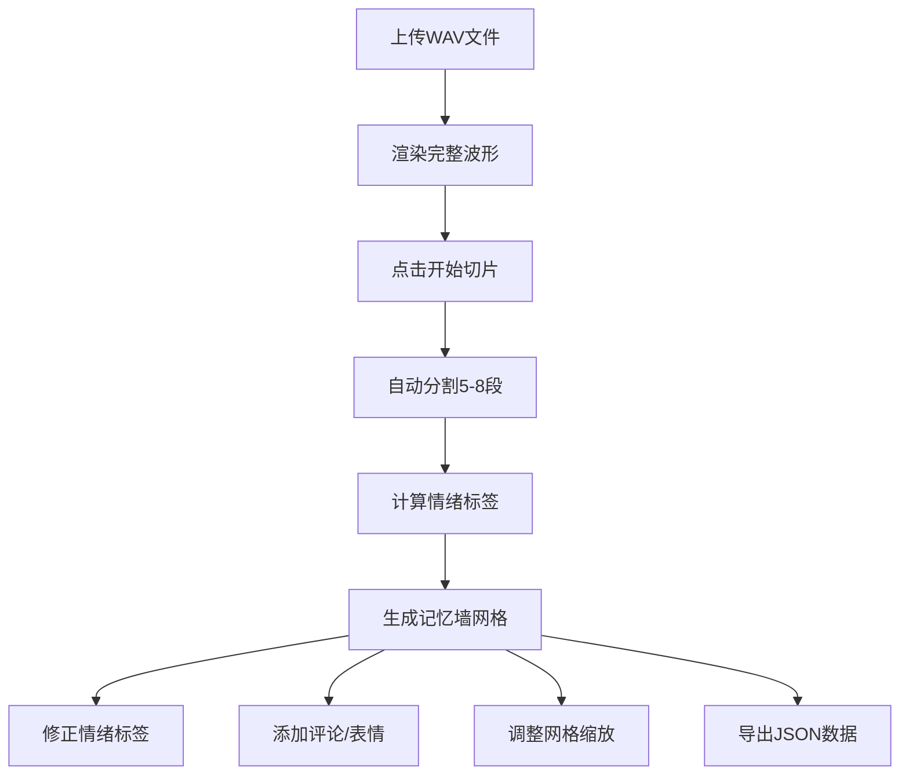

## 1. 产品概述

本应用为独立音乐人工作室打造的轻量级现场录音切片与情绪标注工具，帮助将现场演出录音自动分割成带有波形可视化与情绪标签的音频片段，乐迷可在片段上添加评论和表情标签，形成可分享的音乐记忆墙。

- 核心价值：将单一的演出录音转化为可互动、可分享的音乐记忆集合
- 目标用户：独立音乐人、现场演出爱好者、乐迷社群

## 2. 核心功能

### 2.1 用户角色

| 角色 | 注册方式 | 核心权限 |
|------|----------|----------|
| 普通用户 | 无需注册，匿名使用 | 上传音频、切片查看、添加评论、导出数据 |

### 2.2 功能模块

1. **音频上传与波形渲染**：WAV文件上传、波形可视化、加载进度显示
2. **自动切片与情绪检测**：节奏变化检测、自动分段、情绪标签计算
3. **情绪标签修正**：手动调整情绪标签、颜色同步更新
4. **评论与表情系统**：文本评论输入、表情标签选择、评论流展示
5. **记忆墙网格**：卡片式展示、拖拽排序、动态缩放
6. **数据持久化**：本地存储、JSON导出

### 2.3 页面详情

| 页面名称 | 模块名称 | 功能描述 |
|----------|----------|----------|
| 主页面 | 顶部导航栏 | 应用标题、导出按钮 |
| 主页面 | 音频上传区 | 虚线框上传区域、拖拽交互、文件选择 |
| 主页面 | 波形预览区 | 完整波形渲染、播放控制、进度条 |
| 主页面 | 切片控制区 | 开始切片按钮、处理动画 |
| 主页面 | 记忆墙网格 | 切片卡片网格、拖拽排序、缩放控制 |
| 主页面 | 评论浮层 | 完整波形、评论列表、评论输入、表情选择 |

## 3. 核心流程

用户上传WAV格式演出录音 → 系统渲染完整波形 → 点击开始切片 → 自动分割5-8个片段并计算情绪标签 → 生成记忆墙网格 → 用户可修正情绪标签 → 点击卡片查看详情并添加评论/表情 → 调整网格列数 → 导出JSON数据

## 4. 用户界面设计

### 4.1 设计风格
- 主色调：深蓝黑#0B0B1A背景，主色#6C63FF，渐变蓝紫色
- 情绪色：兴奋#FF6B6B、忧郁#5B86E5、躁动#FFA94D、空灵#B197FC
- 卡片圆角10px，悬停上移3px，阴影加深
- 字体：现代无衬线字体，标题16px白色，标签12px
- 情绪标签呼吸闪烁动画（2秒周期，透明度0.8→1.0）

### 4.2 页面设计概述

| 页面名称 | 模块名称 | UI元素 |
|----------|----------|--------|
| 主页面 | 顶部导航栏 | 56px高，半透明深色#1A1A2ECC，底部1px分割线#3A3A5C |
| 主页面 | 上传区 | 400x200px虚线框，圆角12px，主色边框，拖拽时变实线 |
| 主页面 | 波形预览区 | 100%宽120px高，渐变波形#6C63FF→#E040FB |
| 主页面 | 切片卡片 | 260x180px，缩略波形120x40px，情绪标签圆角4px |
| 主页面 | 评论浮层 | 480x360px，圆角16px，深灰#1E1E2E背景 |
| 主页面 | 缩放滑块 | 轨道4px高#3A3A5C，滑球16px#6C63FF，悬停放大1.2倍 |

### 4.3 响应式
- 桌面端：1200px宽主区域，3列网格默认
- 移动端（<768px）：单列网格，预览区与网格区上下排列，导航栏48px高，边距12px
- 卡片大小响应式适配，0.4s弹性过渡动画

### 4.4 性能要求
- 文件选择到波形渲染：≤1.5秒（5分钟WAV）
- 切片算法模拟：≤300毫秒
- 滚动帧率：≥50fps
- 所有数据自动保存localStorage
