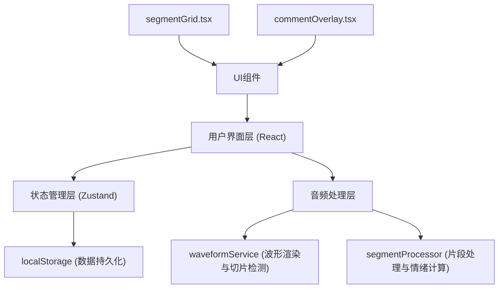

## 1. 架构设计



## 2. 技术描述

- 前端框架：React@18 + TypeScript
- 构建工具：Vite@5
- 波形渲染：wavesurfer.js@7
- 动画库：framer-motion@11
- 状态管理：zustand@4（自定义轻量级store）
- 样式方案：CSS Modules + 内联样式

## 3. 项目文件结构

```
d:\Pro\tasks\auto181\
├── package.json
├── vite.config.js
├── tsconfig.json
├── index.html
└── src/
    ├── main.tsx
    ├── App.tsx
    ├── audioEngine/
    │   ├── waveformService.ts
    │   └── segmentProcessor.ts
    ├── ui/
    │   ├── segmentGrid.tsx
    │   └── commentOverlay.tsx
    └── store/
        └── appStore.ts
```

### 文件职责与调用关系

| 文件 | 职责 | 输入 | 输出 | 调用者 |
|------|------|------|------|--------|
| waveformService.ts | 波形渲染与切片时间戳检测 | File对象 | Array<{start, end, waveformData}> | App.tsx |
| segmentProcessor.ts | 音频切片与情绪标签计算 | 时间戳数组 | Array<{id, start, end, emotion, waveformThumb}> | App.tsx |
| segmentGrid.tsx | 切片卡片网格展示 | 切片数组 | 排序事件、卡片点击 | App.tsx |
| commentOverlay.tsx | 评论浮层组件 | 选中片段ID | 新评论数据 | segmentGrid.tsx |
| appStore.ts | 全局状态管理 | 排序/评论事件 | useStore Hook | 所有组件 |

### 数据流向

```
File上传 → waveformService → 时间戳数组 → segmentProcessor → 切片数组 → appStore → segmentGrid → commentOverlay → appStore → localStorage
```

## 4. 数据模型

### 4.1 核心类型定义

```typescript
// 波形切片时间戳
interface WaveformSlice {
  start: number;
  end: number;
  waveformData: number[];
}

// 情绪类型
type EmotionType = 'excited' | 'melancholy' | 'restless' | 'ethereal' | 'energetic';

// 情绪配置
interface EmotionConfig {
  label: string;
  color: string;
  threshold?: [number, number];
}

// 音频片段
interface AudioSegment {
  id: string;
  start: number;
  end: number;
  emotion: EmotionType;
  waveformThumb: number[];
  audioData?: ArrayBuffer;
}

// 评论
interface Comment {
  id: string;
  segmentId: string;
  text: string;
  emoji: string;
  userName: string;
  userColor: string;
  timestamp: number;
}

// 应用状态
interface AppState {
  segments: AudioSegment[];
  comments: Record<string, Comment[]>;
  gridColumns: number;
  selectedSegmentId: string | null;
  isProcessing: boolean;
  audioFile: File | null;
}
```

### 4.2 情绪映射规则

| 情绪类型 | 中文标签 | 颜色 | 能量阈值 |
|----------|----------|------|----------|
| excited | 兴奋 | #FF6B6B | >0.7 |
| melancholy | 忧郁 | #5B86E5 | <0.3 |
| restless | 躁动 | #FFA94D | 0.5-0.7 |
| ethereal | 空灵 | #B197FC | 0.3-0.5 |
| energetic | 激昂 | #FF6B6B | 手动选择 |

## 5. 性能优化策略

1. **波形渲染优化**：使用Web Audio API离线分析，避免UI线程阻塞
2. **切片数据缓存**：计算结果存入store，避免重复计算
3. **虚拟滚动**：卡片列表使用CSS contain优化重绘
4. **动画优化**：使用transform和opacity属性实现GPU加速
5. **内存管理**：音频播放完成后及时释放wavesurfer实例
6. **懒加载**：评论浮层按需加载评论数据

## 6. 关键算法

### 6.1 节奏变化检测（模拟）
- 将音频按时间平均分为5-8段
- 每段计算频谱能量平均值
- 能量突变点作为切片边界
- 确保每段时长在30秒-1分钟之间

### 6.2 情绪标签计算
- 计算片段平均频谱能量
- 根据能量阈值映射情绪类型
- 能量值归一化到0-1范围
