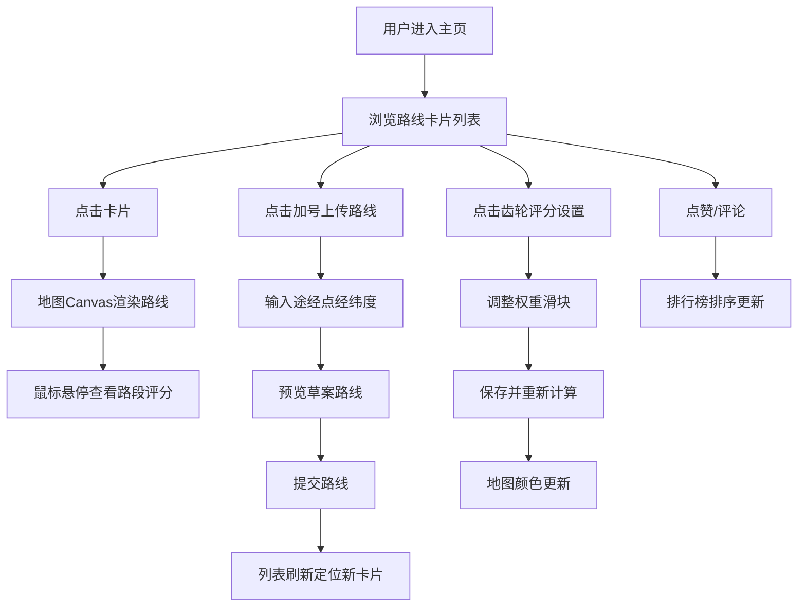

## 1. 产品概述

城市骑行路线体验评分系统——面向城市骑行爱好者，提供路线分享、体验评分和社区互动的在线平台。用户可上传骑行路线，系统根据坡度、树荫覆盖率、路面平整度和车流量自动计算体验评分，以颜色渐变在地图上可视化展示，其他用户可点赞评论，形成热门路线排行榜。

- 目标用户：城市骑行爱好者、慢行交通规划者
- 核心价值：帮助骑行者发现高质量骑行路线，量化路线体验，促进骑行社区互动

## 2. 核心功能

### 2.1 用户角色

| 角色 | 注册方式 | 核心权限 |
|------|----------|----------|
| 普通用户 | 无需注册，本地使用 | 浏览路线、上传路线、点赞评论、调整评分权重 |

### 2.2 功能模块

1. **主页面**：顶部导航栏、左侧路线卡片列表、右侧地图Canvas渲染区、评分设置与路线上传入口
2. **评分设置面板**：四维权重滑块配置，实时重新计算评分
3. **路线上传面板**：途经点输入、预览、提交
4. **互动系统**：点赞、评论、排行榜

### 2.3 页面详情

| 页面名称 | 模块名称 | 功能描述 |
|----------|----------|----------|
| 主页面 | 顶部导航栏 | 高50px，主色#2E7D32，白色文字，齿轮图标打开评分设置，加号按钮打开路线上传 |
| 主页面 | 路线卡片列表 | 左侧区域，卡片280×160px，白底#FFFFFF，2px实线边框#C8E6C9，圆角12px，悬停阴影加深上浮3px，显示路线名称、距离、爬升、评分星级，底部点赞和评论，排行榜榜首金色皇冠 |
| 主页面 | 地图Canvas区 | 右侧800×600px，Canvas绘制路线折线，路段颜色红#E53935到绿#43A047渐变，线宽4px，鼠标悬停弹出评分细则信息框，路段切换0.5s淡入淡出 |
| 评分设置面板 | 模态框 | 宽480px，圆角16px，白底，阴影0 8px 32px rgba(0,0,0,0.15)，四维滑块（坡度/树荫/平整度/车流量权重0-100），保存和重置按钮 |
| 路线上传面板 | 侧边面板 | 固定左侧宽320px，浅灰#F5F5F5背景，圆角12px，途经点文本输入，预览按钮（灰色半透明折线），提交按钮（深绿#1B5E20），300ms旋转加载动画 |
| 评论面板 | 卡片展开区域 | 在卡片下方展开，0.4s高度过渡动画，文本输入框240×80px，提交按钮浅绿#66BB6A，评论列表含发布时间 |

## 3. 核心流程

1. **浏览路线流程**：用户进入主页 → 左侧卡片列表展示路线 → 点击卡片 → 右侧地图Canvas渲染路线颜色渐变 → 鼠标悬停路段查看评分细则
2. **路线上传流程**：点击加号按钮 → 输入途经点经纬度 → 点击预览查看灰色草案线 → 确认后提交 → 加载动画 → 列表刷新定位新卡片
3. **评分调整流程**：点击齿轮图标 → 调整四维权重滑块 → 点击保存 → 系统重新计算评分 → 地图颜色实时更新
4. **互动流程**：点击爱心点赞（灰色→红色，0.2s scale 1.1动画）→ 点击评论数展开评论面板 → 输入评论提交 → 评论即时显示 → 列表按点赞数排序

## 4. 用户界面设计

### 4.1 设计风格

- **主色调**：浅绿背景#F0F7E6，主色#2E7D32，深绿#1B5E20
- **辅助色**：白色#FFFFFF（卡片），浅绿#C8E6C9（边框），浅绿#A5D6A7（输入框虚线），浅绿#66BB6A（按钮）
- **评分渐变色**：红色#E53935（低分）→ 绿色#43A047（高分）
- **按钮风格**：圆角8-20px，主色按钮带白色文字，悬停加深0.2s过渡
- **字体**：系统字体栈，标题16px加粗，正文14px常规，辅助文字12px灰色
- **布局风格**：顶部导航+左侧卡片列表+右侧地图区，卡片式布局
- **图标风格**：lucide-react图标 + Unicode皇冠👑
- **动画**：framer-motion驱动的淡入淡出、上浮、缩放动画

### 4.2 页面设计概述

| 页面名称 | 模块名称 | UI元素 |
|----------|----------|--------|
| 主页面 | 顶部导航栏 | 浅绿#F0F7E6背景下50px高导航，主色#2E7D32底色，白色文字，左侧加号按钮，右侧齿轮图标，悬停加深0.2s |
| 主页面 | 路线卡片列表 | 左侧280px宽卡片列表，卡片280×160px白底圆角12px，2px#C8E6C9边框，悬停阴影加深上浮3px 0.3s cubic-bezier，卡片内路线名称/距离/爬升/星级评分 |
| 主页面 | 地图Canvas | 右侧800×600px Canvas，路线折线线宽4px，红→绿颜色渐变，鼠标悬停信息框，0.5s淡入淡出 |
| 评分设置面板 | 模态框 | 480px宽圆角16px白底，阴影0 8px 32px rgba(0,0,0,0.15)，4个360×8px滑块，#E0E0E0轨道#2E7D32按钮半径16px，保存/重置按钮 |
| 路线上传面板 | 侧边面板 | 320px宽浅灰#F5F5F5圆角12px，280×120px文本输入白底虚线边框#A5D6A7，预览/提交按钮 |
| 评论面板 | 展开区域 | 卡片下方0.4s高度动画，240×80px输入框#F5F5F5背景，浅绿提交按钮 |

### 4.3 响应式

- 桌面优先设计，主区域宽度1100px居中
- 地图Canvas固定800×600px
- 卡片列表固定280px宽
- 小屏幕暂不做适配（MVP阶段）

### 4.4 3D场景指导

不适用
