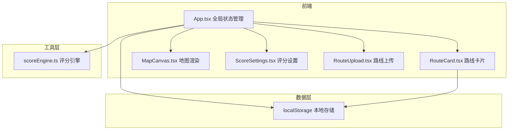
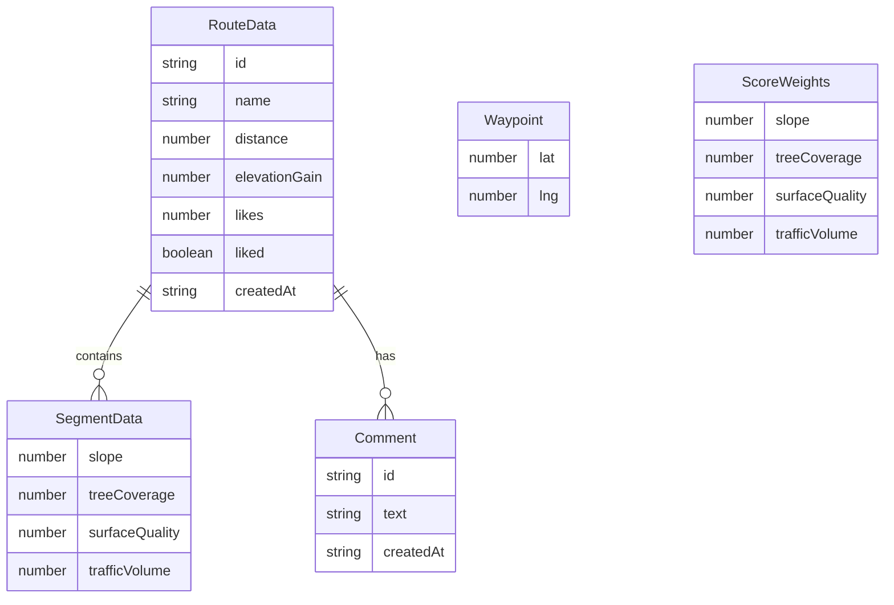

## 1. 架构设计



纯前端架构，所有数据存储在localStorage，评分计算在客户端完成。

## 2. 技术说明

- **前端**：React@18 + TypeScript + Vite + framer-motion
- **样式方案**：CSS-in-JS（内联样式 + CSS模块），不使用Tailwind（用户未指定）
- **初始化工具**：vite-init（react-ts模板）
- **后端**：无
- **数据库**：无，使用localStorage持久化

### 依赖清单

| 依赖 | 版本 | 用途 |
|------|------|------|
| react | ^18 | UI框架 |
| react-dom | ^18 | DOM渲染 |
| vite | 最新 | 构建工具 |
| @vitejs/plugin-react | 最新 | Vite React插件 |
| typescript | 最新 | 类型安全 |
| @types/react | 最新 | React类型定义 |
| @types/react-dom | 最新 | ReactDOM类型定义 |
| framer-motion | 最新 | 动画库 |

## 3. 路由定义

单页应用，无路由切换，所有功能在同一页面通过面板展开/收起实现。

| 路径 | 用途 |
|------|------|
| / | 主页面，包含路线列表、地图、评分设置、路线上传 |

## 4. API定义

无后端API，所有数据操作通过localStorage完成。

### 数据接口定义

```typescript
interface Waypoint {
  lat: number;
  lng: number;
}

interface SegmentData {
  slope: number;
  treeCoverage: number;
  surfaceQuality: number;
  trafficVolume: number;
}

interface RouteData {
  id: string;
  name: string;
  waypoints: Waypoint[];
  segments: SegmentData[];
  distance: number;
  elevationGain: number;
  likes: number;
  liked: boolean;
  comments: Comment[];
  scores: number[];
  createdAt: string;
}

interface Comment {
  id: string;
  text: string;
  createdAt: string;
}

interface ScoreWeights {
  slope: number;
  treeCoverage: number;
  surfaceQuality: number;
  trafficVolume: number;
}
```

## 5. 服务器架构图

不适用（纯前端项目）

## 6. 数据模型

### 6.1 数据模型定义



### 6.2 数据初始化

预置3条示例路线数据，包含完整的途经点、路段属性和模拟评论，确保首次加载即有内容展示。数据通过localStorage持久化，首次访问时写入初始数据。

## 7. 性能要求

- 地图Canvas渲染帧率 ≥ 30fps
- 评分计算完成时间 < 50ms
- 评论提交后列表更新 < 200ms
- 使用requestAnimationFrame优化Canvas渲染
- 评分引擎使用纯数学计算，避免DOM操作
