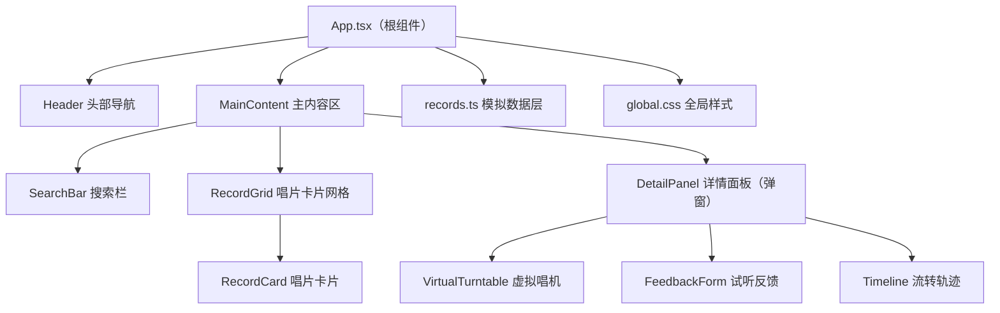
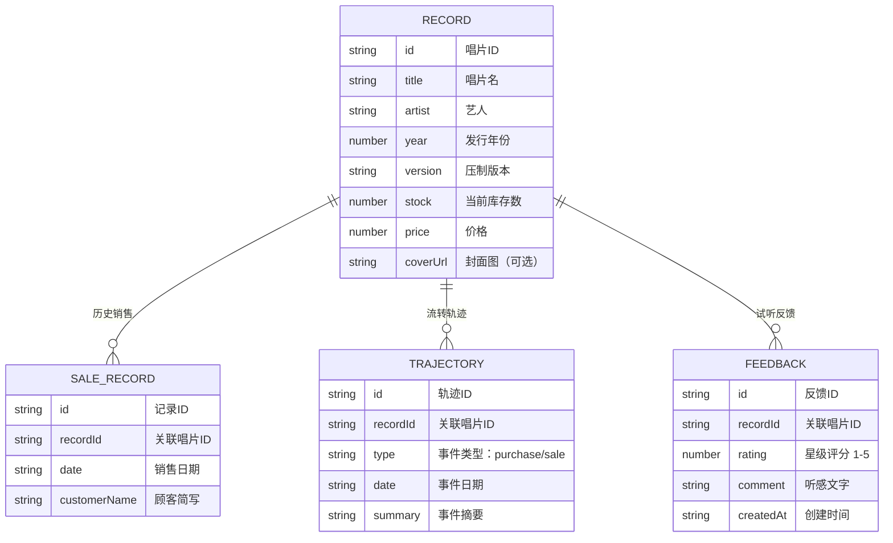

## 1. 架构设计



## 2. 技术描述

- **前端框架**：React 18 + TypeScript（strict 模式，target ES2020）
- **构建工具**：Vite 5 + @vitejs/plugin-react
- **动画库**：framer-motion（面板弹出、卡片过渡、旋转动画）
- **样式方案**：原生 CSS（global.css）+ CSS 变量，不引入 Tailwind
- **状态管理**：React useState/useReducer 本地状态（无需全局状态库）
- **数据来源**：src/data/records.ts 本地模拟数据
- **初始化方式**：按用户指定手动创建所有项目文件（不使用脚手架模板）

## 3. 路由定义
本项目为单页面应用（SPA），无需多页面路由。所有交互通过组件显隐和弹窗实现。

| 路由 | 用途 |
|-------|---------|
| / | 唱片展示主页（唯一页面） |

## 4. 数据模型

### 4.1 数据模型定义



### 4.2 TypeScript 类型定义

```typescript
export interface SaleRecord {
  id: string;
  date: string;
  customerName: string;
}

export interface TrajectoryNode {
  id: string;
  type: 'purchase' | 'sale';
  date: string;
  summary: string;
}

export interface Feedback {
  id: string;
  rating: number;
  comment: string;
  createdAt: string;
}

export interface VinylRecord {
  id: string;
  title: string;
  artist: string;
  year: number;
  version: string;
  stock: number;
  price: number;
  coverUrl?: string;
  sales: SaleRecord[];
  trajectory: TrajectoryNode[];
  feedbacks: Feedback[];
}
```

## 5. 项目文件结构

```
d:\Pro\tasks\auto183\
├── package.json          # 依赖与脚本配置
├── index.html            # Vite 入口 HTML
├── vite.config.js        # Vite 构建配置
├── tsconfig.json         # TypeScript 严格模式配置
└── src/
    ├── App.tsx           # 根组件：全局状态、Header、MainContent
    ├── components/
    │   ├── RecordCard.tsx        # 唱片卡片（悬停/售罄状态）
    │   ├── DetailPanel.tsx       # 详情面板（唱机+时间线+反馈）
    │   └── VirtualTurntable.tsx  # 虚拟唱机（播放/旋转/音量）
    ├── data/
    │   └── records.ts    # 模拟唱片数据集
    └── styles/
        └── global.css    # 全局样式（CSS变量+Grid+响应式+动画）
```

## 6. 关键技术点

### 6.1 性能优化
- **搜索过滤 ≤150ms**：使用 `useMemo` 缓存过滤结果，避免每次渲染重计算
- **唱机旋转 60fps**：使用 CSS `animation` + `transform: rotate()` 触发 GPU 加速，避免 JS 驱动动画
- **详情面板 ≤200ms**：使用 framer-motion 预设动画，挂载时立即开始过渡

### 6.2 状态管理
- `App.tsx` 维护：`records` 列表、`searchQuery`、`selectedRecordId`、详情面板显隐
- 子组件通过 props 接收数据和回调，保持单向数据流
- 标记售出：父组件回调更新 stock，立即反映到卡片和详情

### 6.3 动画实现
- 卡片悬停：CSS `transition: border-color 0.3s ease-out, box-shadow 0.3s ease-out`
- 唱机旋转：CSS `@keyframes spin { to { transform: rotate(1turn); } }` 配合 `animation: spin 1.8s linear infinite`（33.33rpm ≈ 1.8s/圈）
- 面板弹出：framer-motion `<AnimatePresence>` + `initial/animate/exit`
- 点击反馈：CSS `:active { transform: scale(0.95); }`

### 6.4 响应式实现
- CSS Grid：`grid-template-columns: repeat(auto-fill, minmax(200px, 1fr))`
- 媒体查询：`@media (max-width: 1024px)` 触发 2 列网格和全屏详情面板
