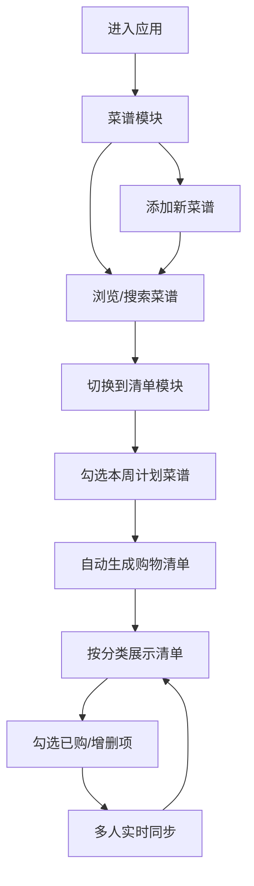

## 1. 产品概述

家庭菜谱共享与智能购物清单同步应用，帮助家庭成员上传和管理拿手菜谱，系统根据本周计划烹饪的菜谱自动合并生成分门别类的购物清单，并支持多人实时协作编辑清单。

- 主要目的：简化家庭菜谱管理和购物规划，提升家庭烹饪效率
- 解决的问题：菜谱分散、购物清单重复统计、多人协作不便
- 目标用户：家庭成员、合租伙伴、小型餐饮团队

## 2. 核心功能

### 2.1 用户角色
| 角色 | 注册方式 | 核心权限 |
|------|----------|----------|
| 家庭成员 | 虚拟ID登录 | 上传菜谱、查看菜谱、编辑购物清单、协作同步 |

### 2.2 功能模块
1. **菜谱管理模块**：菜谱列表展示、添加菜谱、菜谱详情、搜索过滤
2. **购物清单模块**：智能清单生成、分类展示、勾选已购、手动增删
3. **多人协作模块**：协作者列表、实时同步、在线状态显示

### 2.3 页面详情
| 页面名称 | 模块名称 | 功能描述 |
|----------|----------|----------|
| 菜谱页面 | 菜谱卡片列表 | 网格布局展示所有菜谱卡片，支持悬停动效 |
| 菜谱页面 | 添加菜谱表单 | 录入菜名、食材、步骤等信息 |
| 菜谱页面 | 搜索过滤栏 | 实时搜索菜名和主要食材 |
| 菜谱页面 | 菜谱详情面板 | 右侧滑入展示完整菜谱信息 |
| 清单页面 | 本周计划选择区 | 勾选计划烹饪的菜谱 |
| 清单页面 | 分类购物清单 | 按类别分组展示购物项，支持勾选 |
| 清单页面 | 协作状态栏 | 显示在线协作者头像 |

## 3. 核心流程

### 3.1 主流程描述
用户进入应用后，可在菜谱模块浏览和添加菜谱；切换到购物清单模块后，勾选本周计划烹饪的菜谱，系统自动聚合食材生成购物清单；多位家庭成员可同时在线编辑清单，所有变更实时同步。

### 3.2 流程图

## 4. 用户界面设计

### 4.1 设计风格
- **主题**：暖色厨房风格，温馨家庭感
- **主色**：#E67E22（暖橙色）
- **主背景**：#FFF8F0（浅米色）
- **卡片背景**：#FFFFFF（白色）
- **文字主色**：#2C3E50（深灰蓝）
- **按钮**：统一圆角8px，主色填充，悬停加深10%
- **字体**：清晰易读的无衬线字体，标题加粗，正文常规
- **布局**：左侧导航 + 中央内容区 + 右侧详情面板（滑入式）
- **图标风格**：简洁线性图标

### 4.2 页面设计概述
| 页面名称 | 模块名称 | UI元素 |
|----------|----------|--------|
| 菜谱页面 | 顶部导航栏 | 高56px，主色背景，白色标题文字 |
| 菜谱页面 | 左侧菜单栏 | 宽200px，白底，选中项左侧4px主色条 |
| 菜谱页面 | 搜索框 | 高42px，圆角8px，浅灰背景，聚焦主色边框 |
| 菜谱页面 | 菜谱卡片 | 宽280px高200px，圆角16px，两级阴影过渡 |
| 菜谱页面 | 详情面板 | 右侧滑入，宽400px，半透明深色背景 |
| 清单页面 | 协作状态栏 | 彩色圆角头像（直径36px） |
| 清单页面 | 分类标题 | 主色文字，左侧4px色条 |
| 清单页面 | 清单项 | 高48px，圆形checkbox，已购灰色加删除线 |

### 4.3 响应式设计
- 桌面端（>900px）：左侧导航 + 内容区网格布局
- 平板端（768px-900px）：内容区单列布局
- 移动端（<768px）：导航折叠为汉堡菜单，单列卡片布局
- 触摸优化：增大点击热区，支持滑动手势

### 4.4 动画过渡
- 列表项出现：framer-motion scaleY从0到1，持续0.4s
- 卡片悬停：上移8px，阴影加深，0.3s cubic-bezier过渡
- 复选框勾选：scale 1.2再回弹，0.2s颜色过渡
- 搜索过滤：0.3s渐隐后重新排列（AnimatePresence）
- 详情面板：0.5s cubic-bezier滑入动画
- 清单同步：0.5s内平滑更新
