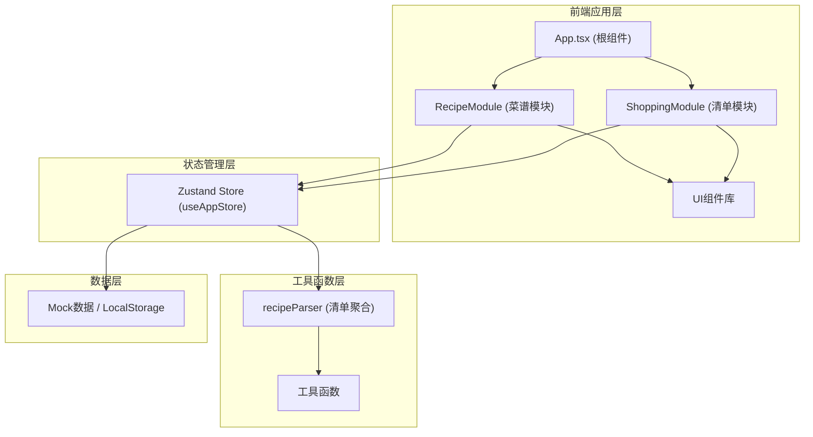
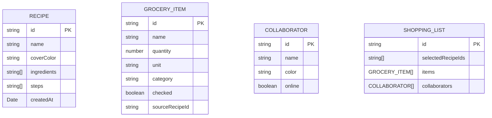

## 1. 架构设计



## 2. 技术描述

- **前端框架**：React 18 + TypeScript
- **构建工具**：Vite
- **状态管理**：Zustand
- **动画库**：Framer Motion
- **样式方案**：CSS Modules / 内联样式
- **唯一ID生成**：uuid
- **路由**：React Router（可选，根据需求复杂度）

## 3. 项目结构

```
src/
├── main.tsx              # React渲染入口
├── App.tsx               # 根组件，路由分发
├── modules/
│   ├── recipes/
│   │   ├── RecipeModule.tsx       # 菜谱模块容器
│   │   └── components/
│   │       ├── RecipeCard.tsx     # 菜谱卡片
│   │       └── AddRecipeForm.tsx  # 添加菜谱表单
│   └── shopping/
│       ├── ShoppingModule.tsx     # 清单模块容器
│       └── components/
│           ├── IngredientList.tsx # 食材分类列表
│           └── GroceryChecklist.tsx # 购物清单卡片
├── store/
│   └── useAppStore.ts    # Zustand全局store
└── utils/
    └── recipeParser.ts   # 菜谱食材解析聚合
```

## 4. 数据模型

### 4.1 数据模型定义



### 4.2 TypeScript 类型定义

```typescript
interface Ingredient {
  id: string;
  name: string;
  quantity: number;
  unit: string;
  category: IngredientCategory;
}

interface Recipe {
  id: string;
  name: string;
  coverColor: string;
  ingredients: Ingredient[];
  steps: string[];
  createdAt: Date;
}

interface GroceryItem {
  id: string;
  name: string;
  quantity: number;
  unit: string;
  category: IngredientCategory;
  checked: boolean;
  sourceRecipes: string[];
}

interface Collaborator {
  id: string;
  name: string;
  color: string;
  online: boolean;
}

type IngredientCategory = 'vegetables' | 'meat' | 'seasoning' | 'drygoods' | 'other';
```

## 5. 状态管理设计

### 5.1 Zustand Store 结构

```typescript
interface AppState {
  // 菜谱数据
  recipes: Recipe[];
  addRecipe: (recipe: Omit<Recipe, 'id' | 'createdAt'>) => void;
  updateRecipe: (id: string, recipe: Partial<Recipe>) => void;
  deleteRecipe: (id: string) => void;
  
  // 购物清单
  selectedRecipeIds: string[];
  groceryItems: GroceryItem[];
  toggleRecipeSelection: (recipeId: string) => void;
  toggleGroceryItem: (itemId: string) => void;
  addGroceryItem: (item: Omit<GroceryItem, 'id'>) => void;
  removeGroceryItem: (itemId: string) => void;
  generateShoppingList: () => void;
  
  // 协作者
  collaborators: Collaborator[];
  currentUserId: string;
}
```

## 6. 核心算法

### 6.1 食材聚合算法 (recipeParser)

1. 遍历所有选中菜谱的食材
2. 按食材名称+单位归一化（统一小写、去除空格）
3. 相同食材数量累加
4. 按分类分组
5. 输出分类清单结构

### 6.2 分类规则

- **蔬菜类**：蔬菜、蔬果、菌菇相关
- **肉类**：猪肉、牛肉、鸡肉、鱼类、海鲜
- **调味品**：盐、糖、酱油、醋、香料等
- **干货类**：米面、豆类、干货
- **其他**：未分类食材

## 7. 性能优化

- 菜谱列表首次渲染 < 100ms
- 搜索过滤响应 < 50ms（使用 useMemo 缓存过滤结果）
- 清单合并计算 < 200ms（100个菜谱场景）
- 使用 React.memo 优化列表项渲染
- Framer Motion 动画使用 GPU 加速属性（transform、opacity）
