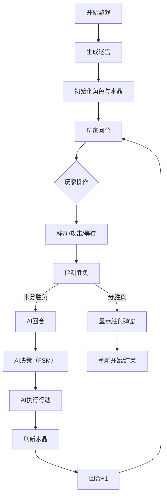

## 1. 产品概述

微型迷宫对战游戏是一款融合回合制策略与即时反应机制的网页游戏。玩家操控发光小精灵在随机生成的10x10网格迷宫中收集能量水晶，同时与AI控制的暗影生物进行回合制对战。

- **目标用户**：独立游戏爱好者、休闲玩家
- **核心玩法**：迷宫探索 + 回合制战斗 + 资源收集
- **产品价值**：轻量级、策略性强、易上手难精通的网页游戏体验

## 2. 核心功能

### 2.1 用户角色

| 角色 | 控制方式 | 核心能力 |
|------|----------|----------|
| 玩家（发光小精灵） | 人工操作 | 移动、攻击、收集水晶、增益属性 |
| AI（暗影生物） | 自动决策（FSM） | 巡逻、追击、逃跑、攻击、收集水晶 |

### 2.2 功能模块

1. **迷宫生成模块**：递归回溯算法生成10x10连通迷宫，墙壁/地板两种状态
2. **战斗系统模块**：回合制移动与攻击，生命值/攻击力管理，碰撞检测
3. **AI行为模块**：有限状态机（巡逻/追击/逃跑），A*寻路算法
4. **能量水晶模块**：随机刷新水晶，收集后属性增益，粒子特效
5. **UI渲染模块**：迷宫网格渲染、角色动画、HUD信息、操作面板

### 2.3 页面详情

| 页面名称 | 模块名称 | 功能描述 |
|---------|---------|----------|
| 游戏主界面 | 战斗画布 | 渲染迷宫、角色、水晶，处理动画效果 |
| 游戏主界面 | HUD面板 | 显示回合计数、生命值条、回合提示 |
| 游戏主界面 | 控制面板 | 方向移动按钮、攻击按钮、等待按钮 |
| 游戏主界面 | 胜负弹窗 | 游戏结束时显示胜利/失败结果 |

## 3. 核心流程

玩家进入游戏后，系统随机生成迷宫并放置双方角色。玩家与AI轮流行动，每回合可选择移动或攻击。靠近能量水晶可自动收集并获得属性增益。当一方生命值归零时游戏结束。

## 4. 用户界面设计

### 4.1 设计风格

- **主色调**：深色科幻风格，渐变深蓝 #0A0E27 到 #1A104A
- **强调色**：玩家黄色辉光、AI紫色暗影、水晶蓝色半透明
- **按钮风格**：圆形按钮（半径25px），深紫色 #6A1B9A 背景，悬停变亮至 #8E24AA
- **字体**：白色科幻风格字体，回合计数器 24px
- **布局**：中央游戏画布，四周黑色阴影边框模拟游戏设备屏幕
- **动效**：framer-motion 实现角色移动过渡、攻击闪光、水晶粒子爆散

### 4.2 页面设计概述

| 页面名称 | 模块名称 | UI元素 |
|---------|---------|--------|
| 游戏主界面 | 战斗画布 | 10x10网格迷宫（每格40x40px）、墙壁深灰#333、地板浅灰#CCC、黄色圆形发光角色、紫色多边形暗影生物、蓝色六边形水晶 |
| 游戏主界面 | HUD面板 | 半透明深紫#2A1B3DAA背景，圆角8px，内边距10px，生命值条高度14px，渐变填充（玩家红→橙，AI蓝→青），动画光带进度指示器 |
| 游戏主界面 | 控制面板 | 右下角固定，圆形按钮组，间距12px，点击波纹涟漪效果，0.8倍缩放弹性动画 |
| 游戏主界面 | 胜负弹窗 | 半透明遮罩，动画弹入奖杯/骷髅图标 |

### 4.3 响应式设计

- 桌面端：游戏画布占宽度90%、高度80%（最大800x600px）
- 移动端（<600px）：画布宽度100%，按钮间距缩小至8px
- 触控优化：按钮尺寸适合手指点击

### 4.4 动画与特效

- 角色移动：0.3s 平滑过渡
- 攻击特效：0.2s 白色闪屏 + 被攻击格子红色闪烁
- 水晶刷新：10个金色粒子爆散动画，持续0.5s
- 水晶浮动：上下浮动动画
- 角色状态：发光小精灵辉光动画、暗影生物闪烁动画
- 回合提示：打字机效果文字
- 进度指示器：2s循环光带动画
