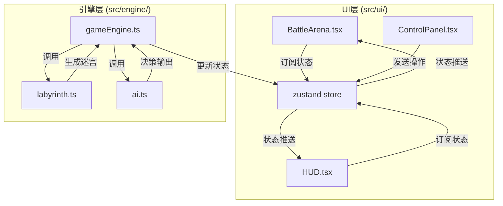

## 1. 架构设计

项目采用纯前端架构，分为引擎层和UI层两个独立模块，通过状态管理进行数据交互。



## 2. 技术说明

- **前端框架**：React@18 + TypeScript
- **构建工具**：Vite + @vitejs/plugin-react
- **状态管理**：zustand
- **动画库**：framer-motion
- **样式方案**：CSS Modules + CSS Variables（按需求定制，不使用Tailwind）
- **初始化方式**：Vite React TypeScript 模板

## 3. 文件结构

```
src/
├── engine/                    # 游戏引擎模块
│   ├── labyrinth.ts           # 迷宫生成（递归回溯算法）
│   ├── ai.ts                  # AI决策（FSM有限状态机 + A*寻路）
│   └── gameEngine.ts          # 游戏核心引擎（回合管理、状态更新）
├── ui/
│   └── components/            # UI组件
│       ├── BattleArena.tsx    # 战斗画布（迷宫、角色、水晶渲染）
│       ├── HUD.tsx            # 抬头显示（生命值、回合、提示）
│       └── ControlPanel.tsx   # 控制面板（操作按钮）
├── store/
│   └── useGameStore.ts        # zustand状态管理
├── types/
│   └── game.ts                # TypeScript类型定义
├── App.tsx                    # 根组件
├── main.tsx                   # 入口文件
└── index.css                  # 全局样式
```

### 文件调用关系与数据流

1. **labyrinth.ts**
   - 被 `gameEngine.ts` 调用
   - 输出：`Cell[][]` 二维网格数组

2. **ai.ts**
   - 被 `gameEngine.ts` 调用
   - 输入：当前游戏状态（玩家位置、AI位置、迷宫、生命值等）
   - 输出：`AIAction` 动作对象（移动方向/攻击/等待）

3. **gameEngine.ts**
   - 被 `useGameStore.ts` 调用/集成
   - 输入：玩家操作指令
   - 调用：`labyrinth.ts` 生成迷宫、`ai.ts` 获取AI决策
   - 输出：更新后的游戏状态

4. **BattleArena.tsx**
   - 从 `useGameStore` 订阅状态
   - 向 `useGameStore` 发送用户操作（通过事件回调）

5. **HUD.tsx**
   - 从 `useGameStore` 订阅状态（只读）

6. **ControlPanel.tsx**
   - 向 `useGameStore` 发送操作指令

## 4. 数据模型

### 4.1 核心类型定义

```typescript
// 格子类型
type CellType = 'wall' | 'floor';

interface Cell {
  type: CellType;
  x: number;
  y: number;
}

// 位置
interface Position {
  x: number;
  y: number;
}

// 角色状态
interface Character {
  position: Position;
  hp: number;
  maxHp: number;
  attack: number;
  moveRange: number;
  crystalsCollected: number;
}

// 能量水晶
interface Crystal {
  position: Position;
  id: string;
}

// AI状态
type AIState = 'patrol' | 'chase' | 'flee';

// 回合归属
type Turn = 'player' | 'ai';

// 游戏状态
type GameStatus = 'playing' | 'playerWin' | 'aiWin';

// AI动作类型
type AIActionType = 'move' | 'attack' | 'wait';

interface AIAction {
  type: AIActionType;
  direction?: 'up' | 'down' | 'left' | 'right';
  target?: Position;
}

// 游戏完整状态
interface GameState {
  grid: Cell[][];
  player: Character;
  ai: Character;
  crystals: Crystal[];
  turn: Turn;
  turnCount: number;
  aiState: AIState;
  gameStatus: GameStatus;
  isAnimating: boolean;
  flashEffect: 'attack' | 'damage' | null;
  damagedPosition: Position | null;
  crystalBurst: Position | null;
}
```

## 5. 核心算法

### 5.1 迷宫生成 - 递归回溯算法

- 输入：迷宫尺寸（10x10）
- 输出：连通的二维网格数组
- 起点：左下角 (0, 9)
- 终点/水晶集中区：右上角 (9, 0)

### 5.2 AI决策 - 有限状态机

- **巡逻状态**：随机选择可移动方向移动
- **追击状态**：距离玩家<5格时触发，A*寻路向玩家移动，每回合移动2格
- **逃跑状态**：生命值<30%时触发，向远离玩家方向移动

### 5.3 寻路算法 - A*

- 启发函数：曼哈顿距离
- 用于追击状态下的路径规划

### 5.4 战斗与碰撞检测

- 攻击判定：相邻格子（曼哈顿距离=1）可攻击
- 移动判定：目标格子为地板且在移动范围内
- 水晶收集：角色与水晶相邻时自动收集

## 6. 性能约束

- 游戏帧率：稳定60fps
- AI决策时间：每回合<50ms
- 动画帧率：≥30fps
- 迷宫生成：单次<10ms
- 状态更新：单次<5ms
