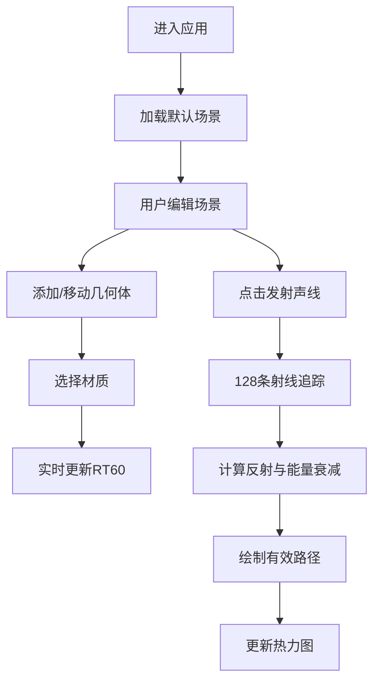

## 1. 产品概述

室内声学可视化模拟器是一款交互式三维应用，帮助声学设计师和音乐爱好者直观理解不同表面材质和几何形状对声波传播路径及混响时间的影响。通过实时声线追踪和RT60计算，用户可以在虚拟空间中搭建场景并即时观察声学效果。

- 目标用户：声学设计师、建筑声学工程师、音乐制作人、声学爱好者
- 核心价值：将抽象的声学概念转化为直观的三维可视化，降低声学设计门槛

## 2. 核心特性

### 2.1 用户角色
| 角色 | 注册方式 | 核心权限 |
|------|----------|----------|
| 普通用户 | 无需注册 | 场景编辑、声线模拟、参数查看 |

### 2.2 功能模块
1. **三维场景编辑器**：几何体拖放、材质赋值、声源与接收点管理
2. **声线追踪模拟**：128条射线均匀发射、镜面反射、能量衰减、有效路径筛选
3. **RT60混响时间计算**：三频段（125Hz、500Hz、2000Hz）实时计算与柱状图展示
4. **声波能量热力图**：地面网格动态声压级分布可视化

### 2.3 页面详情
| 页面名称 | 模块名称 | 功能描述 |
|----------|----------|----------|
| 主界面 | 顶部工具栏 | 发射声线按钮、重置场景按钮、材质选择下拉菜单 |
| 主界面 | 三维视口 | 正交相机、场景几何体渲染、声源/接收点显示、声线路径绘制 |
| 主界面 | 左侧信息面板 | 当前选中物体材质、RT60值、有效路径数量 |
| 主界面 | 右侧柱状图 | 三频段RT60动态柱状图，弹簧动画过渡 |
| 主界面 | 热力图 | 地面12x12网格声压级热力图 |

## 3. 核心流程

用户进入应用后，默认加载一个包含基础墙体和预设声源/接收点的初始场景。用户可以：
1. 从工具栏选择几何体类型（墙体、圆柱、斜顶）
2. 在场景中放置并调整几何体位置和旋转
3. 为每个几何体选择表面材质（木材、石材、玻璃、吸音棉）
4. 点击"发射声线"按钮触发声线追踪模拟
5. 观察声线反射路径、有效路径、热力图分布和RT60柱状图
6. 通过拖拽旋转视角和滚轮缩放观察场景

## 4. 用户界面设计

### 4.1 设计风格
- **设计主题**：暗色监听室风格，专业声学工作室氛围
- **主色调**：深灰#1C1C1C背景，#2A2A2A面板背景
- **强调色**：黄色#FFD700（声源）、绿色#32CD32（接收点）、红蓝色渐变（声线）
- **按钮样式**：圆角4px，悬停背景#3A3A3A，0.2s ease-in-out过渡
- **字体**：现代无衬线字体，清晰易读
- **布局风格**：固定顶部工具栏 + 中央三维视口 + 侧边信息面板
- **动效风格**：统一0.2s ease-in-out过渡，柱状图弹簧动画

### 4.2 页面设计概述
| 页面名称 | 模块名称 | UI元素 |
|----------|----------|--------|
| 主界面 | 顶部工具栏 | 48px高度，#2A2A2A背景，操作按钮组，材质下拉选择 |
| 主界面 | 三维视口 | 自适应宽高，最小800x600px，正交相机，地面网格 |
| 主界面 | 信息面板 | 240px宽，半透明#2A2A2A，圆角8px，左下角定位 |
| 主界面 | RT60柱状图 | 右侧面板，三频段彩色柱状图，弹簧动画 |
| 主界面 | 热力图 | 地面12x12网格，蓝到红渐变，透明度0.5 |

### 4.3 响应式设计
- 桌面端：左侧信息面板固定，右侧柱状图固定
- 宽度小于900px：信息面板折叠为顶部可展开抽屉
- 触摸优化：支持触摸拖拽旋转视角

### 4.4 3D场景指导
- **环境**：暗色空间，模拟声学实验室氛围
- **光照**：环境光 + 方向光，均匀照亮场景物体
- **相机**：正交相机，等比例缩放无透视变形
- **构图**：地面网格居中，物体放置在网格平面上
- **交互**：鼠标拖拽旋转视角，滚轮缩放，悬停高亮可选物体
- **后处理**：轻微泛光效果增强声源发光感
- **性能预算**：20-30个几何体，保持45FPS以上
